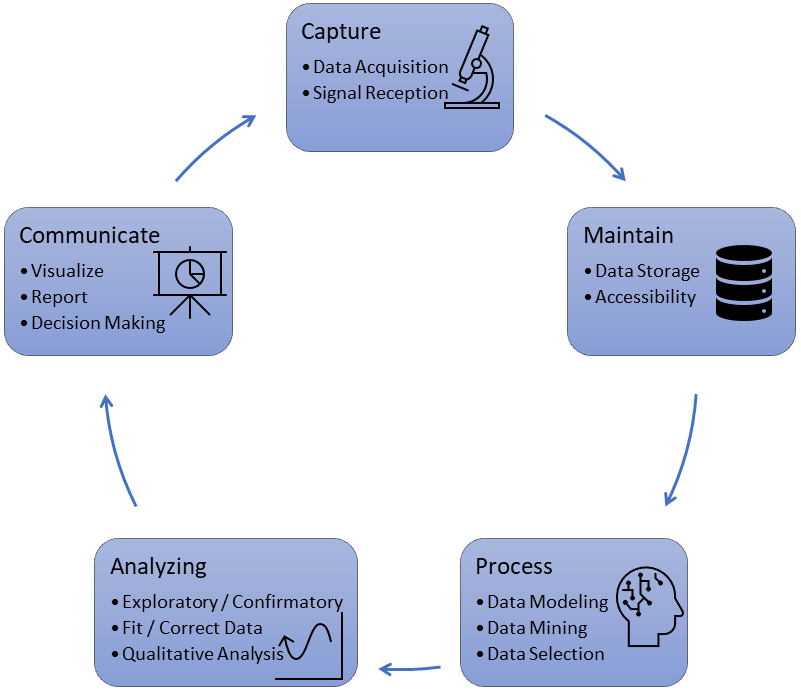
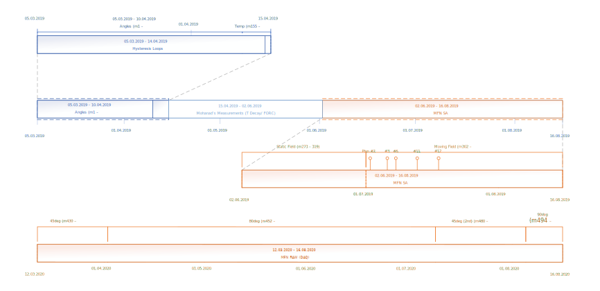

About the Data
==============

.. important::
    All data parameters are available in the :doc:`onenote/index`

About this section
------------------

This section gives a documentation about the data.
It explains how the data has been acquired.

The first part describes the used tools like the sensor, cryostat and instruments.
Here also an overview is given over the OneNote notebook which has been used to document all measurements.
This notebook contains all information about every performed measurement until m462.

Afterwards this Lab Book is continuing the measurement documentation in the second part.
This is splitted into magnetic and fluctuation measurements.

Data Life Cycle
~~~~~~~~~~~~~~~

   Data Lifecycle (see https://datascience.berkeley.edu/about/what-is-data-science/)

Timeline
~~~~~~~~

   Project Timeline
