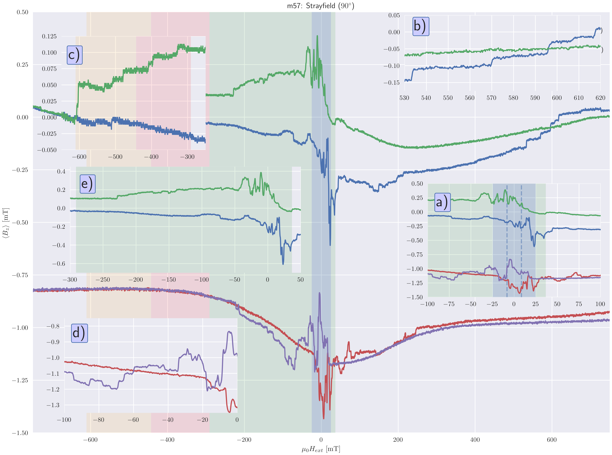
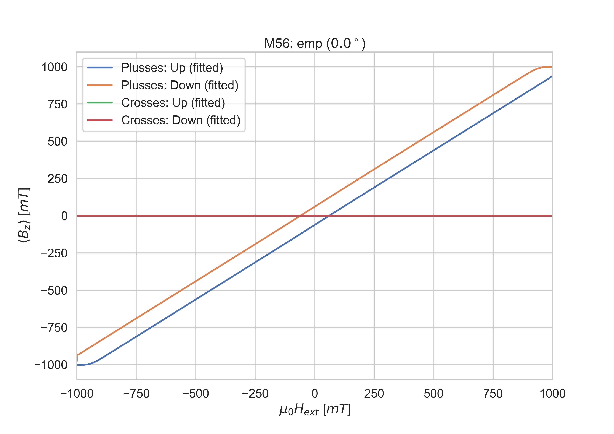

Different Angles
----------------

Parallel (90deg)
################

This is a special angle as it is the only one that can be measured with parallel setting.

   **m57**: Parallel measured 90deg hysteresis loop.

Perpendicular (0deg)
####################

   **m56**: Hall voltage of external 1 T field sweep.

