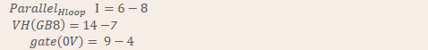
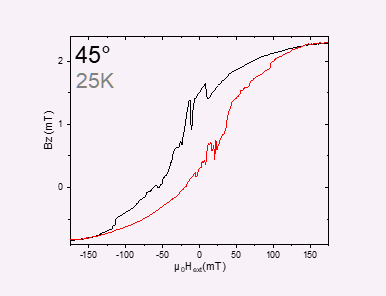
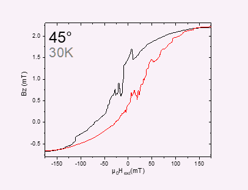
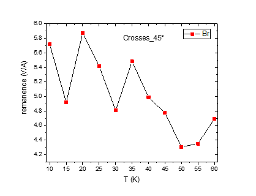
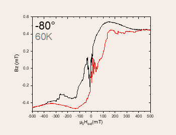
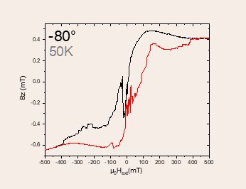
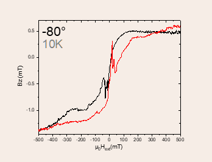
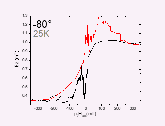

02: Temperature
===============
:Date: Montag, 8. April 2019 09:41

.. note::
   Introducing an exchange gas 0.5mbar

I did introduce an exchange gas for 0.5mbar between some measurments

 

 

C: Changing angle 45deg
************************************

:Date: Montag, 8. April 2019

08:49

 

============= ========
Float/Ground: Ground
============= ========
AC/DC:        AC
A/A-B:        A-B
Reserve:      Normal
Source:       Internal
============= ========

+----------------------------+------------------------------------------------+
| VH(max) (mV)               | *11,164mV*                                     |
+============================+================================================+
| Angle of sensor calculator | **V_H= Cos(45)*11,164 = 7,894140105166617 mV** |
|                            |                                                |
|                            | **Before changing: -0.037mV**                  |
|                            |                                                |
|                            | **Measured: 7.895mV**                          |
+----------------------------+------------------------------------------------+
| |image9|                   | |image10|                                      |
+----------------------------+------------------------------------------------+
| |image11|                  | |image12|                                      |
+----------------------------+------------------------------------------------+
| |image13|                  | ========= ===                                  |
|                            | |image14| *1*                                  |
|                            | ========= ===                                  |
|                            |                                                |
|                            |                                                |
+----------------------------+------------------------------------------------+
| |image15|                  | |image16|                                      |
|                            |                                                |
|                            | |image17|                                      |
+----------------------------+------------------------------------------------+
| *Period of measurement*    |                                                |
+----------------------------+------------------------------------------------+
| *Notes*                    |                                                |
+----------------------------+------------------------------------------------+
| *Data files*               |                                                |
+----------------------------+------------------------------------------------+
| *Plot*                     |                                                |
+----------------------------+------------------------------------------------+

 
m156:** Plusses_Hloop_25T_dependent_(45)deg
************************************

:Date: Montag, 8. April 2019

07:52

|Sensor 26 3um Tetrahedral CoFe nanostructures D B x A and B: old square
ASI|

============= ========
Float/Ground: Ground
============= ========
AC/DC:        AC
A/A-B:        A-B
Reserve:      Normal
Source:       Internal
============= ========

+-------------------------------+-------------------------------------+
| Temperature (K)               | *25K*                               |
+===============================+=====================================+
| Angle of sensor θ             | *45°*                               |
+-------------------------------+-------------------------------------+
| |image43|                     | |image44|                           |
+-------------------------------+-------------------------------------+
| |image45|                     | |image46|                           |
|                               |                                     |
|                               | |image47|                           |
+-------------------------------+-------------------------------------+
| |image48|                     | ========= =====                     |
|                               | |image49| *0.2*                     |
|                               | ========= =====                     |
|                               | |image50| 10                        |
|                               | ========= =====                     |
+-------------------------------+-------------------------------------+
| |image51|                     | R12 = 235/1000*50 = 11,75           |
+-------------------------------+-------------------------------------+
| |image52|                     | |image53|                           |
|                               |                                     |
|                               | |image54|                           |
+-------------------------------+-------------------------------------+
| *Period of measurement (min)* |                                     |
+-------------------------------+-------------------------------------+
| *Notes*                       |                                     |
+-------------------------------+-------------------------------------+
| *Data files*                  | <<m156_Plu                          |
|                               | sses_45deg_Hloop_down_T25K_T_dep__G |
|                               | radio_20190408_1000_I1-1-13_I2-8-6_ |
|                               | GBIP8-14-7_Vin-2.5V_R11-1MO_R12-11. |
|                               | 75kO_R13-0_R21-1MO_C11-1_C21-6_SR-0 |
|                               | .01-T-min_B-0.2T_gate-0V_down.dat>> |
|                               |                                     |
|                               |                                     |
|                               |                                     |
|                               | <<m156                              |
|                               | _Plusses_45deg_Hloop_up_T25K_T_dep_ |
|                               | _Gradio_20190408_1000_I1-1-13_I2-8- |
|                               | 6_GBIP8-14-7_Vin-2.5V_R11-1MO_R12-1 |
|                               | 1.75kO_R13-0_R21-1MO_C11-1_C21-6_SR |
|                               | -0.01-T-min_B-0.2T_gate-0V_up.dat>> |
|                               |                                     |
|                               |                                     |
+-------------------------------+-------------------------------------+
| *Plot*                        |                                     |
+-------------------------------+-------------------------------------+

 
m157:** Plusses_Hloop_20T_dependent_(45)deg
************************************

:Date: Montag, 8. April 2019

07:52

|Sensor 26 3um Tetrahedral CoFe nanostructures D B x A and B: old square
ASI|

============= ========
Float/Ground: Ground
============= ========
AC/DC:        AC
A/A-B:        A-B
Reserve:      Normal
Source:       Internal
============= ========

+-------------------------------+-------------------------------------+
| Temperature (K)               | *20K*                               |
+===============================+=====================================+
| Angle of sensor θ             | *45°*                               |
+-------------------------------+-------------------------------------+
| |image79|                     | |image80|                           |
+-------------------------------+-------------------------------------+
| |image81|                     | |image82|                           |
|                               |                                     |
|                               | |image83|                           |
+-------------------------------+-------------------------------------+
| |image84|                     | ========= =====                     |
|                               | |image85| *0.2*                     |
|                               | ========= =====                     |
|                               | |image86| 10                        |
|                               | ========= =====                     |
+-------------------------------+-------------------------------------+
| |image87|                     | R12 = 235/1000*50 = 11,75           |
+-------------------------------+-------------------------------------+
| |image88|                     | |image89|                           |
|                               |                                     |
|                               | |image90|                           |
+-------------------------------+-------------------------------------+
| *Period of measurement (min)* |                                     |
+-------------------------------+-------------------------------------+
| *Notes*                       |                                     |
+-------------------------------+-------------------------------------+
| *Data files*                  | <<m157_Plu                          |
|                               | sses_45deg_Hloop_down_T20K_T_dep__G |
|                               | radio_20190408_1000_I1-1-13_I2-8-6_ |
|                               | GBIP8-14-7_Vin-2.5V_R11-1MO_R12-11. |
|                               | 75kO_R13-0_R21-1MO_C11-1_C21-6_SR-0 |
|                               | .01-T-min_B-0.2T_gate-0V_down.dat>> |
|                               |                                     |
|                               |                                     |
|                               |                                     |
|                               | <<m157                              |
|                               | _Plusses_45deg_Hloop_up_T20K_T_dep_ |
|                               | _Gradio_20190408_1000_I1-1-13_I2-8- |
|                               | 6_GBIP8-14-7_Vin-2.5V_R11-1MO_R12-1 |
|                               | 1.75kO_R13-0_R21-1MO_C11-1_C21-6_SR |
|                               | -0.01-T-min_B-0.2T_gate-0V_up.dat>> |
|                               |                                     |
|                               |                                     |
+-------------------------------+-------------------------------------+
| *Plot*                        |                                     |
+-------------------------------+-------------------------------------+
| *Routine file*                |                                     |
+-------------------------------+-------------------------------------+

 
m158:** Plusses_Hloop_15T_dependent_(45)deg
************************************

:Date: Montag, 8. April 2019

07:52

|Sensor 26 3um Tetrahedral CoFe nanostructures D B x A and B: old square
ASI|

============= ========
Float/Ground: Ground
============= ========
AC/DC:        AC
A/A-B:        A-B
Reserve:      Normal
Source:       Internal
============= ========

+-------------------------------+-------------------------------------+
| Temperature (K)               | *15K*                               |
+===============================+=====================================+
| Angle of sensor θ             | *45°*                               |
+-------------------------------+-------------------------------------+
| |image115|                    | |image116|                          |
+-------------------------------+-------------------------------------+
| |image117|                    | |image118|                          |
|                               |                                     |
|                               | |image119|                          |
+-------------------------------+-------------------------------------+
| |image120|                    | ========== =====                    |
|                               | |image121| *0.2*                    |
|                               | ========== =====                    |
|                               | |image122| 10                       |
|                               | ========== =====                    |
+-------------------------------+-------------------------------------+
| |image123|                    | R12 = 235/1000*50 = 11,75           |
+-------------------------------+-------------------------------------+
| |image124|                    | |image125|                          |
|                               |                                     |
|                               | |image126|                          |
+-------------------------------+-------------------------------------+
| *Period of measurement (min)* |                                     |
+-------------------------------+-------------------------------------+
| *Notes*                       |                                     |
+-------------------------------+-------------------------------------+
| *Data files*                  | <<m158_Plu                          |
|                               | sses_45deg_Hloop_down_T15K_T_dep__G |
|                               | radio_20190408_1600_I1-1-13_I2-8-6_ |
|                               | GBIP8-14-7_Vin-2.5V_R11-1MO_R12-11. |
|                               | 75kO_R13-0_R21-1MO_C11-1_C21-6_SR-0 |
|                               | .01-T-min_B-0.2T_gate-0V_down.dat>> |
|                               |                                     |
|                               |                                     |
|                               |                                     |
|                               | <<m158                              |
|                               | _Plusses_45deg_Hloop_up_T15K_T_dep_ |
|                               | _Gradio_20190408_1600_I1-1-13_I2-8- |
|                               | 6_GBIP8-14-7_Vin-2.5V_R11-1MO_R12-1 |
|                               | 1.75kO_R13-0_R21-1MO_C11-1_C21-6_SR |
|                               | -0.01-T-min_B-0.2T_gate-0V_up.dat>> |
|                               |                                     |
|                               |                                     |
+-------------------------------+-------------------------------------+
| *Plot*                        |                                     |
+-------------------------------+-------------------------------------+
| *Routine file*                |                                     |
+-------------------------------+-------------------------------------+

 

Filling He(l)
************************************

:Date: Montag, 8. April 2019

18:00

 

======== ==== ========== ==== ======
1. He(l) 27in 08.04.2019 1800 Person
======== ==== ========== ==== ======
2. He(l) 36   08.04.2019 1837 MAM
======== ==== ========== ==== ======

 

Notes:

-   

 

   'To do:

    

 
m159:** Plusses_Hloop_10K_dependent_(45)deg
************************************

:Date: Montag, 8. April 2019

18:40

|Sensor 26 3um Tetrahedral CoFe nanostructures D B x A and B: old square
ASI|

============= ========
Float/Ground: Ground
============= ========
AC/DC:        AC
A/A-B:        A-B
Reserve:      Normal
Source:       Internal
============= ========

+-------------------------------+-------------------------------------+
| Temperature (K)               | *10K*                               |
+===============================+=====================================+
| Angle of sensor θ             | *45°*                               |
+-------------------------------+-------------------------------------+
| |image151|                    | |image152|                          |
+-------------------------------+-------------------------------------+
| |image153|                    | |image154|                          |
|                               |                                     |
|                               | |image155|                          |
+-------------------------------+-------------------------------------+
| |image156|                    | ========== =====                    |
|                               | |image157| *0.2*                    |
|                               | ========== =====                    |
|                               | |image158| 10                       |
|                               | ========== =====                    |
+-------------------------------+-------------------------------------+
| |image159|                    | R12 = 235/1000*50 = 11,75           |
+-------------------------------+-------------------------------------+
| |image160|                    | |image161|                          |
|                               |                                     |
|                               | |image162|                          |
+-------------------------------+-------------------------------------+
| *Period of measurement (min)* |                                     |
+-------------------------------+-------------------------------------+
| *Notes*                       |                                     |
+-------------------------------+-------------------------------------+
| *Data files*                  | <<m159_Plu                          |
|                               | sses_45deg_Hloop_down_T10K_T_dep__G |
|                               | radio_20190408_1900_I1-1-13_I2-8-6_ |
|                               | GBIP8-14-7_Vin-2.5V_R11-1MO_R12-11. |
|                               | 75kO_R13-0_R21-1MO_C11-1_C21-6_SR-0 |
|                               | .01-T-min_B-0.2T_gate-0V_down.dat>> |
|                               |                                     |
|                               |                                     |
|                               |                                     |
|                               | <<m159                              |
|                               | _Plusses_45deg_Hloop_up_T10K_T_dep_ |
|                               | _Gradio_20190408_1900_I1-1-13_I2-8- |
|                               | 6_GBIP8-14-7_Vin-2.5V_R11-1MO_R12-1 |
|                               | 1.75kO_R13-0_R21-1MO_C11-1_C21-6_SR |
|                               | -0.01-T-min_B-0.2T_gate-0V_up.dat>> |
|                               |                                     |
|                               |                                     |
+-------------------------------+-------------------------------------+
| *Plot*                        |                                     |
+-------------------------------+-------------------------------------+
| *Routine file*                |                                     |
+-------------------------------+-------------------------------------+

 

Left empty

Freitag, 12. April 2019

08:13

 

m160: Crosses_Hloop_10K_dependent_45deg
************************************

:Date: 07 April 2019

08:49

 

============= ========
Float/Ground: Ground
============= ========
AC/DC:        AC
A/A-B:        A-B
Reserve:      Normal
Source:       Internal
============= ========

+-------------------------------+-------------------------------------+
| Temperature (K)               | *10*                                |
+===============================+=====================================+
| Angle of sensor θ             | *45*                                |
+-------------------------------+-------------------------------------+
| |image188|                    | |image189|                          |
+-------------------------------+-------------------------------------+
| |image190|                    | |image191|                          |
|                               |                                     |
|                               | |image192|                          |
+-------------------------------+-------------------------------------+
| |image193|                    | ========== =====                    |
|                               | |image194| *0.2*                    |
|                               | ========== =====                    |
|                               | |image195| 10                       |
|                               | ========== =====                    |
+-------------------------------+-------------------------------------+
| |image196|                    | R12 = 180/1000*50 = 9               |
+-------------------------------+-------------------------------------+
| |image197|                    | |image198|                          |
|                               |                                     |
|                               | |image199|                          |
+-------------------------------+-------------------------------------+
| *Period of measurement (min)* | *80*                                |
+-------------------------------+-------------------------------------+
| *Notes*                       | *Over night routine*                |
+-------------------------------+-------------------------------------+
| *Data files*                  | <<m160                              |
|                               | _Crosses_45deg_Hloop_down_T10K_T_de |
|                               | p__Gradio_20190408_2000_I1-2-12_I2- |
|                               | 8-6_GBIP8-14-7_Vin-2.5V_R11-1MO_R12 |
|                               | -9kO_R13-0_R21-1MO_C11-1_C21-6_SR-0 |
|                               | .01-T-min_B-0.2T_gate-0V_down.dat>> |
|                               |                                     |
|                               |                                     |
|                               |                                     |
|                               | <<                                  |
|                               | m160_Crosses_45deg_Hloop_up_T10K_T_ |
|                               | dep__Gradio_20190408_2000_I1-2-12_I |
|                               | 2-8-6_GBIP8-14-7_Vin-2.5V_R11-1MO_R |
|                               | 12-9kO_R13-0_R21-1MO_C11-1_C21-6_SR |
|                               | -0.01-T-min_B-0.2T_gate-0V_up.dat>> |
|                               |                                     |
|                               |                                     |
+-------------------------------+-------------------------------------+
| *Plot*                        | |Machine generated alternative      |
|                               | text: 450 10K poi--Vr(mT)|          |
+-------------------------------+-------------------------------------+

 

m161: Crosses_Hloop_15K_dependent_45deg
************************************

:Date: 07 April 2019

08:49

 

============= ========
Float/Ground: Ground
============= ========
AC/DC:        AC
A/A-B:        A-B
Reserve:      Normal
Source:       Internal
============= ========

 

+-------------------------------+-------------------------------------+
| Temperature (K)               | *15*                                |
+===============================+=====================================+
| Angle of sensor θ             | *45*                                |
+-------------------------------+-------------------------------------+
| |image225|                    | |image226|                          |
+-------------------------------+-------------------------------------+
| |image227|                    | |image228|                          |
|                               |                                     |
|                               | |image229|                          |
+-------------------------------+-------------------------------------+
| |image230|                    | ========== =====                    |
|                               | |image231| *0.2*                    |
|                               | ========== =====                    |
|                               | |image232| 10                       |
|                               | ========== =====                    |
+-------------------------------+-------------------------------------+
| |image233|                    | R12 = 180/1000*50 = 9               |
+-------------------------------+-------------------------------------+
| |image234|                    | |image235|                          |
|                               |                                     |
|                               | |image236|                          |
+-------------------------------+-------------------------------------+
| *Period of measurement (min)* | *80*                                |
+-------------------------------+-------------------------------------+
| *Notes*                       | *Over night routine*                |
+-------------------------------+-------------------------------------+
| *Data files*                  | <<                                  |
|                               | m161_Crosses_45deg_Hloop_up_T15K_T_ |
|                               | dep__Gradio_20190408_2000_I1-2-12_I |
|                               | 2-8-6_GBIP8-14-7_Vin-2.5V_R11-1MO_R |
|                               | 12-9kO_R13-0_R21-1MO_C11-1_C21-6_SR |
|                               | -0.01-T-min_B-0.2T_gate-0V_up.dat>> |
|                               |                                     |
|                               |                                     |
|                               |                                     |
|                               | <<m161                              |
|                               | _Crosses_45deg_Hloop_down_T15K_T_de |
|                               | p__Gradio_20190408_2000_I1-2-12_I2- |
|                               | 8-6_GBIP8-14-7_Vin-2.5V_R11-1MO_R12 |
|                               | -9kO_R13-0_R21-1MO_C11-1_C21-6_SR-0 |
|                               | .01-T-min_B-0.2T_gate-0V_down.dat>> |
|                               |                                     |
|                               |                                     |
+-------------------------------+-------------------------------------+
| *Plot*                        | |Machine generated alternative      |
|                               | text: 450 15K poi--Vr(mT)|          |
|                               |                                     |
|                               |                                     |
+-------------------------------+-------------------------------------+

 

m162: Crosses_Hloop_20K_dependent_45deg
************************************

:Date: 07 April 2019

08:49

 

============= ========
Float/Ground: Ground
============= ========
AC/DC:        AC
A/A-B:        A-B
Reserve:      Normal
Source:       Internal
============= ========

 

+-------------------------------+-------------------------------------+
| Temperature (K)               | *20*                                |
+===============================+=====================================+
| Angle of sensor θ             | *45*                                |
+-------------------------------+-------------------------------------+
| |image262|                    | |image263|                          |
+-------------------------------+-------------------------------------+
| |image264|                    | |image265|                          |
|                               |                                     |
|                               | |image266|                          |
+-------------------------------+-------------------------------------+
| |image267|                    | ========== =====                    |
|                               | |image268| *0.2*                    |
|                               | ========== =====                    |
|                               | |image269| 10                       |
|                               | ========== =====                    |
+-------------------------------+-------------------------------------+
| |image270|                    | R12 = 180/1000*50 = 9               |
+-------------------------------+-------------------------------------+
| |image271|                    | |image272|                          |
|                               |                                     |
|                               | |image273|                          |
+-------------------------------+-------------------------------------+
| *Period of measurement (min)* | *80*                                |
+-------------------------------+-------------------------------------+
| *Notes*                       | *Over night routine*                |
+-------------------------------+-------------------------------------+
| *Data files*                  | <<                                  |
|                               | m162_Crosses_45deg_Hloop_up_T20K_T_ |
|                               | dep__Gradio_20190408_2000_I1-2-12_I |
|                               | 2-8-6_GBIP8-14-7_Vin-2.5V_R11-1MO_R |
|                               | 12-9kO_R13-0_R21-1MO_C11-1_C21-6_SR |
|                               | -0.01-T-min_B-0.2T_gate-0V_up.dat>> |
|                               |                                     |
|                               |                                     |
|                               |                                     |
|                               | <<m162                              |
|                               | _Crosses_45deg_Hloop_down_T20K_T_de |
|                               | p__Gradio_20190408_2000_I1-2-12_I2- |
|                               | 8-6_GBIP8-14-7_Vin-2.5V_R11-1MO_R12 |
|                               | -9kO_R13-0_R21-1MO_C11-1_C21-6_SR-0 |
|                               | .01-T-min_B-0.2T_gate-0V_down.dat>> |
|                               |                                     |
|                               |                                     |
+-------------------------------+-------------------------------------+
| *Plot*                        | |Machine generated alternative      |
|                               | text: 450 20K poi--Vr(mT)|          |
+-------------------------------+-------------------------------------+

 

m163: Crosses_Hloop_25K_dependent_45deg
************************************

:Date: 07 April 2019

08:49

 

============= ========
Float/Ground: Ground
============= ========
AC/DC:        AC
A/A-B:        A-B
Reserve:      Normal
Source:       Internal
============= ========

 

+-------------------------------+-------------------------------------+
| Temperature (K)               | *25*                                |
+===============================+=====================================+
| Angle of sensor θ             | *45*                                |
+-------------------------------+-------------------------------------+
| |image299|                    | |image300|                          |
+-------------------------------+-------------------------------------+
| |image301|                    | |image302|                          |
|                               |                                     |
|                               | |image303|                          |
+-------------------------------+-------------------------------------+
| |image304|                    | ========== =====                    |
|                               | |image305| *0.2*                    |
|                               | ========== =====                    |
|                               | |image306| 10                       |
|                               | ========== =====                    |
+-------------------------------+-------------------------------------+
| |image307|                    | R12 = 180/1000*50 = 9               |
+-------------------------------+-------------------------------------+
| |image308|                    | |image309|                          |
|                               |                                     |
|                               | |image310|                          |
+-------------------------------+-------------------------------------+
| *Period of measurement (min)* | *80*                                |
+-------------------------------+-------------------------------------+
| *Notes*                       | *Over night routine*                |
+-------------------------------+-------------------------------------+
| *Data files*                  | <<m163                              |
|                               | _Crosses_45deg_Hloop_down_T25K_T_de |
|                               | p__Gradio_20190408_2000_I1-2-12_I2- |
|                               | 8-6_GBIP8-14-7_Vin-2.5V_R11-1MO_R12 |
|                               | -9kO_R13-0_R21-1MO_C11-1_C21-6_SR-0 |
|                               | .01-T-min_B-0.2T_gate-0V_down.dat>> |
|                               |                                     |
|                               |                                     |
|                               |                                     |
|                               | <<                                  |
|                               | m163_Crosses_45deg_Hloop_up_T25K_T_ |
|                               | dep__Gradio_20190408_2000_I1-2-12_I |
|                               | 2-8-6_GBIP8-14-7_Vin-2.5V_R11-1MO_R |
|                               | 12-9kO_R13-0_R21-1MO_C11-1_C21-6_SR |
|                               | -0.01-T-min_B-0.2T_gate-0V_up.dat>> |
|                               |                                     |
|                               |                                     |
+-------------------------------+-------------------------------------+
| *Plot*                        | |Machine generated alternative      |
|                               | text: 450 25K poi--Vr(mT)|          |
+-------------------------------+-------------------------------------+

 

m164: Crosses_Hloop_30K_dependent_45deg
************************************

:Date: 07 April 2019

08:49

 

============= ========
Float/Ground: Ground
============= ========
AC/DC:        AC
A/A-B:        A-B
Reserve:      Normal
Source:       Internal
============= ========

 

+-------------------------------+-------------------------------------+
| Temperature (K)               | *30*                                |
+===============================+=====================================+
| Angle of sensor θ             | *45*                                |
+-------------------------------+-------------------------------------+
| |image336|                    | |image337|                          |
+-------------------------------+-------------------------------------+
| |image338|                    | |image339|                          |
|                               |                                     |
|                               | |image340|                          |
+-------------------------------+-------------------------------------+
| |image341|                    | ========== =====                    |
|                               | |image342| *0.2*                    |
|                               | ========== =====                    |
|                               | |image343| 10                       |
|                               | ========== =====                    |
+-------------------------------+-------------------------------------+
| |image344|                    | R12 = 180/1000*50 = 9               |
+-------------------------------+-------------------------------------+
| |image345|                    | |image346|                          |
|                               |                                     |
|                               | |image347|                          |
+-------------------------------+-------------------------------------+
| *Period of measurement (min)* | *80*                                |
+-------------------------------+-------------------------------------+
| *Notes*                       | *Over night routine*                |
+-------------------------------+-------------------------------------+
| *Data files*                  | <<m164                              |
|                               | _Crosses_45deg_Hloop_down_T30K_T_de |
|                               | p__Gradio_20190408_2000_I1-2-12_I2- |
|                               | 8-6_GBIP8-14-7_Vin-2.5V_R11-1MO_R12 |
|                               | -9kO_R13-0_R21-1MO_C11-1_C21-6_SR-0 |
|                               | .01-T-min_B-0.2T_gate-0V_down.dat>> |
|                               |                                     |
|                               |                                     |
|                               |                                     |
|                               | <<                                  |
|                               | m164_Crosses_45deg_Hloop_up_T30K_T_ |
|                               | dep__Gradio_20190408_2000_I1-2-12_I |
|                               | 2-8-6_GBIP8-14-7_Vin-2.5V_R11-1MO_R |
|                               | 12-9kO_R13-0_R21-1MO_C11-1_C21-6_SR |
|                               | -0.01-T-min_B-0.2T_gate-0V_up.dat>> |
|                               |                                     |
|                               |                                     |
+-------------------------------+-------------------------------------+
| *Plot*                        | |Machine generated alternative      |
|                               | text: 450 30K poi--Vr(mT)|          |
+-------------------------------+-------------------------------------+

 

m165: Crosses_Hloop_35K_dependent_45deg
************************************

:Date: 07 April 2019

08:49

 

============= ========
Float/Ground: Ground
============= ========
AC/DC:        AC
A/A-B:        A-B
Reserve:      Normal
Source:       Internal
============= ========

 

+-------------------------------+-------------------------------------+
| Temperature (K)               | *35*                                |
+===============================+=====================================+
| Angle of sensor θ             | *45*                                |
+-------------------------------+-------------------------------------+
| |image373|                    | |image374|                          |
+-------------------------------+-------------------------------------+
| |image375|                    | |image376|                          |
|                               |                                     |
|                               | |image377|                          |
+-------------------------------+-------------------------------------+
| |image378|                    | ========== =====                    |
|                               | |image379| *0.2*                    |
|                               | ========== =====                    |
|                               | |image380| 10                       |
|                               | ========== =====                    |
+-------------------------------+-------------------------------------+
| |image381|                    | R12 = 180/1000*50 = 9               |
+-------------------------------+-------------------------------------+
| |image382|                    | |image383|                          |
|                               |                                     |
|                               | |image384|                          |
+-------------------------------+-------------------------------------+
| *Period of measurement (min)* | *80*                                |
+-------------------------------+-------------------------------------+
| *Notes*                       |                                     |
+-------------------------------+-------------------------------------+
| *Data files*                  |                                     |
|                               |                                     |
|                               | <<m165                              |
|                               | _Crosses_45deg_Hloop_down_T35K_T_de |
|                               | p__Gradio_20190409_0700_I1-2-12_I2- |
|                               | 8-6_GBIP8-14-7_Vin-2.5V_R11-1MO_R12 |
|                               | -9kO_R13-0_R21-1MO_C11-1_C21-6_SR-0 |
|                               | .01-T-min_B-0.2T_gate-0V_down.dat>> |
|                               |                                     |
|                               |                                     |
|                               |                                     |
|                               | <<                                  |
|                               | m165_Crosses_45deg_Hloop_up_T35K_T_ |
|                               | dep__Gradio_20190409_0700_I1-2-12_I |
|                               | 2-8-6_GBIP8-14-7_Vin-2.5V_R11-1MO_R |
|                               | 12-9kO_R13-0_R21-1MO_C11-1_C21-6_SR |
|                               | -0.01-T-min_B-0.2T_gate-0V_up.dat>> |
|                               |                                     |
|                               |                                     |
+-------------------------------+-------------------------------------+
| *Plot*                        | |450 35K|                           |
+-------------------------------+-------------------------------------+

 

m166: Crosses_Hloop_40K_dependent_45deg
************************************

:Date: 07 April 2019

08:49

 

============= ========
Float/Ground: Ground
============= ========
AC/DC:        AC
A/A-B:        A-B
Reserve:      Normal
Source:       Internal
============= ========

 

+-------------------------------+-------------------------------------+
| Temperature (K)               | *40*                                |
+===============================+=====================================+
| Angle of sensor θ             | *45*                                |
+-------------------------------+-------------------------------------+
| |image410|                    | |image411|                          |
+-------------------------------+-------------------------------------+
| |image412|                    | |image413|                          |
|                               |                                     |
|                               | |image414|                          |
+-------------------------------+-------------------------------------+
| |image415|                    | ========== =====                    |
|                               | |image416| *0.2*                    |
|                               | ========== =====                    |
|                               | |image417| 10                       |
|                               | ========== =====                    |
+-------------------------------+-------------------------------------+
| |image418|                    | R12 = 180/1000*50 = 9               |
+-------------------------------+-------------------------------------+
| |image419|                    | |image420|                          |
|                               |                                     |
|                               | |image421|                          |
+-------------------------------+-------------------------------------+
| *Period of measurement (min)* | *80*                                |
+-------------------------------+-------------------------------------+
| *Notes*                       |                                     |
+-------------------------------+-------------------------------------+
| *Data files*                  | <<                                  |
|                               | m166_Crosses_45deg_Hloop_up_T40K_T_ |
|                               | dep__Gradio_20190409_0700_I1-2-12_I |
|                               | 2-8-6_GBIP8-14-7_Vin-2.5V_R11-1MO_R |
|                               | 12-9kO_R13-0_R21-1MO_C11-1_C21-6_SR |
|                               | -0.01-T-min_B-0.2T_gate-0V_up.dat>> |
|                               |                                     |
|                               |                                     |
|                               |                                     |
|                               | <<m166                              |
|                               | _Crosses_45deg_Hloop_down_T40K_T_de |
|                               | p__Gradio_20190409_0700_I1-2-12_I2- |
|                               | 8-6_GBIP8-14-7_Vin-2.5V_R11-1MO_R12 |
|                               | -9kO_R13-0_R21-1MO_C11-1_C21-6_SR-0 |
|                               | .01-T-min_B-0.2T_gate-0V_down.dat>> |
|                               |                                     |
|                               |                                     |
+-------------------------------+-------------------------------------+
| *Plot*                        | |Machine generated alternative      |
|                               | text: 450 40K poi--Vr(mT)|          |
+-------------------------------+-------------------------------------+

 

m167: Crosses_Hloop_45K_dependent_45deg
************************************

:Date: 07 April 2019

08:49

 

============= ========
Float/Ground: Ground
============= ========
AC/DC:        AC
A/A-B:        A-B
Reserve:      Normal
Source:       Internal
============= ========

 

+-------------------------------+-------------------------------------+
| Temperature (K)               | *45*                                |
+===============================+=====================================+
| Angle of sensor θ             | *45*                                |
+-------------------------------+-------------------------------------+
| |image447|                    | |image448|                          |
+-------------------------------+-------------------------------------+
| |image449|                    | |image450|                          |
|                               |                                     |
|                               | |image451|                          |
+-------------------------------+-------------------------------------+
| |image452|                    | ========== =====                    |
|                               | |image453| *0.2*                    |
|                               | ========== =====                    |
|                               | |image454| 10                       |
|                               | ========== =====                    |
+-------------------------------+-------------------------------------+
| |image455|                    | R12 = 180/1000*50 = 9               |
+-------------------------------+-------------------------------------+
| |image456|                    | |image457|                          |
|                               |                                     |
|                               | |image458|                          |
+-------------------------------+-------------------------------------+
| *Period of measurement (min)* | *80*                                |
+-------------------------------+-------------------------------------+
| *Notes*                       |                                     |
+-------------------------------+-------------------------------------+
| *Data files*                  | <<m167                              |
|                               | _Crosses_45deg_Hloop_down_T45K_T_de |
|                               | p__Gradio_20190409_0700_I1-2-12_I2- |
|                               | 8-6_GBIP8-14-7_Vin-2.5V_R11-1MO_R12 |
|                               | -9kO_R13-0_R21-1MO_C11-1_C21-6_SR-0 |
|                               | .01-T-min_B-0.2T_gate-0V_down.dat>> |
|                               |                                     |
|                               |                                     |
|                               |                                     |
|                               | <<                                  |
|                               | m167_Crosses_45deg_Hloop_up_T45K_T_ |
|                               | dep__Gradio_20190409_0700_I1-2-12_I |
|                               | 2-8-6_GBIP8-14-7_Vin-2.5V_R11-1MO_R |
|                               | 12-9kO_R13-0_R21-1MO_C11-1_C21-6_SR |
|                               | -0.01-T-min_B-0.2T_gate-0V_up.dat>> |
|                               |                                     |
|                               |                                     |
+-------------------------------+-------------------------------------+
| *Plot*                        | |Machine generated alternative      |
|                               | text: 450 45K|                      |
|                               |                                     |
|                               |                                     |
+-------------------------------+-------------------------------------+

 

m168: Crosses_Hloop_50K_dependent_45deg
************************************

:Date: 07 April 2019

08:49

 

============= ========
Float/Ground: Ground
============= ========
AC/DC:        AC
A/A-B:        A-B
Reserve:      Normal
Source:       Internal
============= ========

 

+-------------------------------+-------------------------------------+
| Temperature (K)               | *50*                                |
+===============================+=====================================+
| Angle of sensor θ             | *45*                                |
+-------------------------------+-------------------------------------+
| |image483|                    | |image484|                          |
+-------------------------------+-------------------------------------+
| |image485|                    | |image486|                          |
|                               |                                     |
|                               | |image487|                          |
+-------------------------------+-------------------------------------+
| |image488|                    | ========== =====                    |
|                               | |image489| *0.2*                    |
|                               | ========== =====                    |
|                               | |image490| 10                       |
|                               | ========== =====                    |
+-------------------------------+-------------------------------------+
| |image491|                    | R12 = 180/1000*50 = 9               |
+-------------------------------+-------------------------------------+
| |image492|                    | |image493|                          |
|                               |                                     |
|                               | |image494|                          |
+-------------------------------+-------------------------------------+
| *Period of measurement (min)* | *80*                                |
+-------------------------------+-------------------------------------+
| *Notes*                       |                                     |
+-------------------------------+-------------------------------------+
| *Data files*                  | <<                                  |
|                               | m168_Crosses_45deg_Hloop_up_T50K_T_ |
|                               | dep__Gradio_20190409_0700_I1-2-12_I |
|                               | 2-8-6_GBIP8-14-7_Vin-2.5V_R11-1MO_R |
|                               | 12-9kO_R13-0_R21-1MO_C11-1_C21-6_SR |
|                               | -0.01-T-min_B-0.2T_gate-0V_up.dat>> |
|                               |                                     |
|                               |                                     |
|                               |                                     |
|                               | <<m168                              |
|                               | _Crosses_45deg_Hloop_down_T50K_T_de |
|                               | p__Gradio_20190409_0700_I1-2-12_I2- |
|                               | 8-6_GBIP8-14-7_Vin-2.5V_R11-1MO_R12 |
|                               | -9kO_R13-0_R21-1MO_C11-1_C21-6_SR-0 |
|                               | .01-T-min_B-0.2T_gate-0V_down.dat>> |
|                               |                                     |
|                               |                                     |
+-------------------------------+-------------------------------------+
| *Plot*                        |                                     |
+-------------------------------+-------------------------------------+

 

m169: Crosses_Hloop_55K_dependent_45deg
************************************

:Date: 07 April 2019

08:49

 

============= ========
Float/Ground: Ground
============= ========
AC/DC:        AC
A/A-B:        A-B
Reserve:      Normal
Source:       Internal
============= ========

 

+-------------------------------+-------------------------------------+
| Temperature (K)               | *55*                                |
+===============================+=====================================+
| Angle of sensor θ             | *45*                                |
+-------------------------------+-------------------------------------+
| |image519|                    | |image520|                          |
+-------------------------------+-------------------------------------+
| |image521|                    | |image522|                          |
|                               |                                     |
|                               | |image523|                          |
+-------------------------------+-------------------------------------+
| |image524|                    | ========== =====                    |
|                               | |image525| *0.2*                    |
|                               | ========== =====                    |
|                               | |image526| 10                       |
|                               | ========== =====                    |
+-------------------------------+-------------------------------------+
| |image527|                    | R12 = 180/1000*50 = 9               |
+-------------------------------+-------------------------------------+
| |image528|                    | |image529|                          |
|                               |                                     |
|                               | |image530|                          |
+-------------------------------+-------------------------------------+
| *Period of measurement (min)* | *80*                                |
+-------------------------------+-------------------------------------+
| *Notes*                       |                                     |
+-------------------------------+-------------------------------------+
| *Data files*                  | <<m169                              |
|                               | _Crosses_45deg_Hloop_down_T55K_T_de |
|                               | p__Gradio_20190409_0700_I1-2-12_I2- |
|                               | 8-6_GBIP8-14-7_Vin-2.5V_R11-1MO_R12 |
|                               | -9kO_R13-0_R21-1MO_C11-1_C21-6_SR-0 |
|                               | .01-T-min_B-0.2T_gate-0V_down.dat>> |
|                               |                                     |
|                               |                                     |
|                               |                                     |
|                               | <<                                  |
|                               | m169_Crosses_45deg_Hloop_up_T55K_T_ |
|                               | dep__Gradio_20190409_0700_I1-2-12_I |
|                               | 2-8-6_GBIP8-14-7_Vin-2.5V_R11-1MO_R |
|                               | 12-9kO_R13-0_R21-1MO_C11-1_C21-6_SR |
|                               | -0.01-T-min_B-0.2T_gate-0V_up.dat>> |
|                               |                                     |
|                               |                                     |
+-------------------------------+-------------------------------------+
| *Plot*                        |                                     |
+-------------------------------+-------------------------------------+

 

m170: Crosses_Hloop_60K_dependent_45deg
************************************

:Date: 07 April 2019

08:49

 

============= ========
Float/Ground: Ground
============= ========
AC/DC:        AC
A/A-B:        A-B
Reserve:      Normal
Source:       Internal
============= ========

 

+-------------------------------+-------------------------------------+
| Temperature (K)               | *60*                                |
+===============================+=====================================+
| Angle of sensor θ             | *45*                                |
+-------------------------------+-------------------------------------+
| |image555|                    | |image556|                          |
+-------------------------------+-------------------------------------+
| |image557|                    | |image558|                          |
|                               |                                     |
|                               | |image559|                          |
+-------------------------------+-------------------------------------+
| |image560|                    | ========== =====                    |
|                               | |image561| *0.2*                    |
|                               | ========== =====                    |
|                               | |image562| 10                       |
|                               | ========== =====                    |
+-------------------------------+-------------------------------------+
| |image563|                    | R12 = 180/1000*50 = 9               |
+-------------------------------+-------------------------------------+
| |image564|                    | |image565|                          |
|                               |                                     |
|                               | |image566|                          |
+-------------------------------+-------------------------------------+
| *Period of measurement (min)* | *80*                                |
+-------------------------------+-------------------------------------+
| *Notes*                       |                                     |
+-------------------------------+-------------------------------------+
| *Data files*                  | <<m170                              |
|                               | _Crosses_45deg_Hloop_down_T60K_T_de |
|                               | p__Gradio_20190409_0700_I1-2-12_I2- |
|                               | 8-6_GBIP8-14-7_Vin-2.5V_R11-1MO_R12 |
|                               | -9kO_R13-0_R21-1MO_C11-1_C21-6_SR-0 |
|                               | .01-T-min_B-0.2T_gate-0V_down.dat>> |
|                               |                                     |
|                               |                                     |
|                               |                                     |
|                               | <<                                  |
|                               | m170_Crosses_45deg_Hloop_up_T60K_T_ |
|                               | dep__Gradio_20190409_0700_I1-2-12_I |
|                               | 2-8-6_GBIP8-14-7_Vin-2.5V_R11-1MO_R |
|                               | 12-9kO_R13-0_R21-1MO_C11-1_C21-6_SR |
|                               | -0.01-T-min_B-0.2T_gate-0V_up.dat>> |
|                               |                                     |
|                               |                                     |
+-------------------------------+-------------------------------------+
| *Plot*                        |                                     |
+-------------------------------+-------------------------------------+

 

|Machine generated alternative text:|

All Hloops_crosses

10 April 2019

17:32

 

|0035% 45'|\ |WoHc(mT) C 「 osses 45 ' FW 工 M|\ |40 10 Crosses Plusses
15 20 25 30 45|\ |(VIA) remanence MA)|

 

Left empty

Freitag, 12. April 2019

08:13

 
m171:** Plusses_Hloop_60K_dependent_45deg
************************************

:Date: Dienstag, 9. April 2019

19:42

|Sensor 26 3um Tetrahedral CoFe nanostructures D B x A and B: old square
ASI|

============= ========
Float/Ground: Ground
============= ========
AC/DC:        AC
A/A-B:        A-B
Reserve:      Normal
Source:       Internal
============= ========

 

+-------------------------------+-------------------------------------+
| Temperature (K)               |                                     |
+===============================+=====================================+
| Angle of sensor θ             |                                     |
+-------------------------------+-------------------------------------+
| |image596|                    | |image597|                          |
+-------------------------------+-------------------------------------+
| |image598|                    | |image599|                          |
|                               |                                     |
|                               | |image600|                          |
+-------------------------------+-------------------------------------+
| |image601|                    | ==========                          |
|                               | |image602|                          |
|                               | ==========                          |
|                               | |image603|                          |
|                               | ==========                          |
+-------------------------------+-------------------------------------+
| |image604|                    | R12 = 300/1000*50 = 15              |
+-------------------------------+-------------------------------------+
| |image605|                    | |image606|                          |
|                               |                                     |
|                               | |image607|                          |
+-------------------------------+-------------------------------------+
| *Period of measurement (min)* |                                     |
+-------------------------------+-------------------------------------+
| *Notes*                       |                                     |
+-------------------------------+-------------------------------------+
| *Data files*                  | <<m                                 |
|                               | 171_Plusses_45deg_Hloop_up_T60K_T_d |
|                               | ep__Gradio_20190409_1900_I1-1-13_I2 |
|                               | -8-6_GBIP8-14-7_Vin-2.5V_R11-1MO_R1 |
|                               | 2-15kO_R13-0_R21-1MO_C11-1_C21-6_SR |
|                               | -0.01-T-min_B-0.2T_gate-0V_up.dat>> |
|                               |                                     |
|                               |                                     |
|                               |                                     |
|                               | <<m171_                             |
|                               | Plusses_45deg_Hloop_down_T60K_T_dep |
|                               | __Gradio_20190409_1900_I1-1-13_I2-8 |
|                               | -6_GBIP8-14-7_Vin-2.5V_R11-1MO_R12- |
|                               | 15kO_R13-0_R21-1MO_C11-1_C21-6_SR-0 |
|                               | .01-T-min_B-0.2T_gate-0V_down.dat>> |
|                               |                                     |
|                               |                                     |
+-------------------------------+-------------------------------------+
| *Plot*                        |                                     |
+-------------------------------+-------------------------------------+

 
m172:** Plusses_Hloop_55K_dependent_45deg
************************************

:Date: Dienstag, 9. April 2019

19:42

|Sensor 26 3um Tetrahedral CoFe nanostructures D B x A and B: old square
ASI|

============= ========
Float/Ground: Ground
============= ========
AC/DC:        AC
A/A-B:        A-B
Reserve:      Normal
Source:       Internal
============= ========

 

+-------------------------------+-------------------------------------+
| Temperature (K)               |                                     |
+===============================+=====================================+
| Angle of sensor θ             |                                     |
+-------------------------------+-------------------------------------+
| |image632|                    | |image633|                          |
+-------------------------------+-------------------------------------+
| |image634|                    | |image635|                          |
|                               |                                     |
|                               | |image636|                          |
+-------------------------------+-------------------------------------+
| |image637|                    | ==========                          |
|                               | |image638|                          |
|                               | ==========                          |
|                               | |image639|                          |
|                               | ==========                          |
+-------------------------------+-------------------------------------+
| |image640|                    | R12 = 300/1000*50 = 15              |
+-------------------------------+-------------------------------------+
| |image641|                    | |image642|                          |
|                               |                                     |
|                               | |image643|                          |
+-------------------------------+-------------------------------------+
| *Period of measurement (min)* |                                     |
+-------------------------------+-------------------------------------+
| *Notes*                       |                                     |
+-------------------------------+-------------------------------------+
| *Data files*                  | <<m172_                             |
|                               | Plusses_45deg_Hloop_down_T55K_T_dep |
|                               | __Gradio_20190409_1900_I1-1-13_I2-8 |
|                               | -6_GBIP8-14-7_Vin-2.5V_R11-1MO_R12- |
|                               | 15kO_R13-0_R21-1MO_C11-1_C21-6_SR-0 |
|                               | .01-T-min_B-0.2T_gate-0V_down.dat>> |
|                               |                                     |
|                               |                                     |
|                               |                                     |
|                               | <<m                                 |
|                               | 172_Plusses_45deg_Hloop_up_T55K_T_d |
|                               | ep__Gradio_20190409_1900_I1-1-13_I2 |
|                               | -8-6_GBIP8-14-7_Vin-2.5V_R11-1MO_R1 |
|                               | 2-15kO_R13-0_R21-1MO_C11-1_C21-6_SR |
|                               | -0.01-T-min_B-0.2T_gate-0V_up.dat>> |
|                               |                                     |
|                               |                                     |
+-------------------------------+-------------------------------------+
| *Plot*                        |                                     |
+-------------------------------+-------------------------------------+

 
m173:** Plusses_Hloop_50K_dependent_45deg
************************************

:Date: Dienstag, 9. April 2019

19:42

|Sensor 26 3um Tetrahedral CoFe nanostructures D B x A and B: old square
ASI|

============= ========
Float/Ground: Ground
============= ========
AC/DC:        AC
A/A-B:        A-B
Reserve:      Normal
Source:       Internal
============= ========

 

+-------------------------------+-------------------------------------+
| Temperature (K)               |                                     |
+===============================+=====================================+
| Angle of sensor θ             |                                     |
+-------------------------------+-------------------------------------+
| |image668|                    | |image669|                          |
+-------------------------------+-------------------------------------+
| |image670|                    | |image671|                          |
|                               |                                     |
|                               | |image672|                          |
+-------------------------------+-------------------------------------+
| |image673|                    | ==========                          |
|                               | |image674|                          |
|                               | ==========                          |
|                               | |image675|                          |
|                               | ==========                          |
+-------------------------------+-------------------------------------+
| |image676|                    | R12 = 300/1000*50 = 15              |
+-------------------------------+-------------------------------------+
| |image677|                    | |image678|                          |
|                               |                                     |
|                               | |image679|                          |
+-------------------------------+-------------------------------------+
| *Period of measurement (min)* |                                     |
+-------------------------------+-------------------------------------+
| *Notes*                       |                                     |
+-------------------------------+-------------------------------------+
| *Data files*                  | <<m                                 |
|                               | 173_Plusses_45deg_Hloop_up_T50K_T_d |
|                               | ep__Gradio_20190409_1900_I1-1-13_I2 |
|                               | -8-6_GBIP8-14-7_Vin-2.5V_R11-1MO_R1 |
|                               | 2-15kO_R13-0_R21-1MO_C11-1_C21-6_SR |
|                               | -0.01-T-min_B-0.2T_gate-0V_up.dat>> |
|                               |                                     |
|                               |                                     |
|                               |                                     |
|                               | <<m173_                             |
|                               | Plusses_45deg_Hloop_down_T50K_T_dep |
|                               | __Gradio_20190409_1900_I1-1-13_I2-8 |
|                               | -6_GBIP8-14-7_Vin-2.5V_R11-1MO_R12- |
|                               | 15kO_R13-0_R21-1MO_C11-1_C21-6_SR-0 |
|                               | .01-T-min_B-0.2T_gate-0V_down.dat>> |
|                               |                                     |
|                               |                                     |
+-------------------------------+-------------------------------------+
| *Plot*                        |                                     |
+-------------------------------+-------------------------------------+

 
m174:** Plusses_Hloop_45K_dependent_45deg
************************************

:Date: Dienstag, 9. April 2019

19:42

|Sensor 26 3um Tetrahedral CoFe nanostructures D B x A and B: old square
ASI|

============= ========
Float/Ground: Ground
============= ========
AC/DC:        AC
A/A-B:        A-B
Reserve:      Normal
Source:       Internal
============= ========

 

+-------------------------------+-------------------------------------+
| Temperature (K)               |                                     |
+===============================+=====================================+
| Angle of sensor θ             |                                     |
+-------------------------------+-------------------------------------+
| |image704|                    | |image705|                          |
+-------------------------------+-------------------------------------+
| |image706|                    | |image707|                          |
|                               |                                     |
|                               | |image708|                          |
+-------------------------------+-------------------------------------+
| |image709|                    | ==========                          |
|                               | |image710|                          |
|                               | ==========                          |
|                               | |image711|                          |
|                               | ==========                          |
+-------------------------------+-------------------------------------+
| |image712|                    | R12 = 300/1000*50 = 15              |
+-------------------------------+-------------------------------------+
| |image713|                    | |image714|                          |
|                               |                                     |
|                               | |image715|                          |
+-------------------------------+-------------------------------------+
| *Period of measurement (min)* |                                     |
+-------------------------------+-------------------------------------+
| *Notes*                       |                                     |
+-------------------------------+-------------------------------------+
| *Data files*                  | <<m174_                             |
|                               | Plusses_45deg_Hloop_down_T45K_T_dep |
|                               | __Gradio_20190409_1900_I1-1-13_I2-8 |
|                               | -6_GBIP8-14-7_Vin-2.5V_R11-1MO_R12- |
|                               | 15kO_R13-0_R21-1MO_C11-1_C21-6_SR-0 |
|                               | .01-T-min_B-0.2T_gate-0V_down.dat>> |
|                               |                                     |
|                               |                                     |
|                               |                                     |
|                               | <<m                                 |
|                               | 174_Plusses_45deg_Hloop_up_T45K_T_d |
|                               | ep__Gradio_20190409_1900_I1-1-13_I2 |
|                               | -8-6_GBIP8-14-7_Vin-2.5V_R11-1MO_R1 |
|                               | 2-15kO_R13-0_R21-1MO_C11-1_C21-6_SR |
|                               | -0.01-T-min_B-0.2T_gate-0V_up.dat>> |
|                               |                                     |
|                               |                                     |
+-------------------------------+-------------------------------------+
| *Plot*                        |                                     |
+-------------------------------+-------------------------------------+

 
m175:** Plusses_Hloop_40K_dependent_45deg
************************************

:Date: Dienstag, 9. April 2019

19:42

|Sensor 26 3um Tetrahedral CoFe nanostructures D B x A and B: old square
ASI|

============= ========
Float/Ground: Ground
============= ========
AC/DC:        AC
A/A-B:        A-B
Reserve:      Normal
Source:       Internal
============= ========

 

+-------------------------------+-------------------------------------+
| Temperature (K)               |                                     |
+===============================+=====================================+
| Angle of sensor θ             |                                     |
+-------------------------------+-------------------------------------+
| |image740|                    | |image741|                          |
+-------------------------------+-------------------------------------+
| |image742|                    | |image743|                          |
|                               |                                     |
|                               | |image744|                          |
+-------------------------------+-------------------------------------+
| |image745|                    | ==========                          |
|                               | |image746|                          |
|                               | ==========                          |
|                               | |image747|                          |
|                               | ==========                          |
+-------------------------------+-------------------------------------+
| |image748|                    | R12 = 300/1000*50 = 15              |
+-------------------------------+-------------------------------------+
| |image749|                    | |image750|                          |
|                               |                                     |
|                               | |image751|                          |
+-------------------------------+-------------------------------------+
| *Period of measurement (min)* |                                     |
+-------------------------------+-------------------------------------+
| *Notes*                       |                                     |
+-------------------------------+-------------------------------------+
| *Data files*                  | <<m175_                             |
|                               | Plusses_45deg_Hloop_down_T40K_T_dep |
|                               | __Gradio_20190409_1900_I1-1-13_I2-8 |
|                               | -6_GBIP8-14-7_Vin-2.5V_R11-1MO_R12- |
|                               | 15kO_R13-0_R21-1MO_C11-1_C21-6_SR-0 |
|                               | .01-T-min_B-0.2T_gate-0V_down.dat>> |
|                               |                                     |
|                               |                                     |
|                               |                                     |
|                               | <<m                                 |
|                               | 175_Plusses_45deg_Hloop_up_T40K_T_d |
|                               | ep__Gradio_20190409_1900_I1-1-13_I2 |
|                               | -8-6_GBIP8-14-7_Vin-2.5V_R11-1MO_R1 |
|                               | 2-15kO_R13-0_R21-1MO_C11-1_C21-6_SR |
|                               | -0.01-T-min_B-0.2T_gate-0V_up.dat>> |
|                               |                                     |
|                               |                                     |
+-------------------------------+-------------------------------------+
| *Plot*                        |                                     |
+-------------------------------+-------------------------------------+

 
m176:** Plusses_Hloop_35K_dependent_45deg
************************************

:Date: Dienstag, 9. April 2019

19:42

|Sensor 26 3um Tetrahedral CoFe nanostructures D B x A and B: old square
ASI|

============= ========
Float/Ground: Ground
============= ========
AC/DC:        AC
A/A-B:        A-B
Reserve:      Normal
Source:       Internal
============= ========

 

+-------------------------------+-------------------------------------+
| Temperature (K)               |                                     |
+===============================+=====================================+
| Angle of sensor θ             |                                     |
+-------------------------------+-------------------------------------+
| |image776|                    | |image777|                          |
+-------------------------------+-------------------------------------+
| |image778|                    | |image779|                          |
|                               |                                     |
|                               | |image780|                          |
+-------------------------------+-------------------------------------+
| |image781|                    | ==========                          |
|                               | |image782|                          |
|                               | ==========                          |
|                               | |image783|                          |
|                               | ==========                          |
+-------------------------------+-------------------------------------+
| |image784|                    | R12 = 300/1000*50 = 15              |
+-------------------------------+-------------------------------------+
| |image785|                    | |image786|                          |
|                               |                                     |
|                               | |image787|                          |
+-------------------------------+-------------------------------------+
| *Period of measurement (min)* |                                     |
+-------------------------------+-------------------------------------+
| *Notes*                       |                                     |
+-------------------------------+-------------------------------------+
| *Data files*                  | <<m                                 |
|                               | 176_Plusses_45deg_Hloop_up_T35K_T_d |
|                               | ep__Gradio_20190409_1900_I1-1-13_I2 |
|                               | -8-6_GBIP8-14-7_Vin-2.5V_R11-1MO_R1 |
|                               | 2-15kO_R13-0_R21-1MO_C11-1_C21-6_SR |
|                               | -0.01-T-min_B-0.2T_gate-0V_up.dat>> |
|                               |                                     |
|                               |                                     |
|                               |                                     |
|                               | <<m176_                             |
|                               | Plusses_45deg_Hloop_down_T35K_T_dep |
|                               | __Gradio_20190409_1900_I1-1-13_I2-8 |
|                               | -6_GBIP8-14-7_Vin-2.5V_R11-1MO_R12- |
|                               | 15kO_R13-0_R21-1MO_C11-1_C21-6_SR-0 |
|                               | .01-T-min_B-0.2T_gate-0V_down.dat>> |
|                               |                                     |
|                               |                                     |
+-------------------------------+-------------------------------------+
| *Plot*                        |                                     |
+-------------------------------+-------------------------------------+

 
m177:** Plusses_Hloop_30K_dependent_45deg
************************************

:Date: Dienstag, 9. April 2019

19:42

|Sensor 26 3um Tetrahedral CoFe nanostructures D B x A and B: old square
ASI|

============= ========
Float/Ground: Ground
============= ========
AC/DC:        AC
A/A-B:        A-B
Reserve:      Normal
Source:       Internal
============= ========

 

+-------------------------------+-------------------------------------+
| Temperature (K)               |                                     |
+===============================+=====================================+
| Angle of sensor θ             |                                     |
+-------------------------------+-------------------------------------+
| |image812|                    | |image813|                          |
+-------------------------------+-------------------------------------+
| |image814|                    | |image815|                          |
|                               |                                     |
|                               | |image816|                          |
+-------------------------------+-------------------------------------+
| |image817|                    | ==========                          |
|                               | |image818|                          |
|                               | ==========                          |
|                               | |image819|                          |
|                               | ==========                          |
+-------------------------------+-------------------------------------+
| |image820|                    | R12 = 300/1000*50 = 15              |
+-------------------------------+-------------------------------------+
| |image821|                    | |image822|                          |
|                               |                                     |
|                               | |image823|                          |
+-------------------------------+-------------------------------------+
| *Period of measurement (min)* |                                     |
+-------------------------------+-------------------------------------+
| *Notes*                       |                                     |
+-------------------------------+-------------------------------------+
| *Data files*                  | <<m177_                             |
|                               | Plusses_45deg_Hloop_down_T30K_T_dep |
|                               | __Gradio_20190409_1900_I1-1-13_I2-8 |
|                               | -6_GBIP8-14-7_Vin-2.5V_R11-1MO_R12- |
|                               | 15kO_R13-0_R21-1MO_C11-1_C21-6_SR-0 |
|                               | .01-T-min_B-0.2T_gate-0V_down.dat>> |
|                               |                                     |
|                               |                                     |
|                               |                                     |
|                               | <<m                                 |
|                               | 177_Plusses_45deg_Hloop_up_T30K_T_d |
|                               | ep__Gradio_20190409_1900_I1-1-13_I2 |
|                               | -8-6_GBIP8-14-7_Vin-2.5V_R11-1MO_R1 |
|                               | 2-15kO_R13-0_R21-1MO_C11-1_C21-6_SR |
|                               | -0.01-T-min_B-0.2T_gate-0V_up.dat>> |
|                               |                                     |
|                               |                                     |
+-------------------------------+-------------------------------------+
| *Plot*                        |                                     |
+-------------------------------+-------------------------------------+

 
m178:** PlussesCrossesEmpty_Parallel Hloop_45deg
************************************

:Date: Mittwoch, 10. April 2019

17:50

 

============= ========
Float/Ground: Ground
============= ========
AC/DC:        AC
A/A-B:        A-B
Reserve:      Normal
Source:       Internal
============= ========

+-------------------------------+-------------------------------------+
| Angle of sensor θ             |                                     |
+===============================+=====================================+
| |image846|                    | |image847|                          |
+-------------------------------+-------------------------------------+
| |image848|                    | |image849|                          |
+-------------------------------+-------------------------------------+
| |image850|                    | ========== ====                     |
|                               | |image851| *1*                      |
|                               | ========== ====                     |
|                               | |image852| 1000                     |
|                               | ========== ====                     |
+-------------------------------+-------------------------------------+
| |image853|                    | R12 = 40/1000*50 =                  |
+-------------------------------+-------------------------------------+
| |image854|                    | |image855|                          |
|                               |                                     |
|                               | |image856|                          |
+-------------------------------+-------------------------------------+
| *Period of measurement (min)* |                                     |
+-------------------------------+-------------------------------------+
| *Notes*                       |                                     |
+-------------------------------+-------------------------------------+
| *Data files*                  | <<m178_cros_plu_emp_45              |
|                               | deg_Hloop_down_Parallel_20190410_18 |
|                               | 00_I-7-14_GB8-1-13_GB9-2-12_GB13-6- |
|                               | 8_Vin-2.5V_R11-1MO_C11-1_C21-6_T-30 |
|                               | K_SR-10-T-min_B-1T_gate-0V_a_.dat>> |
|                               |                                     |
|                               |                                     |
|                               |                                     |
|                               | <<m178_cros_plu_emp_                |
|                               | 45deg_Hloop_up_Parallel_20190410_18 |
|                               | 00_I-7-14_GB8-1-13_GB9-2-12_GB13-6- |
|                               | 8_Vin-2.5V_R11-1MO_C11-1_C21-6_T-30 |
|                               | K_SR-10-T-min_B-1T_gate-0V_a_.dat>> |
|                               |                                     |
|                               |                                     |
+-------------------------------+-------------------------------------+
| *Plot*                        |                                     |
+-------------------------------+-------------------------------------+

 

 

C: Changing angle (-80)
************************************

:Date: Mittwoch, 10. April 2019

17:54

 

============= ========
Float/Ground: Ground
============= ========
AC/DC:        AC
A/A-B:        A-B
Reserve:      Normal
Source:       Internal
============= ========

+----------------------------+----------------------------------------+
| VH(max) (mV)               | *11,164mV*                             |
+============================+========================================+
| Angle of sensor calculator | **V_H= Cos(-80)*11,164 =               |
|                            | 1,938608255473611 mV**                 |
|                            |                                        |
|                            | **Before changing: 7.414mV**           |
|                            |                                        |
|                            | **Measured:1.938mV**                   |
+----------------------------+----------------------------------------+
| |image875|                 | |image876|                             |
+----------------------------+----------------------------------------+
| |image877|                 | |image878|                             |
+----------------------------+----------------------------------------+
| |image879|                 | ========== ===                         |
|                            | |image880| *1*                         |
|                            | ========== ===                         |
|                            |                                        |
|                            |                                        |
+----------------------------+----------------------------------------+
| |image881|                 | |image882|                             |
|                            |                                        |
|                            | |image883|                             |
+----------------------------+----------------------------------------+
| *Period of measurement*    |                                        |
+----------------------------+----------------------------------------+
| *Notes*                    |                                        |
+----------------------------+----------------------------------------+
| *Data files*               |                                        |
+----------------------------+----------------------------------------+
| *Plot*                     |                                        |
+----------------------------+----------------------------------------+

 

m179: Crosses_Hloop_30K_dependent_(-80)deg
************************************

:Date: Mittwoch, 10. April 2019

17:55

 

============= ========
Float/Ground: Ground
============= ========
AC/DC:        AC
A/A-B:        A-B
Reserve:      Normal
Source:       Internal
============= ========

+-------------------------------+-------------------------------------+
| Temperature (K)               | *30K*                               |
+===============================+=====================================+
| Angle of sensor θ             | *-80*                               |
+-------------------------------+-------------------------------------+
| |image909|                    | |image910|                          |
+-------------------------------+-------------------------------------+
| |image911|                    | |image912|                          |
|                               |                                     |
|                               | |image913|                          |
+-------------------------------+-------------------------------------+
| |image914|                    | ========== =====                    |
|                               | |image915| *0.4*                    |
|                               | ========== =====                    |
|                               | |image916| 10                       |
|                               | ========== =====                    |
+-------------------------------+-------------------------------------+
| |image917|                    | R12 = 135/1000*50 = 6,75            |
+-------------------------------+-------------------------------------+
| |image918|                    | |image919|                          |
|                               |                                     |
|                               | |image920|                          |
+-------------------------------+-------------------------------------+
| *Period of measurement (min)* | *160*                               |
+-------------------------------+-------------------------------------+
| *Notes*                       | *Over night and dayliht routine*    |
+-------------------------------+-------------------------------------+
| *Data files*                  |                                     |
|                               |                                     |
|                               | <<m179_Cro                          |
|                               | sses_-80deg_Hloop_down_T30K_T_dep__ |
|                               | Gradio_20190410_1800_I1-2-12_I2-8-6 |
|                               | _GBIP8-14-7_Vin-2.5V_R11-1MO_R12-6. |
|                               | 75kO_R13-0_R21-1MO_C11-1_C21-6_SR-0 |
|                               | .01-T-min_B-0.4T_gate-0V_down.dat>> |
|                               |                                     |
|                               |                                     |
|                               |                                     |
|                               | <<m179                              |
|                               | _Crosses_-80deg_Hloop_up_T30K_T_dep |
|                               | __Gradio_20190410_1800_I1-2-12_I2-8 |
|                               | -6_GBIP8-14-7_Vin-2.5V_R11-1MO_R12- |
|                               | 6.75kO_R13-0_R21-1MO_C11-1_C21-6_SR |
|                               | -0.01-T-min_B-0.4T_gate-0V_up.dat>> |
|                               |                                     |
|                               |                                     |
+-------------------------------+-------------------------------------+
| *Plot*                        | |Machine generated alternative      |
|                               | text: -800 30K mo uoHÅmT)|          |
|                               |                                     |
|                               |                                     |
+-------------------------------+-------------------------------------+

 

m180: Crosses_Hloop_35K_dependent_(-80)deg
************************************

:Date: Mittwoch, 10. April 2019

17:55

 

============= ========
Float/Ground: Ground
============= ========
AC/DC:        AC
A/A-B:        A-B
Reserve:      Normal
Source:       Internal
============= ========

+-------------------------------+-------------------------------------+
| Temperature (K)               | *35K*                               |
+===============================+=====================================+
| Angle of sensor θ             | *-80*                               |
+-------------------------------+-------------------------------------+
| |image946|                    | |image947|                          |
+-------------------------------+-------------------------------------+
| |image948|                    | |image949|                          |
|                               |                                     |
|                               | |image950|                          |
+-------------------------------+-------------------------------------+
| |image951|                    | ========== =====                    |
|                               | |image952| *0.4*                    |
|                               | ========== =====                    |
|                               | |image953| 10                       |
|                               | ========== =====                    |
+-------------------------------+-------------------------------------+
| |image954|                    | R12 = 135/1000*50 = 6,75            |
+-------------------------------+-------------------------------------+
| |image955|                    | |image956|                          |
|                               |                                     |
|                               | |image957|                          |
+-------------------------------+-------------------------------------+
| *Period of measurement (min)* | *160*                               |
+-------------------------------+-------------------------------------+
| *Notes*                       | *Over night and dayliht routine*    |
+-------------------------------+-------------------------------------+
| *Data files*                  |                                     |
|                               |                                     |
|                               | <<m180_Cro                          |
|                               | sses_-80deg_Hloop_down_T35K_T_dep__ |
|                               | Gradio_20190410_1800_I1-2-12_I2-8-6 |
|                               | _GBIP8-14-7_Vin-2.5V_R11-1MO_R12-6. |
|                               | 75kO_R13-0_R21-1MO_C11-1_C21-6_SR-0 |
|                               | .01-T-min_B-0.4T_gate-0V_down.dat>> |
|                               |                                     |
|                               |                                     |
|                               |                                     |
|                               | <<m180                              |
|                               | _Crosses_-80deg_Hloop_up_T35K_T_dep |
|                               | __Gradio_20190410_1800_I1-2-12_I2-8 |
|                               | -6_GBIP8-14-7_Vin-2.5V_R11-1MO_R12- |
|                               | 6.75kO_R13-0_R21-1MO_C11-1_C21-6_SR |
|                               | -0.01-T-min_B-0.4T_gate-0V_up.dat>> |
|                               |                                     |
|                               |                                     |
+-------------------------------+-------------------------------------+
| *Plot*                        |                                     |
|                               |                                     |
|                               | |Machine generated alternative      |
|                               | text: -800 35K 08 mo uoHÅmT)|       |
|                               |                                     |
|                               |                                     |
+-------------------------------+-------------------------------------+

 

m181: Crosses_Hloop_40K_dependent_(-80)deg
************************************

:Date: Mittwoch, 10. April 2019

17:55

 

============= ========
Float/Ground: Ground
============= ========
AC/DC:        AC
A/A-B:        A-B
Reserve:      Normal
Source:       Internal
============= ========

+-------------------------------+-------------------------------------+
| Temperature (K)               | *40K*                               |
+===============================+=====================================+
| Angle of sensor θ             | *-80*                               |
+-------------------------------+-------------------------------------+
| |image983|                    | |image984|                          |
+-------------------------------+-------------------------------------+
| |image985|                    | |image986|                          |
|                               |                                     |
|                               | |image987|                          |
+-------------------------------+-------------------------------------+
| |image988|                    | ========== =====                    |
|                               | |image989| *0.4*                    |
|                               | ========== =====                    |
|                               | |image990| 10                       |
|                               | ========== =====                    |
+-------------------------------+-------------------------------------+
| |image991|                    | R12 = 135/1000*50 = 6,75            |
+-------------------------------+-------------------------------------+
| |image992|                    | |image993|                          |
|                               |                                     |
|                               | |image994|                          |
+-------------------------------+-------------------------------------+
| *Period of measurement (min)* | *160*                               |
+-------------------------------+-------------------------------------+
| *Notes*                       | *Over night and dayliht routine*    |
+-------------------------------+-------------------------------------+
| *Data files*                  |                                     |
|                               |                                     |
|                               | <<m181_Cro                          |
|                               | sses_-80deg_Hloop_down_T40K_T_dep__ |
|                               | Gradio_20190410_1800_I1-2-12_I2-8-6 |
|                               | _GBIP8-14-7_Vin-2.5V_R11-1MO_R12-6. |
|                               | 75kO_R13-0_R21-1MO_C11-1_C21-6_SR-0 |
|                               | .01-T-min_B-0.4T_gate-0V_down.dat>> |
|                               |                                     |
|                               |                                     |
|                               |                                     |
|                               | <<m181                              |
|                               | _Crosses_-80deg_Hloop_up_T40K_T_dep |
|                               | __Gradio_20190410_1800_I1-2-12_I2-8 |
|                               | -6_GBIP8-14-7_Vin-2.5V_R11-1MO_R12- |
|                               | 6.75kO_R13-0_R21-1MO_C11-1_C21-6_SR |
|                               | -0.01-T-min_B-0.4T_gate-0V_up.dat>> |
|                               |                                     |
|                               |                                     |
+-------------------------------+-------------------------------------+
| *Plot*                        | |Machine generated alternative      |
|                               | text: -800 40K mo uoHÅmT)|          |
+-------------------------------+-------------------------------------+

 

m182: Crosses_Hloop_45K_dependent_(-80)deg
************************************

:Date: Mittwoch, 10. April 2019

17:55

 

============= ========
Float/Ground: Ground
============= ========
AC/DC:        AC
A/A-B:        A-B
Reserve:      Normal
Source:       Internal
============= ========

+-------------------------------+-------------------------------------+
| Temperature (K)               | *45K*                               |
+===============================+=====================================+
| Angle of sensor θ             | *-80*                               |
+-------------------------------+-------------------------------------+
| |image1020|                   | |image1021|                         |
+-------------------------------+-------------------------------------+
| |image1022|                   | |image1023|                         |
|                               |                                     |
|                               | |image1024|                         |
+-------------------------------+-------------------------------------+
| |image1025|                   | =========== =====                   |
|                               | |image1026| *0.4*                   |
|                               | =========== =====                   |
|                               | |image1027| 10                      |
|                               | =========== =====                   |
+-------------------------------+-------------------------------------+
| |image1028|                   | R12 = 135/1000*50 = 6,75            |
+-------------------------------+-------------------------------------+
| |image1029|                   | |image1030|                         |
|                               |                                     |
|                               | |image1031|                         |
+-------------------------------+-------------------------------------+
| *Period of measurement (min)* | *160*                               |
+-------------------------------+-------------------------------------+
| *Notes*                       | *Over night and dayliht routine*    |
+-------------------------------+-------------------------------------+
| *Data files*                  |                                     |
|                               |                                     |
|                               | <<m182_Cro                          |
|                               | sses_-80deg_Hloop_down_T45K_T_dep__ |
|                               | Gradio_20190410_1800_I1-2-12_I2-8-6 |
|                               | _GBIP8-14-7_Vin-2.5V_R11-1MO_R12-6. |
|                               | 75kO_R13-0_R21-1MO_C11-1_C21-6_SR-0 |
|                               | .01-T-min_B-0.4T_gate-0V_down.dat>> |
|                               |                                     |
|                               |                                     |
|                               |                                     |
|                               | <<m182                              |
|                               | _Crosses_-80deg_Hloop_up_T45K_T_dep |
|                               | __Gradio_20190410_1800_I1-2-12_I2-8 |
|                               | -6_GBIP8-14-7_Vin-2.5V_R11-1MO_R12- |
|                               | 6.75kO_R13-0_R21-1MO_C11-1_C21-6_SR |
|                               | -0.01-T-min_B-0.4T_gate-0V_up.dat>> |
|                               |                                     |
|                               |                                     |
+-------------------------------+-------------------------------------+
| *Plot*                        | |Machine generated alternative      |
|                               | text: -800 45K mo uoHÅmT)|          |
|                               |                                     |
|                               |                                     |
+-------------------------------+-------------------------------------+

 

m183: Crosses_Hloop_50K_dependent_(-80)deg
************************************

:Date: Donnerstag, 11. April 2019

07:56

 

============= ========
Float/Ground: Ground
============= ========
AC/DC:        AC
A/A-B:        A-B
Reserve:      Normal
Source:       Internal
============= ========

+-------------------------------+-------------------------------------+
| Temperature (K)               | *50K*                               |
+===============================+=====================================+
| Angle of sensor θ             | *-80*                               |
+-------------------------------+-------------------------------------+
| |image1057|                   | |image1058|                         |
+-------------------------------+-------------------------------------+
| |image1059|                   | |image1060|                         |
|                               |                                     |
|                               | |image1061|                         |
+-------------------------------+-------------------------------------+
| |image1062|                   | =========== =====                   |
|                               | |image1063| *0.4*                   |
|                               | =========== =====                   |
|                               | |image1064| 10                      |
|                               | =========== =====                   |
+-------------------------------+-------------------------------------+
| |image1065|                   | R12 = 135/1000*50 = 6,75            |
+-------------------------------+-------------------------------------+
| |image1066|                   | |image1067|                         |
|                               |                                     |
|                               | |image1068|                         |
+-------------------------------+-------------------------------------+
| *Period of measurement (min)* | *160*                               |
+-------------------------------+-------------------------------------+
| *Notes*                       | *Over night and dayliht routine*    |
+-------------------------------+-------------------------------------+
| *Data files*                  |                                     |
|                               |                                     |
|                               | <<m183_Cro                          |
|                               | sses_-80deg_Hloop_down_T50K_T_dep__ |
|                               | Gradio_20190410_1800_I1-2-12_I2-8-6 |
|                               | _GBIP8-14-7_Vin-2.5V_R11-1MO_R12-6. |
|                               | 75kO_R13-0_R21-1MO_C11-1_C21-6_SR-0 |
|                               | .01-T-min_B-0.4T_gate-0V_down.dat>> |
|                               |                                     |
|                               |                                     |
|                               |                                     |
|                               | <<m183                              |
|                               | _Crosses_-80deg_Hloop_up_T50K_T_dep |
|                               | __Gradio_20190410_1800_I1-2-12_I2-8 |
|                               | -6_GBIP8-14-7_Vin-2.5V_R11-1MO_R12- |
|                               | 6.75kO_R13-0_R21-1MO_C11-1_C21-6_SR |
|                               | -0.01-T-min_B-0.4T_gate-0V_up.dat>> |
|                               |                                     |
|                               |                                     |
+-------------------------------+-------------------------------------+
| *Plot*                        | |Machine generated alternative      |
|                               | text: -800 50K mo uoHÅmT)|          |
+-------------------------------+-------------------------------------+

 

m184: Crosses_Hloop_55K_dependent_(-80)deg
************************************

:Date: Donnerstag, 11. April 2019

17:55

 

============= ========
Float/Ground: Ground
============= ========
AC/DC:        AC
A/A-B:        A-B
Reserve:      Normal
Source:       Internal
============= ========

+-------------------------------+-------------------------------------+
| Temperature (K)               | *55K*                               |
+===============================+=====================================+
| Angle of sensor θ             | *-80*                               |
+-------------------------------+-------------------------------------+
| |image1094|                   | |image1095|                         |
+-------------------------------+-------------------------------------+
| |image1096|                   | |image1097|                         |
|                               |                                     |
|                               | |image1098|                         |
+-------------------------------+-------------------------------------+
| |image1099|                   | =========== =====                   |
|                               | |image1100| *0.4*                   |
|                               | =========== =====                   |
|                               | |image1101| 10                      |
|                               | =========== =====                   |
+-------------------------------+-------------------------------------+
| |image1102|                   | R12 = 135/1000*50 = 6,75            |
+-------------------------------+-------------------------------------+
| |image1103|                   | |image1104|                         |
|                               |                                     |
|                               | |image1105|                         |
+-------------------------------+-------------------------------------+
| *Period of measurement (min)* | *160*                               |
+-------------------------------+-------------------------------------+
| *Notes*                       | *Over night and dayliht routine*    |
+-------------------------------+-------------------------------------+
| *Data files*                  |                                     |
|                               |                                     |
|                               | <<m184_Cro                          |
|                               | sses_-80deg_Hloop_down_T55K_T_dep__ |
|                               | Gradio_20190410_1800_I1-2-12_I2-8-6 |
|                               | _GBIP8-14-7_Vin-2.5V_R11-1MO_R12-6. |
|                               | 75kO_R13-0_R21-1MO_C11-1_C21-6_SR-0 |
|                               | .01-T-min_B-0.4T_gate-0V_down.dat>> |
|                               |                                     |
|                               |                                     |
|                               |                                     |
|                               | <<m184                              |
|                               | _Crosses_-80deg_Hloop_up_T55K_T_dep |
|                               | __Gradio_20190410_1800_I1-2-12_I2-8 |
|                               | -6_GBIP8-14-7_Vin-2.5V_R11-1MO_R12- |
|                               | 6.75kO_R13-0_R21-1MO_C11-1_C21-6_SR |
|                               | -0.01-T-min_B-0.4T_gate-0V_up.dat>> |
|                               |                                     |
|                               |                                     |
+-------------------------------+-------------------------------------+
| *Plot*                        | |Machine generated alternative      |
|                               | text: 450 55K mo uoHÅmT)|           |
+-------------------------------+-------------------------------------+

 

m185: Crosses_Hloop_60K_dependent_(-80)deg
************************************

:Date: Donnerstag, 11. April 2019

17:55

 

============= ========
Float/Ground: Ground
============= ========
AC/DC:        AC
A/A-B:        A-B
Reserve:      Normal
Source:       Internal
============= ========

+-------------------------------+-------------------------------------+
| Temperature (K)               | *60K*                               |
+===============================+=====================================+
| Angle of sensor θ             | *-80*                               |
+-------------------------------+-------------------------------------+
| |image1131|                   | |image1132|                         |
+-------------------------------+-------------------------------------+
| |image1133|                   | |image1134|                         |
|                               |                                     |
|                               | |image1135|                         |
+-------------------------------+-------------------------------------+
| |image1136|                   | =========== =====                   |
|                               | |image1137| *0.4*                   |
|                               | =========== =====                   |
|                               | |image1138| 10                      |
|                               | =========== =====                   |
+-------------------------------+-------------------------------------+
| |image1139|                   | R12 = 135/1000*50 = 6,75            |
+-------------------------------+-------------------------------------+
| |image1140|                   | |image1141|                         |
|                               |                                     |
|                               | |image1142|                         |
+-------------------------------+-------------------------------------+
| *Period of measurement (min)* | *160*                               |
+-------------------------------+-------------------------------------+
| *Notes*                       | *Over night and dayliht routine*    |
+-------------------------------+-------------------------------------+
| *Data files*                  |                                     |
|                               |                                     |
|                               | <<m185                              |
|                               | _Crosses_-80deg_Hloop_up_T60K_T_dep |
|                               | __Gradio_20190410_1800_I1-2-12_I2-8 |
|                               | -6_GBIP8-14-7_Vin-2.5V_R11-1MO_R12- |
|                               | 6.75kO_R13-0_R21-1MO_C11-1_C21-6_SR |
|                               | -0.01-T-min_B-0.4T_gate-0V_up.dat>> |
|                               |                                     |
|                               |                                     |
|                               |                                     |
|                               | <<m185_Cro                          |
|                               | sses_-80deg_Hloop_down_T60K_T_dep__ |
|                               | Gradio_20190410_1800_I1-2-12_I2-8-6 |
|                               | _GBIP8-14-7_Vin-2.5V_R11-1MO_R12-6. |
|                               | 75kO_R13-0_R21-1MO_C11-1_C21-6_SR-0 |
|                               | .01-T-min_B-0.4T_gate-0V_down.dat>> |
|                               |                                     |
|                               |                                     |
+-------------------------------+-------------------------------------+
| *Plot*                        | |Machine generated alternative      |
|                               | text: 450 60K 12 uoHÅmT)|           |
|                               |                                     |
|                               |                                     |
+-------------------------------+-------------------------------------+

 

Filling He(l)
************************************

:Date: Donnerstag, 11. April 2019

16:48

 

======== ==== ========== ==== ======
1. He(l) 27in 11.04.2019 1648 Person
======== ==== ========== ==== ======
2. He(l) 36   08.04.2019 1715 MAM
======== ==== ========== ==== ======

 

Notes:

-   

 

   'To do:

    

 

m186: Crosses_Hloop_65K_dependent_(-80)deg
************************************

:Date: Donnerstag, 11. April 2019

17:55

 

============= ========
Float/Ground: Ground
============= ========
AC/DC:        AC
A/A-B:        A-B
Reserve:      Normal
Source:       Internal
============= ========

+-------------------------------+-------------------------------------+
| Temperature (K)               | *65K*                               |
+===============================+=====================================+
| Angle of sensor θ             | *-80*                               |
+-------------------------------+-------------------------------------+
| |image1168|                   | |image1169|                         |
+-------------------------------+-------------------------------------+
| |image1170|                   | |image1171|                         |
|                               |                                     |
|                               | |image1172|                         |
+-------------------------------+-------------------------------------+
| |image1173|                   | =========== ======                  |
|                               | |image1174| *0.35*                  |
|                               | =========== ======                  |
|                               | |image1175| 10                      |
|                               | =========== ======                  |
+-------------------------------+-------------------------------------+
| |image1176|                   | R12 = 135/1000*50 = 6,75            |
+-------------------------------+-------------------------------------+
| |image1177|                   | |image1178|                         |
|                               |                                     |
|                               | |image1179|                         |
+-------------------------------+-------------------------------------+
| *Period of measurement (min)* | *160*                               |
+-------------------------------+-------------------------------------+
| *Notes*                       | *Over night and dayliht routine*    |
+-------------------------------+-------------------------------------+
| *Data files*                  |                                     |
|                               |                                     |
|                               | <<m186_Cro                          |
|                               | sses_-80deg_Hloop_down_T65K_T_dep__ |
|                               | Gradio_20190411_1700_I1-2-12_I2-8-6 |
|                               | _GBIP8-14-7_Vin-2.5V_R11-1MO_R12-6. |
|                               | 75kO_R13-0_R21-1MO_C11-1_C21-6_SR-0 |
|                               | .01-T-min_B-0.4T_gate-0V_down.dat>> |
|                               |                                     |
|                               |                                     |
|                               |                                     |
|                               | <<m186                              |
|                               | _Crosses_-80deg_Hloop_up_T65K_T_dep |
|                               | __Gradio_20190411_1700_I1-2-12_I2-8 |
|                               | -6_GBIP8-14-7_Vin-2.5V_R11-1MO_R12- |
|                               | 6.75kO_R13-0_R21-1MO_C11-1_C21-6_SR |
|                               | -0.01-T-min_B-0.4T_gate-0V_up.dat>> |
|                               |                                     |
|                               |                                     |
+-------------------------------+-------------------------------------+
| *Plot*                        | |-800 65K|                          |
+-------------------------------+-------------------------------------+

 

m187: Crosses_Hloop_70K_dependent_(-80)deg
************************************

:Date: Donnerstag, 11. April 2019

17:55

 

============= ========
Float/Ground: Ground
============= ========
AC/DC:        AC
A/A-B:        A-B
Reserve:      Normal
Source:       Internal
============= ========

+-------------------------------+-------------------------------------+
| Temperature (K)               | *60K*                               |
+===============================+=====================================+
| Angle of sensor θ             | *-80*                               |
+-------------------------------+-------------------------------------+
| |image1205|                   | |image1206|                         |
+-------------------------------+-------------------------------------+
| |image1207|                   | |image1208|                         |
|                               |                                     |
|                               | |image1209|                         |
+-------------------------------+-------------------------------------+
| |image1210|                   | =========== ======                  |
|                               | |image1211| *0.35*                  |
|                               | =========== ======                  |
|                               | |image1212| 10                      |
|                               | =========== ======                  |
+-------------------------------+-------------------------------------+
| |image1213|                   | R12 = 135/1000*50 = 6,75            |
+-------------------------------+-------------------------------------+
| |image1214|                   | |image1215|                         |
|                               |                                     |
|                               | |image1216|                         |
+-------------------------------+-------------------------------------+
| *Period of measurement (min)* | *160*                               |
+-------------------------------+-------------------------------------+
| *Notes*                       | *Over night and dayliht routine*    |
+-------------------------------+-------------------------------------+
| *Data files*                  |                                     |
|                               |                                     |
|                               | <<m187                              |
|                               | _Crosses_-80deg_Hloop_up_T70K_T_dep |
|                               | __Gradio_20190411_1700_I1-2-12_I2-8 |
|                               | -6_GBIP8-14-7_Vin-2.5V_R11-1MO_R12- |
|                               | 6.75kO_R13-0_R21-1MO_C11-1_C21-6_SR |
|                               | -0.01-T-min_B-0.4T_gate-0V_up.dat>> |
|                               |                                     |
|                               |                                     |
|                               |                                     |
|                               | <<m187_Cro                          |
|                               | sses_-80deg_Hloop_down_T70K_T_dep__ |
|                               | Gradio_20190411_1700_I1-2-12_I2-8-6 |
|                               | _GBIP8-14-7_Vin-2.5V_R11-1MO_R12-6. |
|                               | 75kO_R13-0_R21-1MO_C11-1_C21-6_SR-0 |
|                               | .01-T-min_B-0.4T_gate-0V_down.dat>> |
|                               |                                     |
|                               |                                     |
|                               |                                     |
|                               |                                     |
+-------------------------------+-------------------------------------+
| *Plot*                        | |Machine generated alternative      |
|                               | text: -800 70K 12 uoHÅmT)|          |
+-------------------------------+-------------------------------------+

 

m188: Crosses_Hloop_75K_dependent_(-80)deg
************************************

:Date: Donnerstag, 11. April 2019

17:55

 

============= ========
Float/Ground: Ground
============= ========
AC/DC:        AC
A/A-B:        A-B
Reserve:      Normal
Source:       Internal
============= ========

+-------------------------------+-------------------------------------+
| Temperature (K)               | *60K*                               |
+===============================+=====================================+
| Angle of sensor θ             | *-80*                               |
+-------------------------------+-------------------------------------+
| |image1242|                   | |image1243|                         |
+-------------------------------+-------------------------------------+
| |image1244|                   | |image1245|                         |
|                               |                                     |
|                               | |image1246|                         |
+-------------------------------+-------------------------------------+
| |image1247|                   | =========== ======                  |
|                               | |image1248| *0.35*                  |
|                               | =========== ======                  |
|                               | |image1249| 10                      |
|                               | =========== ======                  |
+-------------------------------+-------------------------------------+
| |image1250|                   | R12 = 135/1000*50 = 6,75            |
+-------------------------------+-------------------------------------+
| |image1251|                   | |image1252|                         |
|                               |                                     |
|                               | |image1253|                         |
+-------------------------------+-------------------------------------+
| *Period of measurement (min)* | *160*                               |
+-------------------------------+-------------------------------------+
| *Notes*                       | *Over night and dayliht routine*    |
+-------------------------------+-------------------------------------+
| *Data files*                  |                                     |
|                               |                                     |
|                               | <<m188                              |
|                               | _Crosses_-80deg_Hloop_up_T75K_T_dep |
|                               | __Gradio_20190411_1700_I1-2-12_I2-8 |
|                               | -6_GBIP8-14-7_Vin-2.5V_R11-1MO_R12- |
|                               | 6.75kO_R13-0_R21-1MO_C11-1_C21-6_SR |
|                               | -0.01-T-min_B-0.4T_gate-0V_up.dat>> |
|                               |                                     |
|                               |                                     |
|                               |                                     |
|                               | <<m188_Cro                          |
|                               | sses_-80deg_Hloop_down_T75K_T_dep__ |
|                               | Gradio_20190411_1700_I1-2-12_I2-8-6 |
|                               | _GBIP8-14-7_Vin-2.5V_R11-1MO_R12-6. |
|                               | 75kO_R13-0_R21-1MO_C11-1_C21-6_SR-0 |
|                               | .01-T-min_B-0.4T_gate-0V_down.dat>> |
|                               |                                     |
|                               |                                     |
+-------------------------------+-------------------------------------+
| *Plot*                        | |Machine generated alternative      |
|                               | text: -800 75K E 14 mo uoHÅmT)|     |
|                               |                                     |
|                               |                                     |
+-------------------------------+-------------------------------------+

 

m189: Crosses_Hloop_80K_dependent_(-80)deg
************************************

:Date: Donnerstag, 11. April 2019

17:55

 

============= ========
Float/Ground: Ground
============= ========
AC/DC:        AC
A/A-B:        A-B
Reserve:      Normal
Source:       Internal
============= ========

+-------------------------------+-------------------------------------+
| Temperature (K)               | *80K*                               |
+===============================+=====================================+
| Angle of sensor θ             | *-80*                               |
+-------------------------------+-------------------------------------+
| |image1279|                   | |image1280|                         |
+-------------------------------+-------------------------------------+
| |image1281|                   | |image1282|                         |
|                               |                                     |
|                               | |image1283|                         |
+-------------------------------+-------------------------------------+
| |image1284|                   | =========== ======                  |
|                               | |image1285| *0.35*                  |
|                               | =========== ======                  |
|                               | |image1286| 10                      |
|                               | =========== ======                  |
+-------------------------------+-------------------------------------+
| |image1287|                   | R12 = 135/1000*50 = 6,75            |
+-------------------------------+-------------------------------------+
| |image1288|                   | |image1289|                         |
|                               |                                     |
|                               | |image1290|                         |
+-------------------------------+-------------------------------------+
| *Period of measurement (min)* | *160*                               |
+-------------------------------+-------------------------------------+
| *Notes*                       | *Over night and dayliht routine*    |
+-------------------------------+-------------------------------------+
| *Data files*                  |                                     |
|                               |                                     |
|                               | <<m189                              |
|                               | _Crosses_-80deg_Hloop_up_T80K_T_dep |
|                               | __Gradio_20190411_1700_I1-2-12_I2-8 |
|                               | -6_GBIP8-14-7_Vin-2.5V_R11-1MO_R12- |
|                               | 6.75kO_R13-0_R21-1MO_C11-1_C21-6_SR |
|                               | -0.01-T-min_B-0.4T_gate-0V_up.dat>> |
|                               |                                     |
|                               |                                     |
|                               |                                     |
|                               | <<m189_Cro                          |
|                               | sses_-80deg_Hloop_down_T80K_T_dep__ |
|                               | Gradio_20190411_1700_I1-2-12_I2-8-6 |
|                               | _GBIP8-14-7_Vin-2.5V_R11-1MO_R12-6. |
|                               | 75kO_R13-0_R21-1MO_C11-1_C21-6_SR-0 |
|                               | .01-T-min_B-0.4T_gate-0V_down.dat>> |
|                               |                                     |
|                               |                                     |
|                               |                                     |
|                               |                                     |
+-------------------------------+-------------------------------------+
| *Plot*                        | |-800 80K|                          |
+-------------------------------+-------------------------------------+

 

Left empty

Freitag, 12. April 2019

08:13

 
m190:** Plusses_Hloop_80K_dependent_(-80)deg
************************************

:Date: Freitag, 12. April 2019

08:12

|Sensor 26 3um Tetrahedral CoFe nanostructures D B x A and B: old square
ASI|

============= ========
Float/Ground: Ground
============= ========
AC/DC:        AC
A/A-B:        A-B
Reserve:      Normal
Source:       Internal
============= ========

 

+-------------------------------+-------------------------------------+
| Temperature (K)               | *80*                                |
+===============================+=====================================+
| Angle of sensor θ             | *-80*                               |
+-------------------------------+-------------------------------------+
| |image1316|                   | |image1317|                         |
+-------------------------------+-------------------------------------+
| |image1318|                   | |image1319|                         |
|                               |                                     |
|                               | |image1320|                         |
+-------------------------------+-------------------------------------+
| |image1321|                   | =========== =====                   |
|                               | |image1322| *0.5*                   |
|                               | =========== =====                   |
|                               | |image1323| 10                      |
|                               | =========== =====                   |
+-------------------------------+-------------------------------------+
| |image1324|                   | R12 = 230/1000*50 = 11,5            |
+-------------------------------+-------------------------------------+
| |image1325|                   | |image1326|                         |
|                               |                                     |
|                               | |image1327|                         |
+-------------------------------+-------------------------------------+
| *Period of measurement (min)* | *200*                               |
+-------------------------------+-------------------------------------+
| *Notes*                       |                                     |
+-------------------------------+-------------------------------------+
| *Data files*                  | <<m190_Plu                          |
|                               | sses_-80deg_Hloop_down_T80K_T_dep__ |
|                               | Gradio_20190412_0800_I1-1-13_I2-8-6 |
|                               | _GBIP8-14-7_Vin-2.5V_R11-1MO_R12-11 |
|                               | .5kO_R13-0_R21-1MO_C11-1_C21-6_SR-0 |
|                               | .01-T-min_B-0.5T_gate-0V_down.dat>> |
|                               |                                     |
|                               |                                     |
|                               |                                     |
|                               | <<m190                              |
|                               | _Plusses_-80deg_Hloop_up_T80K_T_dep |
|                               | __Gradio_20190412_0800_I1-1-13_I2-8 |
|                               | -6_GBIP8-14-7_Vin-2.5V_R11-1MO_R12- |
|                               | 11.5kO_R13-0_R21-1MO_C11-1_C21-6_SR |
|                               | -0.01-T-min_B-0.5T_gate-0V_up.dat>> |
|                               |                                     |
|                               |                                     |
+-------------------------------+-------------------------------------+
| *Plot*                        | |Machine generated alternative      |
|                               | text: -800 80K -40 40 uoHÅmT)|      |
|                               |                                     |
|                               |                                     |
+-------------------------------+-------------------------------------+

 
m191:** Plusses_Hloop_70K_dependent_(-80)deg
************************************

:Date: Freitag, 12. April 2019

08:12

|Sensor 26 3um Tetrahedral CoFe nanostructures D B x A and B: old square
ASI|

============= ========
Float/Ground: Ground
============= ========
AC/DC:        AC
A/A-B:        A-B
Reserve:      Normal
Source:       Internal
============= ========

 

+-------------------------------+-------------------------------------+
| Temperature (K)               | *70*                                |
+===============================+=====================================+
| Angle of sensor θ             | *-80*                               |
+-------------------------------+-------------------------------------+
| |image1353|                   | |image1354|                         |
+-------------------------------+-------------------------------------+
| |image1355|                   | |image1356|                         |
|                               |                                     |
|                               | |image1357|                         |
+-------------------------------+-------------------------------------+
| |image1358|                   | =========== =====                   |
|                               | |image1359| *0.5*                   |
|                               | =========== =====                   |
|                               | |image1360| 10                      |
|                               | =========== =====                   |
+-------------------------------+-------------------------------------+
| |image1361|                   | R12 = 230/1000*50 = 11,5            |
+-------------------------------+-------------------------------------+
| |image1362|                   | |image1363|                         |
|                               |                                     |
|                               | |image1364|                         |
+-------------------------------+-------------------------------------+
| *Period of measurement (min)* | *200*                               |
+-------------------------------+-------------------------------------+
| *Notes*                       |                                     |
+-------------------------------+-------------------------------------+
| *Data files*                  |                                     |
|                               |                                     |
|                               | <<m191_Plu                          |
|                               | sses_-80deg_Hloop_down_T70K_T_dep__ |
|                               | Gradio_20190412_0800_I1-1-13_I2-8-6 |
|                               | _GBIP8-14-7_Vin-2.5V_R11-1MO_R12-11 |
|                               | .5kO_R13-0_R21-1MO_C11-1_C21-6_SR-0 |
|                               | .01-T-min_B-0.5T_gate-0V_down.dat>> |
|                               |                                     |
|                               |                                     |
|                               |                                     |
|                               | <<m191                              |
|                               | _Plusses_-80deg_Hloop_up_T70K_T_dep |
|                               | __Gradio_20190412_0800_I1-1-13_I2-8 |
|                               | -6_GBIP8-14-7_Vin-2.5V_R11-1MO_R12- |
|                               | 11.5kO_R13-0_R21-1MO_C11-1_C21-6_SR |
|                               | -0.01-T-min_B-0.5T_gate-0V_up.dat>> |
+-------------------------------+-------------------------------------+
| *Plot*                        | |Machine generated alternative      |
|                               | text: 02 -800 70K -40 40 uoHÅmT)|   |
|                               |                                     |
|                               |                                     |
+-------------------------------+-------------------------------------+

 
m192:** Plusses_Hloop_60K_dependent_(-80)deg
************************************

:Date: Freitag, 12. April 2019

08:12

|Sensor 26 3um Tetrahedral CoFe nanostructures D B x A and B: old square
ASI|

============= ========
Float/Ground: Ground
============= ========
AC/DC:        AC
A/A-B:        A-B
Reserve:      Normal
Source:       Internal
============= ========

 

+-------------------------------+-------------------------------------+
| Temperature (K)               | *60*                                |
+===============================+=====================================+
| Angle of sensor θ             | *-80*                               |
+-------------------------------+-------------------------------------+
| |image1390|                   | |image1391|                         |
+-------------------------------+-------------------------------------+
| |image1392|                   | |image1393|                         |
|                               |                                     |
|                               | |image1394|                         |
+-------------------------------+-------------------------------------+
| |image1395|                   | =========== =====                   |
|                               | |image1396| *0.5*                   |
|                               | =========== =====                   |
|                               | |image1397| 10                      |
|                               | =========== =====                   |
+-------------------------------+-------------------------------------+
| |image1398|                   | R12 = 230/1000*50 = 11,5            |
+-------------------------------+-------------------------------------+
| |image1399|                   | |image1400|                         |
|                               |                                     |
|                               | |image1401|                         |
+-------------------------------+-------------------------------------+
| *Period of measurement (min)* | *200*                               |
+-------------------------------+-------------------------------------+
| *Notes*                       |                                     |
+-------------------------------+-------------------------------------+
| *Data files*                  |                                     |
|                               |                                     |
|                               | <<m192_Plu                          |
|                               | sses_-80deg_Hloop_down_T60K_T_dep__ |
|                               | Gradio_20190412_0800_I1-1-13_I2-8-6 |
|                               | _GBIP8-14-7_Vin-2.5V_R11-1MO_R12-11 |
|                               | .5kO_R13-0_R21-1MO_C11-1_C21-6_SR-0 |
|                               | .01-T-min_B-0.5T_gate-0V_down.dat>> |
|                               |                                     |
|                               |                                     |
|                               |                                     |
|                               | <<m192                              |
|                               | _Plusses_-80deg_Hloop_up_T60K_T_dep |
|                               | __Gradio_20190412_0800_I1-1-13_I2-8 |
|                               | -6_GBIP8-14-7_Vin-2.5V_R11-1MO_R12- |
|                               | 11.5kO_R13-0_R21-1MO_C11-1_C21-6_SR |
|                               | -0.01-T-min_B-0.5T_gate-0V_up.dat>> |
+-------------------------------+-------------------------------------+
| *Plot*                        | |Machine generated alternative      |
|                               | text: -800 60K -40 40 uoHÅmT)|      |
|                               |                                     |
|                               |                                     |
+-------------------------------+-------------------------------------+

 
m193:** Plusses_Hloop_50K_dependent_(-80)deg
************************************

:Date: Freitag, 12. April 2019

08:12

|Sensor 26 3um Tetrahedral CoFe nanostructures D B x A and B: old square
ASI|

============= ========
Float/Ground: Ground
============= ========
AC/DC:        AC
A/A-B:        A-B
Reserve:      Normal
Source:       Internal
============= ========

 

+-------------------------------+-------------------------------------+
| Temperature (K)               | *50*                                |
+===============================+=====================================+
| Angle of sensor θ             | *-80*                               |
+-------------------------------+-------------------------------------+
| |image1427|                   | |image1428|                         |
+-------------------------------+-------------------------------------+
| |image1429|                   | |image1430|                         |
|                               |                                     |
|                               | |image1431|                         |
+-------------------------------+-------------------------------------+
| |image1432|                   | =========== =====                   |
|                               | |image1433| *0.5*                   |
|                               | =========== =====                   |
|                               | |image1434| 10                      |
|                               | =========== =====                   |
+-------------------------------+-------------------------------------+
| |image1435|                   | R12 = 230/1000*50 = 11,5            |
+-------------------------------+-------------------------------------+
| |image1436|                   | |image1437|                         |
|                               |                                     |
|                               | |image1438|                         |
+-------------------------------+-------------------------------------+
| *Period of measurement (min)* | *200*                               |
+-------------------------------+-------------------------------------+
| *Notes*                       |                                     |
+-------------------------------+-------------------------------------+
| *Data files*                  | <<m193_Plu                          |
|                               | sses_-80deg_Hloop_down_T50K_T_dep__ |
|                               | Gradio_20190412_0800_I1-1-13_I2-8-6 |
|                               | _GBIP8-14-7_Vin-2.5V_R11-1MO_R12-11 |
|                               | .5kO_R13-0_R21-1MO_C11-1_C21-6_SR-0 |
|                               | .01-T-min_B-0.5T_gate-0V_down.dat>> |
|                               |                                     |
|                               |                                     |
|                               |                                     |
|                               | <<m193                              |
|                               | _Plusses_-80deg_Hloop_up_T50K_T_dep |
|                               | __Gradio_20190412_0800_I1-1-13_I2-8 |
|                               | -6_GBIP8-14-7_Vin-2.5V_R11-1MO_R12- |
|                               | 11.5kO_R13-0_R21-1MO_C11-1_C21-6_SR |
|                               | -0.01-T-min_B-0.5T_gate-0V_up.dat>> |
|                               |                                     |
|                               |                                     |
+-------------------------------+-------------------------------------+
| *Plot*                        | |-800 50K -400 -Icn o Icn voHat(mT) |
|                               | 400|                                |
+-------------------------------+-------------------------------------+

 
m194:** Plusses_Hloop_40K_dependent_(-80)deg
************************************

:Date: Freitag, 12. April 2019

08:12

|Sensor 26 3um Tetrahedral CoFe nanostructures D B x A and B: old square
ASI|

============= ========
Float/Ground: Ground
============= ========
AC/DC:        AC
A/A-B:        A-B
Reserve:      Normal
Source:       Internal
============= ========

 

+-------------------------------+-------------------------------------+
| Temperature (K)               | *40*                                |
+===============================+=====================================+
| Angle of sensor θ             | *-80*                               |
+-------------------------------+-------------------------------------+
| |image1464|                   | |image1465|                         |
+-------------------------------+-------------------------------------+
| |image1466|                   | |image1467|                         |
|                               |                                     |
|                               | |image1468|                         |
+-------------------------------+-------------------------------------+
| |image1469|                   | =========== =====                   |
|                               | |image1470| *0.5*                   |
|                               | =========== =====                   |
|                               | |image1471| 10                      |
|                               | =========== =====                   |
+-------------------------------+-------------------------------------+
| |image1472|                   | R12 = 230/1000*50 = 11,5            |
+-------------------------------+-------------------------------------+
| |image1473|                   | |image1474|                         |
|                               |                                     |
|                               | |image1475|                         |
+-------------------------------+-------------------------------------+
| *Period of measurement (min)* | *200*                               |
+-------------------------------+-------------------------------------+
| *Notes*                       |                                     |
+-------------------------------+-------------------------------------+
| *Data files*                  | <<m194                              |
|                               | _Plusses_-80deg_Hloop_up_T40K_T_dep |
|                               | __Gradio_20190412_0800_I1-1-13_I2-8 |
|                               | -6_GBIP8-14-7_Vin-2.5V_R11-1MO_R12- |
|                               | 11.5kO_R13-0_R21-1MO_C11-1_C21-6_SR |
|                               | -0.01-T-min_B-0.5T_gate-0V_up.dat>> |
|                               |                                     |
|                               |                                     |
|                               |                                     |
|                               | <<m194_Plu                          |
|                               | sses_-80deg_Hloop_down_T40K_T_dep__ |
|                               | Gradio_20190412_0800_I1-1-13_I2-8-6 |
|                               | _GBIP8-14-7_Vin-2.5V_R11-1MO_R12-11 |
|                               | .5kO_R13-0_R21-1MO_C11-1_C21-6_SR-0 |
|                               | .01-T-min_B-0.5T_gate-0V_down.dat>> |
+-------------------------------+-------------------------------------+
| *Plot*                        | |-800 40K|                          |
|                               |                                     |
|                               |                                     |
+-------------------------------+-------------------------------------+

 
m195:** Plusses_Hloop_30K_dependent_(-80)deg
************************************

:Date: Freitag, 12. April 2019

08:12

|Sensor 26 3um Tetrahedral CoFe nanostructures D B x A and B: old square
ASI|

============= ========
Float/Ground: Ground
============= ========
AC/DC:        AC
A/A-B:        A-B
Reserve:      Normal
Source:       Internal
============= ========

 

+-------------------------------+-------------------------------------+
| Temperature (K)               | *30*                                |
+===============================+=====================================+
| Angle of sensor θ             | *-80*                               |
+-------------------------------+-------------------------------------+
| |image1501|                   | |image1502|                         |
+-------------------------------+-------------------------------------+
| |image1503|                   | |image1504|                         |
|                               |                                     |
|                               | |image1505|                         |
+-------------------------------+-------------------------------------+
| |image1506|                   | =========== =====                   |
|                               | |image1507| *0.5*                   |
|                               | =========== =====                   |
|                               | |image1508| 10                      |
|                               | =========== =====                   |
+-------------------------------+-------------------------------------+
| |image1509|                   | R12 = 230/1000*50 = 11,5            |
+-------------------------------+-------------------------------------+
| |image1510|                   | |image1511|                         |
|                               |                                     |
|                               | |image1512|                         |
+-------------------------------+-------------------------------------+
| *Period of measurement (min)* | *200*                               |
+-------------------------------+-------------------------------------+
| *Notes*                       |                                     |
+-------------------------------+-------------------------------------+
| *Data files*                  | <<m195_Plu                          |
|                               | sses_-80deg_Hloop_down_T30K_T_dep__ |
|                               | Gradio_20190412_0800_I1-1-13_I2-8-6 |
|                               | _GBIP8-14-7_Vin-2.5V_R11-1MO_R12-11 |
|                               | .5kO_R13-0_R21-1MO_C11-1_C21-6_SR-0 |
|                               | .01-T-min_B-0.5T_gate-0V_down.dat>> |
|                               |                                     |
|                               |                                     |
|                               |                                     |
|                               | <<m195                              |
|                               | _Plusses_-80deg_Hloop_up_T30K_T_dep |
|                               | __Gradio_20190412_0800_I1-1-13_I2-8 |
|                               | -6_GBIP8-14-7_Vin-2.5V_R11-1MO_R12- |
|                               | 11.5kO_R13-0_R21-1MO_C11-1_C21-6_SR |
|                               | -0.01-T-min_B-0.5T_gate-0V_up.dat>> |
+-------------------------------+-------------------------------------+
| *Plot*                        | |-800 30K -400 -Icn o Icn voHat(mT) |
|                               | 400|                                |
|                               |                                     |
|                               |                                     |
+-------------------------------+-------------------------------------+

 
m196:** Plusses_Hloop_20K_dependent_(-80)deg
************************************

:Date: Freitag, 12. April 2019

08:12

|Sensor 26 3um Tetrahedral CoFe nanostructures D B x A and B: old square
ASI|

============= ========
Float/Ground: Ground
============= ========
AC/DC:        AC
A/A-B:        A-B
Reserve:      Normal
Source:       Internal
============= ========

 

+-------------------------------+-------------------------------------+
| Temperature (K)               | *20*                                |
+===============================+=====================================+
| Angle of sensor θ             | *-80*                               |
+-------------------------------+-------------------------------------+
| |image1538|                   | |image1539|                         |
+-------------------------------+-------------------------------------+
| |image1540|                   | |image1541|                         |
|                               |                                     |
|                               | |image1542|                         |
+-------------------------------+-------------------------------------+
| |image1543|                   | =========== =====                   |
|                               | |image1544| *0.5*                   |
|                               | =========== =====                   |
|                               | |image1545| 10                      |
|                               | =========== =====                   |
+-------------------------------+-------------------------------------+
| |image1546|                   | R12 = 230/1000*50 = 11,5            |
+-------------------------------+-------------------------------------+
| |image1547|                   | |image1548|                         |
|                               |                                     |
|                               | |image1549|                         |
+-------------------------------+-------------------------------------+
| *Period of measurement (min)* | *200*                               |
+-------------------------------+-------------------------------------+
| *Notes*                       |                                     |
+-------------------------------+-------------------------------------+
| *Data files*                  | <<m196_Plu                          |
|                               | sses_-80deg_Hloop_down_T20K_T_dep__ |
|                               | Gradio_20190412_0800_I1-1-13_I2-8-6 |
|                               | _GBIP8-14-7_Vin-2.5V_R11-1MO_R12-11 |
|                               | .5kO_R13-0_R21-1MO_C11-1_C21-6_SR-0 |
|                               | .01-T-min_B-0.5T_gate-0V_down.dat>> |
|                               |                                     |
|                               |                                     |
|                               |                                     |
|                               | <<m196                              |
|                               | _Plusses_-80deg_Hloop_up_T20K_T_dep |
|                               | __Gradio_20190412_0800_I1-1-13_I2-8 |
|                               | -6_GBIP8-14-7_Vin-2.5V_R11-1MO_R12- |
|                               | 11.5kO_R13-0_R21-1MO_C11-1_C21-6_SR |
|                               | -0.01-T-min_B-0.5T_gate-0V_up.dat>> |
+-------------------------------+-------------------------------------+
| *Plot*                        | |-04 -800 20K -400 -Icn o Icn       |
|                               | voHat(mT) 400|                      |
+-------------------------------+-------------------------------------+

 
m197:** Plusses_Hloop_10K_dependent_(-80)deg
************************************

:Date: Freitag, 12. April 2019

08:12

|Sensor 26 3um Tetrahedral CoFe nanostructures D B x A and B: old square
ASI|

============= ========
Float/Ground: Ground
============= ========
AC/DC:        AC
A/A-B:        A-B
Reserve:      Normal
Source:       Internal
============= ========

 

+-------------------------------+-------------------------------------+
| Temperature (K)               | *10*                                |
+===============================+=====================================+
| Angle of sensor θ             | *-80*                               |
+-------------------------------+-------------------------------------+
| |image1575|                   | |image1576|                         |
+-------------------------------+-------------------------------------+
| |image1577|                   | |image1578|                         |
|                               |                                     |
|                               | |image1579|                         |
+-------------------------------+-------------------------------------+
| |image1580|                   | =========== =====                   |
|                               | |image1581| *0.5*                   |
|                               | =========== =====                   |
|                               | |image1582| 10                      |
|                               | =========== =====                   |
+-------------------------------+-------------------------------------+
| |image1583|                   | R12 = 230/1000*50 = 11,5            |
+-------------------------------+-------------------------------------+
| |image1584|                   | |image1585|                         |
|                               |                                     |
|                               | |image1586|                         |
+-------------------------------+-------------------------------------+
| *Period of measurement (min)* | *200*                               |
+-------------------------------+-------------------------------------+
| *Notes*                       |                                     |
+-------------------------------+-------------------------------------+
| *Data files*                  | <<m197_Plu                          |
|                               | sses_-80deg_Hloop_down_T10K_T_dep__ |
|                               | Gradio_20190412_0800_I1-1-13_I2-8-6 |
|                               | _GBIP8-14-7_Vin-2.5V_R11-1MO_R12-11 |
|                               | .5kO_R13-0_R21-1MO_C11-1_C21-6_SR-0 |
|                               | .01-T-min_B-0.5T_gate-0V_down.dat>> |
|                               |                                     |
|                               |                                     |
|                               |                                     |
|                               | <<m197                              |
|                               | _Plusses_-80deg_Hloop_up_T10K_T_dep |
|                               | __Gradio_20190412_0800_I1-1-13_I2-8 |
|                               | -6_GBIP8-14-7_Vin-2.5V_R11-1MO_R12- |
|                               | 11.5kO_R13-0_R21-1MO_C11-1_C21-6_SR |
|                               | -0.01-T-min_B-0.5T_gate-0V_up.dat>> |
|                               |                                     |
|                               |                                     |
|                               |                                     |
|                               |                                     |
+-------------------------------+-------------------------------------+
| *Plot*                        | |-800 1 OK -400 -Icn o Icn          |
|                               | voHat(mT) 400|                      |
+-------------------------------+-------------------------------------+

 

Filling He(l)
************************************

:Date: Sonntag, 14. April 2019

09:22

 

======== ======== ========== ==== ======
1. He(l) 27.53 in 14.04.2019 0925 Person
======== ======== ========== ==== ======
2. He(l) 36.22 in 08.04.2019 0945 MAM
======== ======== ========== ==== ======

 

Notes:

-   

 

   'To do:

    

 

m198: Crosses_Hloop_10K_dependent_(-80)deg
************************************

:Date: Sonntag, 14. April 2019

09:57

 

============= ========
Float/Ground: Ground
============= ========
AC/DC:        AC
A/A-B:        A-B
Reserve:      Normal
Source:       Internal
============= ========

+-------------------------------+-------------------------------------+
| Temperature (K)               | *10K*                               |
+===============================+=====================================+
| Angle of sensor θ             | *-80*                               |
+-------------------------------+-------------------------------------+
| |image1612|                   | |image1613|                         |
+-------------------------------+-------------------------------------+
| |image1614|                   | |image1615|                         |
|                               |                                     |
|                               | |image1616|                         |
+-------------------------------+-------------------------------------+
| |image1617|                   | =========== =====                   |
|                               | |image1618| *0.4*                   |
|                               | =========== =====                   |
|                               | |image1619| 10                      |
|                               | =========== =====                   |
+-------------------------------+-------------------------------------+
| |image1620|                   | R12 = 0/1000*50 = 0                 |
+-------------------------------+-------------------------------------+
| |image1621|                   | |image1622|                         |
|                               |                                     |
|                               | |image1623|                         |
+-------------------------------+-------------------------------------+
| *Period of measurement (min)* | *160*                               |
+-------------------------------+-------------------------------------+
| *Notes*                       |                                     |
+-------------------------------+-------------------------------------+
| *Data files*                  |                                     |
|                               |                                     |
|                               |                                     |
|                               |                                     |
|                               | <<m19                               |
|                               | 8_Crosses_-80deg_Hloop_down_T10K_T_ |
|                               | dep__Gradio_20190414_1000_I1-2-12_I |
|                               | 2-8-6_GBIP8-14-7_Vin-2.5V_R11-1MO_R |
|                               | 12-0_R13-0_R21-1MO_C11-1_C21-6_SR-0 |
|                               | .01-T-min_B-0.4T_gate-0V_down.dat>> |
|                               |                                     |
|                               |                                     |
|                               |                                     |
|                               | <                                   |
|                               | <m198_Crosses_-80deg_Hloop_up_T10K_ |
|                               | T_dep__Gradio_20190414_1000_I1-2-12 |
|                               | _I2-8-6_GBIP8-14-7_Vin-2.5V_R11-1MO |
|                               | _R12-0_R13-0_R21-1MO_C11-1_C21-6_SR |
|                               | -0.01-T-min_B-0.4T_gate-0V_up.dat>> |
|                               |                                     |
|                               |                                     |
+-------------------------------+-------------------------------------+
| *Plot*                        | |Machine generated alternative      |
|                               | text: -800 10K mo uoHÅmT)|          |
+-------------------------------+-------------------------------------+

 

m199: Crosses_Hloop_15K_dependent_(-80)deg
************************************

:Date: Sonntag, 14. April 2019

09:57

 

============= ========
Float/Ground: Ground
============= ========
AC/DC:        AC
A/A-B:        A-B
Reserve:      Normal
Source:       Internal
============= ========

+-------------------------------+-------------------------------------+
| Temperature (K)               | *15K*                               |
+===============================+=====================================+
| Angle of sensor θ             | *-80*                               |
+-------------------------------+-------------------------------------+
| |image1649|                   | |image1650|                         |
+-------------------------------+-------------------------------------+
| |image1651|                   | |image1652|                         |
|                               |                                     |
|                               | |image1653|                         |
+-------------------------------+-------------------------------------+
| |image1654|                   | =========== =====                   |
|                               | |image1655| *0.4*                   |
|                               | =========== =====                   |
|                               | |image1656| 10                      |
|                               | =========== =====                   |
+-------------------------------+-------------------------------------+
| |image1657|                   | R12 = 0/1000*50 = 0                 |
+-------------------------------+-------------------------------------+
| |image1658|                   | |image1659|                         |
|                               |                                     |
|                               | |image1660|                         |
+-------------------------------+-------------------------------------+
| *Period of measurement (min)* | *160*                               |
+-------------------------------+-------------------------------------+
| *Notes*                       |                                     |
+-------------------------------+-------------------------------------+
| *Data files*                  |                                     |
|                               |                                     |
|                               | <                                   |
|                               | <m199_Crosses_-80deg_Hloop_up_T15K_ |
|                               | T_dep__Gradio_20190414_1000_I1-2-12 |
|                               | _I2-8-6_GBIP8-14-7_Vin-2.5V_R11-1MO |
|                               | _R12-0_R13-0_R21-1MO_C11-1_C21-6_SR |
|                               | -0.01-T-min_B-0.4T_gate-0V_up.dat>> |
|                               |                                     |
|                               |                                     |
|                               |                                     |
|                               | <<m19                               |
|                               | 9_Crosses_-80deg_Hloop_down_T15K_T_ |
|                               | dep__Gradio_20190414_1000_I1-2-12_I |
|                               | 2-8-6_GBIP8-14-7_Vin-2.5V_R11-1MO_R |
|                               | 12-0_R13-0_R21-1MO_C11-1_C21-6_SR-0 |
|                               | .01-T-min_B-0.4T_gate-0V_down.dat>> |
|                               |                                     |
|                               |                                     |
|                               |                                     |
|                               |                                     |
+-------------------------------+-------------------------------------+
| *Plot*                        |                                     |
|                               |                                     |
|                               | |Machine generated alternative      |
|                               | text: -800 15K mo uoHÅmT)|          |
+-------------------------------+-------------------------------------+

 

m200: Crosses_Hloop_20K_dependent_(-80)deg
************************************

:Date: Sonntag, 14. April 2019

09:57

 

============= ========
Float/Ground: Ground
============= ========
AC/DC:        AC
A/A-B:        A-B
Reserve:      Normal
Source:       Internal
============= ========

+-------------------------------+-------------------------------------+
| Temperature (K)               | *20K*                               |
+===============================+=====================================+
| Angle of sensor θ             | *-80*                               |
+-------------------------------+-------------------------------------+
| |image1686|                   | |image1687|                         |
+-------------------------------+-------------------------------------+
| |image1688|                   | |image1689|                         |
|                               |                                     |
|                               | |image1690|                         |
+-------------------------------+-------------------------------------+
| |image1691|                   | =========== =====                   |
|                               | |image1692| *0.4*                   |
|                               | =========== =====                   |
|                               | |image1693| 10                      |
|                               | =========== =====                   |
+-------------------------------+-------------------------------------+
| |image1694|                   | R12 = 0/1000*50 = 0                 |
+-------------------------------+-------------------------------------+
| |image1695|                   | |image1696|                         |
|                               |                                     |
|                               | |image1697|                         |
+-------------------------------+-------------------------------------+
| *Period of measurement (min)* | *160*                               |
+-------------------------------+-------------------------------------+
| *Notes*                       |                                     |
+-------------------------------+-------------------------------------+
| *Data files*                  | <<m20                               |
|                               | 0_Crosses_-80deg_Hloop_down_T20K_T_ |
|                               | dep__Gradio_20190414_1000_I1-2-12_I |
|                               | 2-8-6_GBIP8-14-7_Vin-2.5V_R11-1MO_R |
|                               | 12-0_R13-0_R21-1MO_C11-1_C21-6_SR-0 |
|                               | .01-T-min_B-0.4T_gate-0V_down.dat>> |
|                               |                                     |
|                               |                                     |
|                               |                                     |
|                               | <                                   |
|                               | <m200_Crosses_-80deg_Hloop_up_T20K_ |
|                               | T_dep__Gradio_20190414_1000_I1-2-12 |
|                               | _I2-8-6_GBIP8-14-7_Vin-2.5V_R11-1MO |
|                               | _R12-0_R13-0_R21-1MO_C11-1_C21-6_SR |
|                               | -0.01-T-min_B-0.4T_gate-0V_up.dat>> |
|                               |                                     |
|                               |                                     |
+-------------------------------+-------------------------------------+
| *Plot*                        | |-800 20K N 07 voHat(mT)|           |
|                               |                                     |
|                               |                                     |
+-------------------------------+-------------------------------------+

 

m201: Crosses_Hloop_25K_dependent_(-80)deg
************************************

:Date: Sonntag, 14. April 2019

09:57

 

============= ========
Float/Ground: Ground
============= ========
AC/DC:        AC
A/A-B:        A-B
Reserve:      Normal
Source:       Internal
============= ========

+-------------------------------+-------------------------------------+
| Temperature (K)               | *25K*                               |
+===============================+=====================================+
| Angle of sensor θ             | *-80*                               |
+-------------------------------+-------------------------------------+
| |image1723|                   | |image1724|                         |
+-------------------------------+-------------------------------------+
| |image1725|                   | |image1726|                         |
|                               |                                     |
|                               | |image1727|                         |
+-------------------------------+-------------------------------------+
| |image1728|                   | =========== =====                   |
|                               | |image1729| *0.4*                   |
|                               | =========== =====                   |
|                               | |image1730| 10                      |
|                               | =========== =====                   |
+-------------------------------+-------------------------------------+
| |image1731|                   | R12 = 0/1000*50 = 0                 |
+-------------------------------+-------------------------------------+
| |image1732|                   | |image1733|                         |
|                               |                                     |
|                               | |image1734|                         |
+-------------------------------+-------------------------------------+
| *Period of measurement (min)* | *160*                               |
+-------------------------------+-------------------------------------+
| *Notes*                       |                                     |
+-------------------------------+-------------------------------------+
| *Data files*                  |                                     |
|                               |                                     |
|                               | <                                   |
|                               | <m201_Crosses_-80deg_Hloop_up_T25K_ |
|                               | T_dep__Gradio_20190414_1000_I1-2-12 |
|                               | _I2-8-6_GBIP8-14-7_Vin-2.5V_R11-1MO |
|                               | _R12-0_R13-0_R21-1MO_C11-1_C21-6_SR |
|                               | -0.01-T-min_B-0.4T_gate-0V_up.dat>> |
|                               |                                     |
|                               |                                     |
|                               |                                     |
|                               | <<m20                               |
|                               | 1_Crosses_-80deg_Hloop_down_T25K_T_ |
|                               | dep__Gradio_20190414_1000_I1-2-12_I |
|                               | 2-8-6_GBIP8-14-7_Vin-2.5V_R11-1MO_R |
|                               | 12-0_R13-0_R21-1MO_C11-1_C21-6_SR-0 |
|                               | .01-T-min_B-0.4T_gate-0V_down.dat>> |
|                               |                                     |
|                               |                                     |
+-------------------------------+-------------------------------------+
| *Plot*                        |                                     |
|                               |                                     |
|                               | |Machine generated alternative      |
|                               | text: -800 25K mo uoHÅmT)|          |
|                               |                                     |
|                               |                                     |
+-------------------------------+-------------------------------------+

 
m202:** PlussesCrossesEmpty_Parallel Hloop_(-80)deg
************************************

:Date: Montag, 15. April 2019

09:20

============= ========
Float/Ground: Ground
============= ========
AC/DC:        AC
A/A-B:        A-B
Reserve:      Normal
Source:       Internal
============= ========

+-------------------------------+-------------------------------------+
| Angle of sensor θ             | *-80*                               |
+===============================+=====================================+
| |image1757|                   | |image1758|                         |
+-------------------------------+-------------------------------------+
| |image1759|                   | |image1760|                         |
+-------------------------------+-------------------------------------+
| |image1761|                   | =========== ====                    |
|                               | |image1762| *1*                     |
|                               | =========== ====                    |
|                               | |image1763| 1000                    |
|                               | =========== ====                    |
+-------------------------------+-------------------------------------+
| |image1764|                   | R12 = 40/1000*50 =                  |
+-------------------------------+-------------------------------------+
| |image1765|                   | |image1766|                         |
|                               |                                     |
|                               | |image1767|                         |
+-------------------------------+-------------------------------------+
| *Period of measurement (min)* |                                     |
+-------------------------------+-------------------------------------+
| *Notes*                       |                                     |
+-------------------------------+-------------------------------------+
| *Data files*                  | <<m202_cros_plu_emp_-80             |
|                               | deg_Hloop_down_Parallel_20190415_09 |
|                               | 00_I-7-14_GB8-1-13_GB9-2-12_GB13-6- |
|                               | 8_Vin-2.5V_R11-1MO_C11-1_C21-6_T-30 |
|                               | K_SR-10-T-min_B-1T_gate-0V_a_.dat>> |
|                               |                                     |
|                               |                                     |
|                               |                                     |
|                               | <<m202_cros_plu_emp_-               |
|                               | 80deg_Hloop_up_Parallel_20190415_09 |
|                               | 00_I-7-14_GB8-1-13_GB9-2-12_GB13-6- |
|                               | 8_Vin-2.5V_R11-1MO_C11-1_C21-6_T-30 |
|                               | K_SR-10-T-min_B-1T_gate-0V_b_.dat>> |
|                               |                                     |
|                               |                                     |
|                               |                                     |
|                               |                                     |
+-------------------------------+-------------------------------------+
| *Plot*                        |                                     |
+-------------------------------+-------------------------------------+

 

Comparison_crosses

15 April 2019

08:13

 

   |Machine generated alternative text: 80K 75K 70K 65K 60K 55K 50K 45K
   35K 30K 25K 20K 15K 10K -300 -200 -100 0|

 

Comparison_Plusses

15 April 2019

08:13

 

   |Machine generated alternative text: 80K 70K 60K 50K 40K 30K 20K 10K
   -no -40-300-zn-lm 0 100 200300|

.. |image0| image:: 02_media/image1.png
   :width: 2.125in
   :height: 0.1875in

.. |image4| image:: 02_media/image5.png
   :width: 1.625in
   :height: 0.1875in
.. |image5| image:: 02_media/image6.png
   :width: 1.25in
   :height: 0.1875in

.. |image7| image:: 02_media/image8.png
   :width: 4.58333in
   :height: 0.1875in
.. |image8| image:: 02_media/image9.png
   :width: 2.79167in
   :height: 0.20833in
.. |image9| image:: 02_media/image1.png
   :width: 2.125in
   :height: 0.1875in

.. |image13| image:: 02_media/image5.png
   :width: 1.625in
   :height: 0.1875in
.. |image14| image:: 02_media/image6.png
   :width: 1.25in
   :height: 0.1875in

.. |image16| image:: 02_media/image8.png
   :width: 4.58333in
   :height: 0.1875in
.. |image17| image:: 02_media/image9.png
   :width: 2.79167in
   :height: 0.20833in
.. |Sensor 26 3um Tetrahedral CoFe nanostructures D B x A and B: old square ASI| image:: 02_media/image10.jpeg
   :width: 5in
   :height: 1.77083in
.. |image19| image:: 02_media/image1.png
   :width: 2.125in
   :height: 0.1875in

.. |image23| image:: 02_media/image14.png
   :width: 1.91667in
   :height: 0.20833in

.. |image25| image:: 02_media/image6.png
   :width: 1.25in
   :height: 0.1875in

.. |image29| image:: 02_media/image18.png
   :width: 3.70833in
   :height: 0.1875in
.. |image30| image:: 02_media/image19.png
   :width: 5.20833in
   :height: 0.375in
.. |image31| image:: 02_media/image1.png
   :width: 2.125in
   :height: 0.1875in

.. |image35| image:: 02_media/image14.png
   :width: 1.91667in
   :height: 0.20833in

.. |image37| image:: 02_media/image6.png
   :width: 1.25in
   :height: 0.1875in

.. |image41| image:: 02_media/image18.png
   :width: 3.70833in
   :height: 0.1875in
.. |image42| image:: 02_media/image19.png
   :width: 5.20833in
   :height: 0.375in
.. |image43| image:: 02_media/image1.png
   :width: 2.125in
   :height: 0.1875in

.. |image47| image:: 02_media/image14.png
   :width: 1.91667in
   :height: 0.20833in

.. |image49| image:: 02_media/image6.png
   :width: 1.25in
   :height: 0.1875in

.. |image53| image:: 02_media/image18.png
   :width: 3.70833in
   :height: 0.1875in
.. |image54| image:: 02_media/image19.png
   :width: 5.20833in
   :height: 0.375in
.. |image55| image:: 02_media/image1.png
   :width: 2.125in
   :height: 0.1875in

.. |image59| image:: 02_media/image14.png
   :width: 1.91667in
   :height: 0.20833in

.. |image61| image:: 02_media/image6.png
   :width: 1.25in
   :height: 0.1875in

.. |image65| image:: 02_media/image18.png
   :width: 3.70833in
   :height: 0.1875in
.. |image66| image:: 02_media/image19.png
   :width: 5.20833in
   :height: 0.375in
.. |image67| image:: 02_media/image1.png
   :width: 2.125in
   :height: 0.1875in

.. |image71| image:: 02_media/image14.png
   :width: 1.91667in
   :height: 0.20833in

.. |image73| image:: 02_media/image6.png
   :width: 1.25in
   :height: 0.1875in

.. |image77| image:: 02_media/image18.png
   :width: 3.70833in
   :height: 0.1875in
.. |image78| image:: 02_media/image19.png
   :width: 5.20833in
   :height: 0.375in
.. |image79| image:: 02_media/image1.png
   :width: 2.125in
   :height: 0.1875in

.. |image83| image:: 02_media/image14.png
   :width: 1.91667in
   :height: 0.20833in

.. |image85| image:: 02_media/image6.png
   :width: 1.25in
   :height: 0.1875in

.. |image89| image:: 02_media/image18.png
   :width: 3.70833in
   :height: 0.1875in
.. |image90| image:: 02_media/image19.png
   :width: 5.20833in
   :height: 0.375in
.. |image91| image:: 02_media/image1.png
   :width: 2.125in
   :height: 0.1875in

.. |image95| image:: 02_media/image14.png
   :width: 1.91667in
   :height: 0.20833in

.. |image97| image:: 02_media/image6.png
   :width: 1.25in
   :height: 0.1875in

.. |image101| image:: 02_media/image18.png
   :width: 3.70833in
   :height: 0.1875in
.. |image102| image:: 02_media/image19.png
   :width: 5.20833in
   :height: 0.375in
.. |image103| image:: 02_media/image1.png
   :width: 2.125in
   :height: 0.1875in

.. |image107| image:: 02_media/image14.png
   :width: 1.91667in
   :height: 0.20833in

.. |image109| image:: 02_media/image6.png
   :width: 1.25in
   :height: 0.1875in

.. |image113| image:: 02_media/image18.png
   :width: 3.70833in
   :height: 0.1875in
.. |image114| image:: 02_media/image19.png
   :width: 5.20833in
   :height: 0.375in
.. |image115| image:: 02_media/image1.png
   :width: 2.125in
   :height: 0.1875in

.. |image119| image:: 02_media/image14.png
   :width: 1.91667in
   :height: 0.20833in

.. |image121| image:: 02_media/image6.png
   :width: 1.25in
   :height: 0.1875in

.. |image125| image:: 02_media/image18.png
   :width: 3.70833in
   :height: 0.1875in
.. |image126| image:: 02_media/image19.png
   :width: 5.20833in
   :height: 0.375in
.. |image127| image:: 02_media/image1.png
   :width: 2.125in
   :height: 0.1875in

.. |image131| image:: 02_media/image14.png
   :width: 1.91667in
   :height: 0.20833in

.. |image133| image:: 02_media/image6.png
   :width: 1.25in
   :height: 0.1875in

.. |image137| image:: 02_media/image18.png
   :width: 3.70833in
   :height: 0.1875in
.. |image138| image:: 02_media/image19.png
   :width: 5.20833in
   :height: 0.375in
.. |image139| image:: 02_media/image1.png
   :width: 2.125in
   :height: 0.1875in

.. |image143| image:: 02_media/image14.png
   :width: 1.91667in
   :height: 0.20833in

.. |image145| image:: 02_media/image6.png
   :width: 1.25in
   :height: 0.1875in

.. |image149| image:: 02_media/image18.png
   :width: 3.70833in
   :height: 0.1875in
.. |image150| image:: 02_media/image19.png
   :width: 5.20833in
   :height: 0.375in
.. |image151| image:: 02_media/image1.png
   :width: 2.125in
   :height: 0.1875in

.. |image155| image:: 02_media/image14.png
   :width: 1.91667in
   :height: 0.20833in

.. |image157| image:: 02_media/image6.png
   :width: 1.25in
   :height: 0.1875in

.. |image161| image:: 02_media/image18.png
   :width: 3.70833in
   :height: 0.1875in
.. |image162| image:: 02_media/image19.png
   :width: 5.20833in
   :height: 0.375in
.. |image163| image:: 02_media/image20.png
   :width: 2.125in
   :height: 0.1875in
.. |image164| image:: 02_media/image21.png
   :width: 3.66667in
   :height: 0.3125in
.. |image165| image:: 02_media/image22.png
   :width: 2.04167in
   :height: 0.1875in

.. |image167| image:: 02_media/image24.png
   :width: 1.91667in
   :height: 0.20833in

.. |image169| image:: 02_media/image26.png
   :width: 1.25in
   :height: 0.1875in

.. |image172| image:: 02_media/image29.png
   :width: 2.1875in
   :height: 0.1875in

.. |image174| image:: 02_media/image31.png
   :width: 5.29167in
   :height: 0.20833in

.. |image176| image:: 02_media/image20.png
   :width: 2.125in
   :height: 0.1875in
.. |image177| image:: 02_media/image21.png
   :width: 3.66667in
   :height: 0.3125in
.. |image178| image:: 02_media/image22.png
   :width: 2.04167in
   :height: 0.1875in

.. |image180| image:: 02_media/image24.png
   :width: 1.91667in
   :height: 0.20833in

.. |image182| image:: 02_media/image26.png
   :width: 1.25in
   :height: 0.1875in

.. |image185| image:: 02_media/image29.png
   :width: 2.1875in
   :height: 0.1875in

.. |image187| image:: 02_media/image31.png
   :width: 5.29167in
   :height: 0.20833in
.. |image188| image:: 02_media/image20.png
   :width: 2.125in
   :height: 0.1875in
.. |image189| image:: 02_media/image21.png
   :width: 3.66667in
   :height: 0.3125in
.. |image190| image:: 02_media/image22.png
   :width: 2.04167in
   :height: 0.1875in

.. |image192| image:: 02_media/image24.png
   :width: 1.91667in
   :height: 0.20833in

.. |image194| image:: 02_media/image26.png
   :width: 1.25in
   :height: 0.1875in

.. |image197| image:: 02_media/image29.png
   :width: 2.1875in
   :height: 0.1875in

.. |image199| image:: 02_media/image31.png
   :width: 5.29167in
   :height: 0.20833in
.. |image200| image:: 02_media/image20.png
   :width: 2.125in
   :height: 0.1875in
.. |image201| image:: 02_media/image21.png
   :width: 3.66667in
   :height: 0.3125in
.. |image202| image:: 02_media/image22.png
   :width: 2.04167in
   :height: 0.1875in

.. |image204| image:: 02_media/image24.png
   :width: 1.91667in
   :height: 0.20833in

.. |image209| image:: 02_media/image29.png
   :width: 2.1875in
   :height: 0.1875in

.. |image211| image:: 02_media/image31.png
   :width: 5.29167in
   :height: 0.20833in
.. |Machine generated alternative text: 450 15K poi--Vr(mT)| image:: 02_media/image34.png
   :width: 3.8125in
   :height: 2.91667in
.. |image213| image:: 02_media/image20.png
   :width: 2.125in
   :height: 0.1875in
.. |image214| image:: 02_media/image21.png
   :width: 3.66667in
   :height: 0.3125in
.. |image215| image:: 02_media/image22.png
   :width: 2.04167in
   :height: 0.1875in

.. |image217| image:: 02_media/image24.png
   :width: 1.91667in
   :height: 0.20833in

.. |image222| image:: 02_media/image29.png
   :width: 2.1875in
   :height: 0.1875in

.. |image224| image:: 02_media/image31.png
   :width: 5.29167in
   :height: 0.20833in
.. |image225| image:: 02_media/image20.png
   :width: 2.125in
   :height: 0.1875in
.. |image226| image:: 02_media/image21.png
   :width: 3.66667in
   :height: 0.3125in
.. |image227| image:: 02_media/image22.png
   :width: 2.04167in
   :height: 0.1875in

.. |image229| image:: 02_media/image24.png
   :width: 1.91667in
   :height: 0.20833in

.. |image234| image:: 02_media/image29.png
   :width: 2.1875in
   :height: 0.1875in

.. |image236| image:: 02_media/image31.png
   :width: 5.29167in
   :height: 0.20833in
.. |image237| image:: 02_media/image20.png
   :width: 2.125in
   :height: 0.1875in
.. |image238| image:: 02_media/image35.png
   :width: 3.77083in
   :height: 0.3125in
.. |image239| image:: 02_media/image22.png
   :width: 2.04167in
   :height: 0.1875in

.. |image241| image:: 02_media/image24.png
   :width: 1.91667in
   :height: 0.20833in

.. |image246| image:: 02_media/image29.png
   :width: 2.1875in
   :height: 0.1875in

.. |image248| image:: 02_media/image31.png
   :width: 5.29167in
   :height: 0.20833in
.. |Machine generated alternative text: 450 20K poi--Vr(mT)| image:: 02_media/image36.png
   :width: 4.04167in
   :height: 3.10417in
.. |image250| image:: 02_media/image20.png
   :width: 2.125in
   :height: 0.1875in
.. |image251| image:: 02_media/image35.png
   :width: 3.77083in
   :height: 0.3125in
.. |image252| image:: 02_media/image22.png
   :width: 2.04167in
   :height: 0.1875in

.. |image254| image:: 02_media/image24.png
   :width: 1.91667in
   :height: 0.20833in

.. |image259| image:: 02_media/image29.png
   :width: 2.1875in
   :height: 0.1875in

.. |image261| image:: 02_media/image31.png
   :width: 5.29167in
   :height: 0.20833in
.. |image262| image:: 02_media/image20.png
   :width: 2.125in
   :height: 0.1875in
.. |image263| image:: 02_media/image35.png
   :width: 3.77083in
   :height: 0.3125in
.. |image264| image:: 02_media/image22.png
   :width: 2.04167in
   :height: 0.1875in

.. |image266| image:: 02_media/image24.png
   :width: 1.91667in
   :height: 0.20833in

.. |image271| image:: 02_media/image29.png
   :width: 2.1875in
   :height: 0.1875in

.. |image273| image:: 02_media/image31.png
   :width: 5.29167in
   :height: 0.20833in
.. |image274| image:: 02_media/image20.png
   :width: 2.125in
   :height: 0.1875in

.. |image276| image:: 02_media/image22.png
   :width: 2.04167in
   :height: 0.1875in

.. |image278| image:: 02_media/image24.png
   :width: 1.91667in
   :height: 0.20833in

.. |image283| image:: 02_media/image29.png
   :width: 2.1875in
   :height: 0.1875in

.. |image285| image:: 02_media/image31.png
   :width: 5.29167in
   :height: 0.20833in

.. |image287| image:: 02_media/image20.png
   :width: 2.125in
   :height: 0.1875in

.. |image289| image:: 02_media/image22.png
   :width: 2.04167in
   :height: 0.1875in

.. |image291| image:: 02_media/image24.png
   :width: 1.91667in
   :height: 0.20833in

.. |image296| image:: 02_media/image29.png
   :width: 2.1875in
   :height: 0.1875in

.. |image298| image:: 02_media/image31.png
   :width: 5.29167in
   :height: 0.20833in
.. |image299| image:: 02_media/image20.png
   :width: 2.125in
   :height: 0.1875in

.. |image301| image:: 02_media/image22.png
   :width: 2.04167in
   :height: 0.1875in

.. |image303| image:: 02_media/image24.png
   :width: 1.91667in
   :height: 0.20833in

.. |image308| image:: 02_media/image29.png
   :width: 2.1875in
   :height: 0.1875in

.. |image310| image:: 02_media/image31.png
   :width: 5.29167in
   :height: 0.20833in
.. |image311| image:: 02_media/image20.png
   :width: 2.125in
   :height: 0.1875in
.. |image312| image:: 02_media/image39.png
   :width: 3.83333in
   :height: 0.3125in
.. |image313| image:: 02_media/image22.png
   :width: 2.04167in
   :height: 0.1875in

.. |image315| image:: 02_media/image24.png
   :width: 1.91667in
   :height: 0.20833in

.. |image320| image:: 02_media/image29.png
   :width: 2.1875in
   :height: 0.1875in

.. |image322| image:: 02_media/image31.png
   :width: 5.29167in
   :height: 0.20833in

.. |image324| image:: 02_media/image20.png
   :width: 2.125in
   :height: 0.1875in
.. |image325| image:: 02_media/image39.png
   :width: 3.83333in
   :height: 0.3125in
.. |image326| image:: 02_media/image22.png
   :width: 2.04167in
   :height: 0.1875in

.. |image328| image:: 02_media/image24.png
   :width: 1.91667in
   :height: 0.20833in

.. |image333| image:: 02_media/image29.png
   :width: 2.1875in
   :height: 0.1875in

.. |image335| image:: 02_media/image31.png
   :width: 5.29167in
   :height: 0.20833in
.. |image336| image:: 02_media/image20.png
   :width: 2.125in
   :height: 0.1875in
.. |image337| image:: 02_media/image39.png
   :width: 3.83333in
   :height: 0.3125in
.. |image338| image:: 02_media/image22.png
   :width: 2.04167in
   :height: 0.1875in

.. |image340| image:: 02_media/image24.png
   :width: 1.91667in
   :height: 0.20833in

.. |image345| image:: 02_media/image29.png
   :width: 2.1875in
   :height: 0.1875in

.. |image347| image:: 02_media/image31.png
   :width: 5.29167in
   :height: 0.20833in
.. |image348| image:: 02_media/image20.png
   :width: 2.125in
   :height: 0.1875in

.. |image350| image:: 02_media/image22.png
   :width: 2.04167in
   :height: 0.1875in

.. |image352| image:: 02_media/image24.png
   :width: 1.91667in
   :height: 0.20833in

.. |image357| image:: 02_media/image29.png
   :width: 2.1875in
   :height: 0.1875in

.. |image359| image:: 02_media/image31.png
   :width: 5.29167in
   :height: 0.20833in
.. |450 35K| image:: 02_media/image42.png
   :width: 3.70833in
   :height: 2.85417in
.. |image361| image:: 02_media/image20.png
   :width: 2.125in
   :height: 0.1875in

.. |image363| image:: 02_media/image22.png
   :width: 2.04167in
   :height: 0.1875in

.. |image365| image:: 02_media/image24.png
   :width: 1.91667in
   :height: 0.20833in

.. |image370| image:: 02_media/image29.png
   :width: 2.1875in
   :height: 0.1875in

.. |image372| image:: 02_media/image31.png
   :width: 5.29167in
   :height: 0.20833in
.. |image373| image:: 02_media/image20.png
   :width: 2.125in
   :height: 0.1875in

.. |image375| image:: 02_media/image22.png
   :width: 2.04167in
   :height: 0.1875in

.. |image377| image:: 02_media/image24.png
   :width: 1.91667in
   :height: 0.20833in

.. |image382| image:: 02_media/image29.png
   :width: 2.1875in
   :height: 0.1875in

.. |image384| image:: 02_media/image31.png
   :width: 5.29167in
   :height: 0.20833in
.. |image385| image:: 02_media/image20.png
   :width: 2.125in
   :height: 0.1875in

.. |image387| image:: 02_media/image22.png
   :width: 2.04167in
   :height: 0.1875in

.. |image389| image:: 02_media/image24.png
   :width: 1.91667in
   :height: 0.20833in

.. |image394| image:: 02_media/image29.png
   :width: 2.1875in
   :height: 0.1875in

.. |image396| image:: 02_media/image31.png
   :width: 5.29167in
   :height: 0.20833in

.. |image398| image:: 02_media/image20.png
   :width: 2.125in
   :height: 0.1875in

.. |image400| image:: 02_media/image22.png
   :width: 2.04167in
   :height: 0.1875in

.. |image402| image:: 02_media/image24.png
   :width: 1.91667in
   :height: 0.20833in

.. |image407| image:: 02_media/image29.png
   :width: 2.1875in
   :height: 0.1875in

.. |image409| image:: 02_media/image31.png
   :width: 5.29167in
   :height: 0.20833in
.. |image410| image:: 02_media/image20.png
   :width: 2.125in
   :height: 0.1875in

.. |image412| image:: 02_media/image22.png
   :width: 2.04167in
   :height: 0.1875in

.. |image414| image:: 02_media/image24.png
   :width: 1.91667in
   :height: 0.20833in

.. |image419| image:: 02_media/image29.png
   :width: 2.1875in
   :height: 0.1875in

.. |image421| image:: 02_media/image31.png
   :width: 5.29167in
   :height: 0.20833in
.. |image422| image:: 02_media/image20.png
   :width: 2.125in
   :height: 0.1875in
.. |image423| image:: 02_media/image44.png
   :width: 3.60417in
   :height: 0.3125in
.. |image424| image:: 02_media/image22.png
   :width: 2.04167in
   :height: 0.1875in

.. |image426| image:: 02_media/image24.png
   :width: 1.91667in
   :height: 0.20833in

.. |image431| image:: 02_media/image29.png
   :width: 2.1875in
   :height: 0.1875in

.. |image433| image:: 02_media/image31.png
   :width: 5.29167in
   :height: 0.20833in
.. |Machine generated alternative text: 450 45K| image:: 02_media/image45.png
   :width: 3.83333in
   :height: 2.95833in
.. |image435| image:: 02_media/image20.png
   :width: 2.125in
   :height: 0.1875in
.. |image436| image:: 02_media/image44.png
   :width: 3.60417in
   :height: 0.3125in
.. |image437| image:: 02_media/image22.png
   :width: 2.04167in
   :height: 0.1875in

.. |image439| image:: 02_media/image24.png
   :width: 1.91667in
   :height: 0.20833in

.. |image444| image:: 02_media/image29.png
   :width: 2.1875in
   :height: 0.1875in

.. |image446| image:: 02_media/image31.png
   :width: 5.29167in
   :height: 0.20833in
.. |image447| image:: 02_media/image20.png
   :width: 2.125in
   :height: 0.1875in
.. |image448| image:: 02_media/image44.png
   :width: 3.60417in
   :height: 0.3125in
.. |image449| image:: 02_media/image22.png
   :width: 2.04167in
   :height: 0.1875in

.. |image451| image:: 02_media/image24.png
   :width: 1.91667in
   :height: 0.20833in

.. |image456| image:: 02_media/image29.png
   :width: 2.1875in
   :height: 0.1875in

.. |image458| image:: 02_media/image31.png
   :width: 5.29167in
   :height: 0.20833in
.. |image459| image:: 02_media/image20.png
   :width: 2.125in
   :height: 0.1875in
.. |image460| image:: 02_media/image44.png
   :width: 3.60417in
   :height: 0.3125in
.. |image461| image:: 02_media/image22.png
   :width: 2.04167in
   :height: 0.1875in

.. |image463| image:: 02_media/image24.png
   :width: 1.91667in
   :height: 0.20833in

.. |image468| image:: 02_media/image29.png
   :width: 2.1875in
   :height: 0.1875in

.. |image470| image:: 02_media/image31.png
   :width: 5.29167in
   :height: 0.20833in
.. |image471| image:: 02_media/image20.png
   :width: 2.125in
   :height: 0.1875in
.. |image472| image:: 02_media/image44.png
   :width: 3.60417in
   :height: 0.3125in
.. |image473| image:: 02_media/image22.png
   :width: 2.04167in
   :height: 0.1875in

.. |image475| image:: 02_media/image24.png
   :width: 1.91667in
   :height: 0.20833in

.. |image480| image:: 02_media/image29.png
   :width: 2.1875in
   :height: 0.1875in

.. |image482| image:: 02_media/image31.png
   :width: 5.29167in
   :height: 0.20833in
.. |image483| image:: 02_media/image20.png
   :width: 2.125in
   :height: 0.1875in
.. |image484| image:: 02_media/image44.png
   :width: 3.60417in
   :height: 0.3125in
.. |image485| image:: 02_media/image22.png
   :width: 2.04167in
   :height: 0.1875in

.. |image487| image:: 02_media/image24.png
   :width: 1.91667in
   :height: 0.20833in

.. |image492| image:: 02_media/image29.png
   :width: 2.1875in
   :height: 0.1875in

.. |image494| image:: 02_media/image31.png
   :width: 5.29167in
   :height: 0.20833in
.. |image495| image:: 02_media/image20.png
   :width: 2.125in
   :height: 0.1875in

.. |image497| image:: 02_media/image22.png
   :width: 2.04167in
   :height: 0.1875in

.. |image499| image:: 02_media/image24.png
   :width: 1.91667in
   :height: 0.20833in

.. |image504| image:: 02_media/image29.png
   :width: 2.1875in
   :height: 0.1875in

.. |image506| image:: 02_media/image31.png
   :width: 5.29167in
   :height: 0.20833in
.. |image507| image:: 02_media/image20.png
   :width: 2.125in
   :height: 0.1875in

.. |image509| image:: 02_media/image22.png
   :width: 2.04167in
   :height: 0.1875in

.. |image511| image:: 02_media/image24.png
   :width: 1.91667in
   :height: 0.20833in

.. |image516| image:: 02_media/image29.png
   :width: 2.1875in
   :height: 0.1875in

.. |image518| image:: 02_media/image31.png
   :width: 5.29167in
   :height: 0.20833in
.. |image519| image:: 02_media/image20.png
   :width: 2.125in
   :height: 0.1875in

.. |image521| image:: 02_media/image22.png
   :width: 2.04167in
   :height: 0.1875in

.. |image523| image:: 02_media/image24.png
   :width: 1.91667in
   :height: 0.20833in

.. |image528| image:: 02_media/image29.png
   :width: 2.1875in
   :height: 0.1875in

.. |image530| image:: 02_media/image31.png
   :width: 5.29167in
   :height: 0.20833in
.. |image531| image:: 02_media/image20.png
   :width: 2.125in
   :height: 0.1875in
.. |image532| image:: 02_media/image21.png
   :width: 3.66667in
   :height: 0.3125in
.. |image533| image:: 02_media/image22.png
   :width: 2.04167in
   :height: 0.1875in

.. |image535| image:: 02_media/image24.png
   :width: 1.91667in
   :height: 0.20833in

.. |image540| image:: 02_media/image29.png
   :width: 2.1875in
   :height: 0.1875in

.. |image542| image:: 02_media/image31.png
   :width: 5.29167in
   :height: 0.20833in
.. |image543| image:: 02_media/image20.png
   :width: 2.125in
   :height: 0.1875in
.. |image544| image:: 02_media/image21.png
   :width: 3.66667in
   :height: 0.3125in
.. |image545| image:: 02_media/image22.png
   :width: 2.04167in
   :height: 0.1875in

.. |image547| image:: 02_media/image24.png
   :width: 1.91667in
   :height: 0.20833in

.. |image552| image:: 02_media/image29.png
   :width: 2.1875in
   :height: 0.1875in

.. |image554| image:: 02_media/image31.png
   :width: 5.29167in
   :height: 0.20833in
.. |image555| image:: 02_media/image20.png
   :width: 2.125in
   :height: 0.1875in
.. |image556| image:: 02_media/image21.png
   :width: 3.66667in
   :height: 0.3125in
.. |image557| image:: 02_media/image22.png
   :width: 2.04167in
   :height: 0.1875in

.. |image559| image:: 02_media/image24.png
   :width: 1.91667in
   :height: 0.20833in

.. |image564| image:: 02_media/image29.png
   :width: 2.1875in
   :height: 0.1875in

.. |image566| image:: 02_media/image31.png
   :width: 5.29167in
   :height: 0.20833in
.. |Machine generated alternative text:| image:: 02_media/image47.png
   :width: 4.91667in
   :height: 14.60417in

.. |WoHc(mT) C 「 osses 45 ' FW 工 M| image:: 02_media/image49.png
   :width: 4.35417in
   :height: 3.33333in
.. |40 10 Crosses Plusses 15 20 25 30 45| image:: 02_media/image50.png
   :width: 4.35417in
   :height: 3.33333in

.. |image572| image:: 02_media/image1.png
   :width: 2.125in
   :height: 0.1875in

.. |image576| image:: 02_media/image14.png
   :width: 1.91667in
   :height: 0.20833in

.. |image578| image:: 02_media/image6.png
   :width: 1.25in
   :height: 0.1875in

.. |image582| image:: 02_media/image52.png
   :width: 3.54167in
   :height: 0.1875in
.. |image583| image:: 02_media/image53.png
   :width: 5.25in
   :height: 0.375in
.. |image584| image:: 02_media/image1.png
   :width: 2.125in
   :height: 0.1875in

.. |image588| image:: 02_media/image14.png
   :width: 1.91667in
   :height: 0.20833in

.. |image590| image:: 02_media/image6.png
   :width: 1.25in
   :height: 0.1875in

.. |image594| image:: 02_media/image52.png
   :width: 3.54167in
   :height: 0.1875in
.. |image595| image:: 02_media/image53.png
   :width: 5.25in
   :height: 0.375in
.. |image596| image:: 02_media/image1.png
   :width: 2.125in
   :height: 0.1875in

.. |image600| image:: 02_media/image14.png
   :width: 1.91667in
   :height: 0.20833in

.. |image602| image:: 02_media/image6.png
   :width: 1.25in
   :height: 0.1875in

.. |image606| image:: 02_media/image52.png
   :width: 3.54167in
   :height: 0.1875in
.. |image607| image:: 02_media/image53.png
   :width: 5.25in
   :height: 0.375in
.. |image608| image:: 02_media/image1.png
   :width: 2.125in
   :height: 0.1875in

.. |image612| image:: 02_media/image14.png
   :width: 1.91667in
   :height: 0.20833in

.. |image614| image:: 02_media/image6.png
   :width: 1.25in
   :height: 0.1875in

.. |image618| image:: 02_media/image52.png
   :width: 3.54167in
   :height: 0.1875in
.. |image619| image:: 02_media/image53.png
   :width: 5.25in
   :height: 0.375in
.. |image620| image:: 02_media/image1.png
   :width: 2.125in
   :height: 0.1875in

.. |image624| image:: 02_media/image14.png
   :width: 1.91667in
   :height: 0.20833in

.. |image626| image:: 02_media/image6.png
   :width: 1.25in
   :height: 0.1875in

.. |image630| image:: 02_media/image52.png
   :width: 3.54167in
   :height: 0.1875in
.. |image631| image:: 02_media/image53.png
   :width: 5.25in
   :height: 0.375in
.. |image632| image:: 02_media/image1.png
   :width: 2.125in
   :height: 0.1875in

.. |image636| image:: 02_media/image14.png
   :width: 1.91667in
   :height: 0.20833in

.. |image638| image:: 02_media/image6.png
   :width: 1.25in
   :height: 0.1875in

.. |image642| image:: 02_media/image52.png
   :width: 3.54167in
   :height: 0.1875in
.. |image643| image:: 02_media/image53.png
   :width: 5.25in
   :height: 0.375in
.. |image644| image:: 02_media/image1.png
   :width: 2.125in
   :height: 0.1875in

.. |image648| image:: 02_media/image14.png
   :width: 1.91667in
   :height: 0.20833in

.. |image650| image:: 02_media/image6.png
   :width: 1.25in
   :height: 0.1875in

.. |image654| image:: 02_media/image52.png
   :width: 3.54167in
   :height: 0.1875in
.. |image655| image:: 02_media/image53.png
   :width: 5.25in
   :height: 0.375in
.. |image656| image:: 02_media/image1.png
   :width: 2.125in
   :height: 0.1875in

.. |image660| image:: 02_media/image14.png
   :width: 1.91667in
   :height: 0.20833in

.. |image662| image:: 02_media/image6.png
   :width: 1.25in
   :height: 0.1875in

.. |image666| image:: 02_media/image52.png
   :width: 3.54167in
   :height: 0.1875in
.. |image667| image:: 02_media/image53.png
   :width: 5.25in
   :height: 0.375in
.. |image668| image:: 02_media/image1.png
   :width: 2.125in
   :height: 0.1875in

.. |image672| image:: 02_media/image14.png
   :width: 1.91667in
   :height: 0.20833in

.. |image674| image:: 02_media/image6.png
   :width: 1.25in
   :height: 0.1875in

.. |image678| image:: 02_media/image52.png
   :width: 3.54167in
   :height: 0.1875in
.. |image679| image:: 02_media/image53.png
   :width: 5.25in
   :height: 0.375in
.. |image680| image:: 02_media/image1.png
   :width: 2.125in
   :height: 0.1875in

.. |image684| image:: 02_media/image14.png
   :width: 1.91667in
   :height: 0.20833in

.. |image686| image:: 02_media/image6.png
   :width: 1.25in
   :height: 0.1875in

.. |image690| image:: 02_media/image52.png
   :width: 3.54167in
   :height: 0.1875in
.. |image691| image:: 02_media/image53.png
   :width: 5.25in
   :height: 0.375in
.. |image692| image:: 02_media/image1.png
   :width: 2.125in
   :height: 0.1875in

.. |image696| image:: 02_media/image14.png
   :width: 1.91667in
   :height: 0.20833in

.. |image698| image:: 02_media/image6.png
   :width: 1.25in
   :height: 0.1875in

.. |image702| image:: 02_media/image52.png
   :width: 3.54167in
   :height: 0.1875in
.. |image703| image:: 02_media/image53.png
   :width: 5.25in
   :height: 0.375in
.. |image704| image:: 02_media/image1.png
   :width: 2.125in
   :height: 0.1875in

.. |image708| image:: 02_media/image14.png
   :width: 1.91667in
   :height: 0.20833in

.. |image710| image:: 02_media/image6.png
   :width: 1.25in
   :height: 0.1875in

.. |image714| image:: 02_media/image52.png
   :width: 3.54167in
   :height: 0.1875in
.. |image715| image:: 02_media/image53.png
   :width: 5.25in
   :height: 0.375in
.. |image716| image:: 02_media/image1.png
   :width: 2.125in
   :height: 0.1875in

.. |image720| image:: 02_media/image14.png
   :width: 1.91667in
   :height: 0.20833in

.. |image722| image:: 02_media/image6.png
   :width: 1.25in
   :height: 0.1875in

.. |image726| image:: 02_media/image52.png
   :width: 3.54167in
   :height: 0.1875in
.. |image727| image:: 02_media/image53.png
   :width: 5.25in
   :height: 0.375in
.. |image728| image:: 02_media/image1.png
   :width: 2.125in
   :height: 0.1875in

.. |image732| image:: 02_media/image14.png
   :width: 1.91667in
   :height: 0.20833in

.. |image734| image:: 02_media/image6.png
   :width: 1.25in
   :height: 0.1875in

.. |image738| image:: 02_media/image52.png
   :width: 3.54167in
   :height: 0.1875in
.. |image739| image:: 02_media/image53.png
   :width: 5.25in
   :height: 0.375in
.. |image740| image:: 02_media/image1.png
   :width: 2.125in
   :height: 0.1875in

.. |image744| image:: 02_media/image14.png
   :width: 1.91667in
   :height: 0.20833in

.. |image746| image:: 02_media/image6.png
   :width: 1.25in
   :height: 0.1875in

.. |image750| image:: 02_media/image52.png
   :width: 3.54167in
   :height: 0.1875in
.. |image751| image:: 02_media/image53.png
   :width: 5.25in
   :height: 0.375in
.. |image752| image:: 02_media/image1.png
   :width: 2.125in
   :height: 0.1875in

.. |image756| image:: 02_media/image14.png
   :width: 1.91667in
   :height: 0.20833in

.. |image758| image:: 02_media/image6.png
   :width: 1.25in
   :height: 0.1875in

.. |image762| image:: 02_media/image52.png
   :width: 3.54167in
   :height: 0.1875in
.. |image763| image:: 02_media/image53.png
   :width: 5.25in
   :height: 0.375in
.. |image764| image:: 02_media/image1.png
   :width: 2.125in
   :height: 0.1875in

.. |image768| image:: 02_media/image14.png
   :width: 1.91667in
   :height: 0.20833in

.. |image770| image:: 02_media/image6.png
   :width: 1.25in
   :height: 0.1875in

.. |image774| image:: 02_media/image52.png
   :width: 3.54167in
   :height: 0.1875in
.. |image775| image:: 02_media/image53.png
   :width: 5.25in
   :height: 0.375in
.. |image776| image:: 02_media/image1.png
   :width: 2.125in
   :height: 0.1875in

.. |image780| image:: 02_media/image14.png
   :width: 1.91667in
   :height: 0.20833in

.. |image782| image:: 02_media/image6.png
   :width: 1.25in
   :height: 0.1875in

.. |image786| image:: 02_media/image52.png
   :width: 3.54167in
   :height: 0.1875in
.. |image787| image:: 02_media/image53.png
   :width: 5.25in
   :height: 0.375in
.. |image788| image:: 02_media/image1.png
   :width: 2.125in
   :height: 0.1875in

.. |image792| image:: 02_media/image14.png
   :width: 1.91667in
   :height: 0.20833in

.. |image794| image:: 02_media/image6.png
   :width: 1.25in
   :height: 0.1875in

.. |image798| image:: 02_media/image52.png
   :width: 3.54167in
   :height: 0.1875in
.. |image799| image:: 02_media/image53.png
   :width: 5.25in
   :height: 0.375in
.. |image800| image:: 02_media/image1.png
   :width: 2.125in
   :height: 0.1875in

.. |image804| image:: 02_media/image14.png
   :width: 1.91667in
   :height: 0.20833in

.. |image806| image:: 02_media/image6.png
   :width: 1.25in
   :height: 0.1875in

.. |image810| image:: 02_media/image52.png
   :width: 3.54167in
   :height: 0.1875in
.. |image811| image:: 02_media/image53.png
   :width: 5.25in
   :height: 0.375in
.. |image812| image:: 02_media/image1.png
   :width: 2.125in
   :height: 0.1875in

.. |image816| image:: 02_media/image14.png
   :width: 1.91667in
   :height: 0.20833in

.. |image818| image:: 02_media/image6.png
   :width: 1.25in
   :height: 0.1875in

.. |image822| image:: 02_media/image52.png
   :width: 3.54167in
   :height: 0.1875in
.. |image823| image:: 02_media/image53.png
   :width: 5.25in
   :height: 0.375in
.. |image824| image:: 02_media/image54.png
   :width: 2.125in
   :height: 0.1875in
.. |image825| image:: 02_media/image55.png
   :width: 3.5625in
   :height: 0.33333in
.. |image826| image:: 02_media/image56.png
   :width: 2.04167in
   :height: 0.1875in
.. |image827| image:: 02_media/image57.png
   :width: 4.97917in
   :height: 0.9375in
.. |image828| image:: 02_media/image58.png
   :width: 1.625in
   :height: 0.1875in

.. |image830| image:: 02_media/image60.png
   :width: 1.3125in
   :height: 0.1875in
.. |image831| image:: 02_media/image61.png
   :width: 1.91667in
   :height: 0.1875in
.. |image832| image:: 02_media/image62.png
   :width: 2.1875in
   :height: 0.1875in

.. |image834| image:: 02_media/image64.png
   :width: 2.72917in
   :height: 0.20833in
.. |image835| image:: 02_media/image54.png
   :width: 2.125in
   :height: 0.1875in
.. |image836| image:: 02_media/image55.png
   :width: 3.5625in
   :height: 0.33333in
.. |image837| image:: 02_media/image56.png
   :width: 2.04167in
   :height: 0.1875in
.. |image838| image:: 02_media/image57.png
   :width: 4.97917in
   :height: 0.9375in
.. |image839| image:: 02_media/image58.png
   :width: 1.625in
   :height: 0.1875in

.. |image841| image:: 02_media/image60.png
   :width: 1.3125in
   :height: 0.1875in
.. |image842| image:: 02_media/image61.png
   :width: 1.91667in
   :height: 0.1875in
.. |image843| image:: 02_media/image62.png
   :width: 2.1875in
   :height: 0.1875in

.. |image845| image:: 02_media/image64.png
   :width: 2.72917in
   :height: 0.20833in
.. |image846| image:: 02_media/image54.png
   :width: 2.125in
   :height: 0.1875in
.. |image847| image:: 02_media/image55.png
   :width: 3.5625in
   :height: 0.33333in
.. |image848| image:: 02_media/image56.png
   :width: 2.04167in
   :height: 0.1875in
.. |image849| image:: 02_media/image57.png
   :width: 4.97917in
   :height: 0.9375in
.. |image850| image:: 02_media/image58.png
   :width: 1.625in
   :height: 0.1875in

.. |image852| image:: 02_media/image60.png
   :width: 1.3125in
   :height: 0.1875in
.. |image853| image:: 02_media/image61.png
   :width: 1.91667in
   :height: 0.1875in
.. |image854| image:: 02_media/image62.png
   :width: 2.1875in
   :height: 0.1875in

.. |image856| image:: 02_media/image64.png
   :width: 2.72917in
   :height: 0.20833in
.. |image857| image:: 02_media/image1.png
   :width: 2.125in
   :height: 0.1875in

.. |image861| image:: 02_media/image5.png
   :width: 1.625in
   :height: 0.1875in
.. |image862| image:: 02_media/image6.png
   :width: 1.25in
   :height: 0.1875in

.. |image864| image:: 02_media/image8.png
   :width: 4.58333in
   :height: 0.1875in
.. |image865| image:: 02_media/image9.png
   :width: 2.79167in
   :height: 0.20833in
.. |image866| image:: 02_media/image1.png
   :width: 2.125in
   :height: 0.1875in

.. |image870| image:: 02_media/image5.png
   :width: 1.625in
   :height: 0.1875in
.. |image871| image:: 02_media/image6.png
   :width: 1.25in
   :height: 0.1875in

.. |image873| image:: 02_media/image8.png
   :width: 4.58333in
   :height: 0.1875in
.. |image874| image:: 02_media/image9.png
   :width: 2.79167in
   :height: 0.20833in
.. |image875| image:: 02_media/image1.png
   :width: 2.125in
   :height: 0.1875in

.. |image879| image:: 02_media/image5.png
   :width: 1.625in
   :height: 0.1875in
.. |image880| image:: 02_media/image6.png
   :width: 1.25in
   :height: 0.1875in

.. |image882| image:: 02_media/image8.png
   :width: 4.58333in
   :height: 0.1875in
.. |image883| image:: 02_media/image9.png
   :width: 2.79167in
   :height: 0.20833in
.. |image884| image:: 02_media/image20.png
   :width: 2.125in
   :height: 0.1875in

.. |image886| image:: 02_media/image22.png
   :width: 2.04167in
   :height: 0.1875in

.. |image888| image:: 02_media/image24.png
   :width: 1.91667in
   :height: 0.20833in

.. |image890| image:: 02_media/image26.png
   :width: 1.25in
   :height: 0.1875in

.. |image893| image:: 02_media/image29.png
   :width: 2.1875in
   :height: 0.1875in

.. |image897| image:: 02_media/image20.png
   :width: 2.125in
   :height: 0.1875in

.. |image899| image:: 02_media/image22.png
   :width: 2.04167in
   :height: 0.1875in

.. |image901| image:: 02_media/image24.png
   :width: 1.91667in
   :height: 0.20833in

.. |image903| image:: 02_media/image26.png
   :width: 1.25in
   :height: 0.1875in

.. |image906| image:: 02_media/image29.png
   :width: 2.1875in
   :height: 0.1875in

.. |image909| image:: 02_media/image20.png
   :width: 2.125in
   :height: 0.1875in

.. |image911| image:: 02_media/image22.png
   :width: 2.04167in
   :height: 0.1875in

.. |image913| image:: 02_media/image24.png
   :width: 1.91667in
   :height: 0.20833in

.. |image915| image:: 02_media/image26.png
   :width: 1.25in
   :height: 0.1875in

.. |image918| image:: 02_media/image29.png
   :width: 2.1875in
   :height: 0.1875in

.. |image921| image:: 02_media/image20.png
   :width: 2.125in
   :height: 0.1875in
.. |image922| image:: 02_media/image35.png
   :width: 3.77083in
   :height: 0.3125in
.. |image923| image:: 02_media/image22.png
   :width: 2.04167in
   :height: 0.1875in

.. |image925| image:: 02_media/image24.png
   :width: 1.91667in
   :height: 0.20833in

.. |image927| image:: 02_media/image26.png
   :width: 1.25in
   :height: 0.1875in

.. |image930| image:: 02_media/image29.png
   :width: 2.1875in
   :height: 0.1875in

.. |Machine generated alternative text: -800 35K 08 mo uoHÅmT)| image:: 02_media/image67.png
   :width: 3.77083in
   :height: 2.89583in
.. |image934| image:: 02_media/image20.png
   :width: 2.125in
   :height: 0.1875in
.. |image935| image:: 02_media/image35.png
   :width: 3.77083in
   :height: 0.3125in
.. |image936| image:: 02_media/image22.png
   :width: 2.04167in
   :height: 0.1875in

.. |image938| image:: 02_media/image24.png
   :width: 1.91667in
   :height: 0.20833in

.. |image940| image:: 02_media/image26.png
   :width: 1.25in
   :height: 0.1875in

.. |image943| image:: 02_media/image29.png
   :width: 2.1875in
   :height: 0.1875in

.. |image946| image:: 02_media/image20.png
   :width: 2.125in
   :height: 0.1875in
.. |image947| image:: 02_media/image35.png
   :width: 3.77083in
   :height: 0.3125in
.. |image948| image:: 02_media/image22.png
   :width: 2.04167in
   :height: 0.1875in

.. |image950| image:: 02_media/image24.png
   :width: 1.91667in
   :height: 0.20833in

.. |image952| image:: 02_media/image26.png
   :width: 1.25in
   :height: 0.1875in

.. |image955| image:: 02_media/image29.png
   :width: 2.1875in
   :height: 0.1875in

.. |image958| image:: 02_media/image20.png
   :width: 2.125in
   :height: 0.1875in

.. |image960| image:: 02_media/image22.png
   :width: 2.04167in
   :height: 0.1875in

.. |image962| image:: 02_media/image24.png
   :width: 1.91667in
   :height: 0.20833in

.. |image964| image:: 02_media/image26.png
   :width: 1.25in
   :height: 0.1875in

.. |image967| image:: 02_media/image29.png
   :width: 2.1875in
   :height: 0.1875in

.. |Machine generated alternative text: -800 40K mo uoHÅmT)| image:: 02_media/image68.png
   :width: 4.10417in
   :height: 3.14583in
.. |image971| image:: 02_media/image20.png
   :width: 2.125in
   :height: 0.1875in

.. |image973| image:: 02_media/image22.png
   :width: 2.04167in
   :height: 0.1875in

.. |image975| image:: 02_media/image24.png
   :width: 1.91667in
   :height: 0.20833in

.. |image977| image:: 02_media/image26.png
   :width: 1.25in
   :height: 0.1875in

.. |image980| image:: 02_media/image29.png
   :width: 2.1875in
   :height: 0.1875in

.. |image983| image:: 02_media/image20.png
   :width: 2.125in
   :height: 0.1875in

.. |image985| image:: 02_media/image22.png
   :width: 2.04167in
   :height: 0.1875in

.. |image987| image:: 02_media/image24.png
   :width: 1.91667in
   :height: 0.20833in

.. |image989| image:: 02_media/image26.png
   :width: 1.25in
   :height: 0.1875in

.. |image992| image:: 02_media/image29.png
   :width: 2.1875in
   :height: 0.1875in

.. |image995| image:: 02_media/image20.png
   :width: 2.125in
   :height: 0.1875in

.. |image997| image:: 02_media/image22.png
   :width: 2.04167in
   :height: 0.1875in

.. |image999| image:: 02_media/image24.png
   :width: 1.91667in
   :height: 0.20833in

.. |image1001| image:: 02_media/image26.png
   :width: 1.25in
   :height: 0.1875in

.. |image1004| image:: 02_media/image29.png
   :width: 2.1875in
   :height: 0.1875in

.. |Machine generated alternative text: -800 45K mo uoHÅmT)| image:: 02_media/image69.png
   :width: 3.9375in
   :height: 3.02083in
.. |image1008| image:: 02_media/image20.png
   :width: 2.125in
   :height: 0.1875in

.. |image1010| image:: 02_media/image22.png
   :width: 2.04167in
   :height: 0.1875in

.. |image1012| image:: 02_media/image24.png
   :width: 1.91667in
   :height: 0.20833in

.. |image1014| image:: 02_media/image26.png
   :width: 1.25in
   :height: 0.1875in

.. |image1017| image:: 02_media/image29.png
   :width: 2.1875in
   :height: 0.1875in

.. |image1020| image:: 02_media/image20.png
   :width: 2.125in
   :height: 0.1875in

.. |image1022| image:: 02_media/image22.png
   :width: 2.04167in
   :height: 0.1875in

.. |image1024| image:: 02_media/image24.png
   :width: 1.91667in
   :height: 0.20833in

.. |image1026| image:: 02_media/image26.png
   :width: 1.25in
   :height: 0.1875in

.. |image1029| image:: 02_media/image29.png
   :width: 2.1875in
   :height: 0.1875in

.. |image1032| image:: 02_media/image20.png
   :width: 2.125in
   :height: 0.1875in
.. |image1033| image:: 02_media/image44.png
   :width: 3.60417in
   :height: 0.3125in
.. |image1034| image:: 02_media/image22.png
   :width: 2.04167in
   :height: 0.1875in

.. |image1036| image:: 02_media/image24.png
   :width: 1.91667in
   :height: 0.20833in

.. |image1038| image:: 02_media/image26.png
   :width: 1.25in
   :height: 0.1875in

.. |image1041| image:: 02_media/image29.png
   :width: 2.1875in
   :height: 0.1875in

.. |image1045| image:: 02_media/image20.png
   :width: 2.125in
   :height: 0.1875in
.. |image1046| image:: 02_media/image44.png
   :width: 3.60417in
   :height: 0.3125in
.. |image1047| image:: 02_media/image22.png
   :width: 2.04167in
   :height: 0.1875in

.. |image1049| image:: 02_media/image24.png
   :width: 1.91667in
   :height: 0.20833in

.. |image1051| image:: 02_media/image26.png
   :width: 1.25in
   :height: 0.1875in

.. |image1054| image:: 02_media/image29.png
   :width: 2.1875in
   :height: 0.1875in

.. |image1057| image:: 02_media/image20.png
   :width: 2.125in
   :height: 0.1875in
.. |image1058| image:: 02_media/image44.png
   :width: 3.60417in
   :height: 0.3125in
.. |image1059| image:: 02_media/image22.png
   :width: 2.04167in
   :height: 0.1875in

.. |image1061| image:: 02_media/image24.png
   :width: 1.91667in
   :height: 0.20833in

.. |image1063| image:: 02_media/image26.png
   :width: 1.25in
   :height: 0.1875in

.. |image1066| image:: 02_media/image29.png
   :width: 2.1875in
   :height: 0.1875in

.. |image1069| image:: 02_media/image20.png
   :width: 2.125in
   :height: 0.1875in

.. |image1071| image:: 02_media/image22.png
   :width: 2.04167in
   :height: 0.1875in

.. |image1073| image:: 02_media/image24.png
   :width: 1.91667in
   :height: 0.20833in

.. |image1075| image:: 02_media/image26.png
   :width: 1.25in
   :height: 0.1875in

.. |image1078| image:: 02_media/image29.png
   :width: 2.1875in
   :height: 0.1875in

.. |image1082| image:: 02_media/image20.png
   :width: 2.125in
   :height: 0.1875in

.. |image1084| image:: 02_media/image22.png
   :width: 2.04167in
   :height: 0.1875in

.. |image1086| image:: 02_media/image24.png
   :width: 1.91667in
   :height: 0.20833in

.. |image1088| image:: 02_media/image26.png
   :width: 1.25in
   :height: 0.1875in

.. |image1091| image:: 02_media/image29.png
   :width: 2.1875in
   :height: 0.1875in

.. |image1094| image:: 02_media/image20.png
   :width: 2.125in
   :height: 0.1875in

.. |image1096| image:: 02_media/image22.png
   :width: 2.04167in
   :height: 0.1875in

.. |image1098| image:: 02_media/image24.png
   :width: 1.91667in
   :height: 0.20833in

.. |image1100| image:: 02_media/image26.png
   :width: 1.25in
   :height: 0.1875in

.. |image1103| image:: 02_media/image29.png
   :width: 2.1875in
   :height: 0.1875in

.. |image1106| image:: 02_media/image20.png
   :width: 2.125in
   :height: 0.1875in
.. |image1107| image:: 02_media/image21.png
   :width: 3.66667in
   :height: 0.3125in
.. |image1108| image:: 02_media/image22.png
   :width: 2.04167in
   :height: 0.1875in

.. |image1110| image:: 02_media/image24.png
   :width: 1.91667in
   :height: 0.20833in

.. |image1112| image:: 02_media/image26.png
   :width: 1.25in
   :height: 0.1875in

.. |image1115| image:: 02_media/image29.png
   :width: 2.1875in
   :height: 0.1875in

.. |Machine generated alternative text: 450 60K 12 uoHÅmT)| image:: 02_media/image72.png
   :width: 4.35417in
   :height: 3.33333in
.. |image1119| image:: 02_media/image20.png
   :width: 2.125in
   :height: 0.1875in
.. |image1120| image:: 02_media/image21.png
   :width: 3.66667in
   :height: 0.3125in
.. |image1121| image:: 02_media/image22.png
   :width: 2.04167in
   :height: 0.1875in

.. |image1123| image:: 02_media/image24.png
   :width: 1.91667in
   :height: 0.20833in

.. |image1125| image:: 02_media/image26.png
   :width: 1.25in
   :height: 0.1875in

.. |image1128| image:: 02_media/image29.png
   :width: 2.1875in
   :height: 0.1875in

.. |image1131| image:: 02_media/image20.png
   :width: 2.125in
   :height: 0.1875in
.. |image1132| image:: 02_media/image21.png
   :width: 3.66667in
   :height: 0.3125in
.. |image1133| image:: 02_media/image22.png
   :width: 2.04167in
   :height: 0.1875in

.. |image1135| image:: 02_media/image24.png
   :width: 1.91667in
   :height: 0.20833in

.. |image1137| image:: 02_media/image26.png
   :width: 1.25in
   :height: 0.1875in

.. |image1140| image:: 02_media/image29.png
   :width: 2.1875in
   :height: 0.1875in

.. |image1143| image:: 02_media/image20.png
   :width: 2.125in
   :height: 0.1875in
.. |image1144| image:: 02_media/image73.png
   :width: 3.5in
   :height: 0.3125in
.. |image1145| image:: 02_media/image22.png
   :width: 2.04167in
   :height: 0.1875in

.. |image1147| image:: 02_media/image24.png
   :width: 1.91667in
   :height: 0.20833in

.. |image1149| image:: 02_media/image26.png
   :width: 1.25in
   :height: 0.1875in

.. |image1152| image:: 02_media/image29.png
   :width: 2.1875in
   :height: 0.1875in

.. |-800 65K| image:: 02_media/image74.png
   :width: 4.02083in
   :height: 3.08333in
.. |image1156| image:: 02_media/image20.png
   :width: 2.125in
   :height: 0.1875in
.. |image1157| image:: 02_media/image73.png
   :width: 3.5in
   :height: 0.3125in
.. |image1158| image:: 02_media/image22.png
   :width: 2.04167in
   :height: 0.1875in

.. |image1160| image:: 02_media/image24.png
   :width: 1.91667in
   :height: 0.20833in

.. |image1162| image:: 02_media/image26.png
   :width: 1.25in
   :height: 0.1875in

.. |image1165| image:: 02_media/image29.png
   :width: 2.1875in
   :height: 0.1875in

.. |image1168| image:: 02_media/image20.png
   :width: 2.125in
   :height: 0.1875in
.. |image1169| image:: 02_media/image73.png
   :width: 3.5in
   :height: 0.3125in
.. |image1170| image:: 02_media/image22.png
   :width: 2.04167in
   :height: 0.1875in

.. |image1172| image:: 02_media/image24.png
   :width: 1.91667in
   :height: 0.20833in

.. |image1174| image:: 02_media/image26.png
   :width: 1.25in
   :height: 0.1875in

.. |image1177| image:: 02_media/image29.png
   :width: 2.1875in
   :height: 0.1875in

.. |image1180| image:: 02_media/image20.png
   :width: 2.125in
   :height: 0.1875in

.. |image1182| image:: 02_media/image22.png
   :width: 2.04167in
   :height: 0.1875in

.. |image1184| image:: 02_media/image24.png
   :width: 1.91667in
   :height: 0.20833in

.. |image1186| image:: 02_media/image26.png
   :width: 1.25in
   :height: 0.1875in

.. |image1189| image:: 02_media/image29.png
   :width: 2.1875in
   :height: 0.1875in

.. |Machine generated alternative text: -800 70K 12 uoHÅmT)| image:: 02_media/image76.png
   :width: 3.83333in
   :height: 2.95833in
.. |image1193| image:: 02_media/image20.png
   :width: 2.125in
   :height: 0.1875in

.. |image1195| image:: 02_media/image22.png
   :width: 2.04167in
   :height: 0.1875in

.. |image1197| image:: 02_media/image24.png
   :width: 1.91667in
   :height: 0.20833in

.. |image1199| image:: 02_media/image26.png
   :width: 1.25in
   :height: 0.1875in

.. |image1202| image:: 02_media/image29.png
   :width: 2.1875in
   :height: 0.1875in

.. |image1205| image:: 02_media/image20.png
   :width: 2.125in
   :height: 0.1875in

.. |image1207| image:: 02_media/image22.png
   :width: 2.04167in
   :height: 0.1875in

.. |image1209| image:: 02_media/image24.png
   :width: 1.91667in
   :height: 0.20833in

.. |image1211| image:: 02_media/image26.png
   :width: 1.25in
   :height: 0.1875in

.. |image1214| image:: 02_media/image29.png
   :width: 2.1875in
   :height: 0.1875in

.. |image1217| image:: 02_media/image20.png
   :width: 2.125in
   :height: 0.1875in
.. |image1218| image:: 02_media/image44.png
   :width: 3.60417in
   :height: 0.3125in
.. |image1219| image:: 02_media/image22.png
   :width: 2.04167in
   :height: 0.1875in

.. |image1221| image:: 02_media/image24.png
   :width: 1.91667in
   :height: 0.20833in

.. |image1223| image:: 02_media/image26.png
   :width: 1.25in
   :height: 0.1875in

.. |image1226| image:: 02_media/image29.png
   :width: 2.1875in
   :height: 0.1875in

.. |Machine generated alternative text: -800 75K E 14 mo uoHÅmT)| image:: 02_media/image77.png
   :width: 3.77083in
   :height: 2.89583in
.. |image1230| image:: 02_media/image20.png
   :width: 2.125in
   :height: 0.1875in
.. |image1231| image:: 02_media/image44.png
   :width: 3.60417in
   :height: 0.3125in
.. |image1232| image:: 02_media/image22.png
   :width: 2.04167in
   :height: 0.1875in

.. |image1234| image:: 02_media/image24.png
   :width: 1.91667in
   :height: 0.20833in

.. |image1236| image:: 02_media/image26.png
   :width: 1.25in
   :height: 0.1875in

.. |image1239| image:: 02_media/image29.png
   :width: 2.1875in
   :height: 0.1875in

.. |image1242| image:: 02_media/image20.png
   :width: 2.125in
   :height: 0.1875in
.. |image1243| image:: 02_media/image44.png
   :width: 3.60417in
   :height: 0.3125in
.. |image1244| image:: 02_media/image22.png
   :width: 2.04167in
   :height: 0.1875in

.. |image1246| image:: 02_media/image24.png
   :width: 1.91667in
   :height: 0.20833in

.. |image1248| image:: 02_media/image26.png
   :width: 1.25in
   :height: 0.1875in

.. |image1251| image:: 02_media/image29.png
   :width: 2.1875in
   :height: 0.1875in

.. |image1254| image:: 02_media/image20.png
   :width: 2.125in
   :height: 0.1875in

.. |image1256| image:: 02_media/image22.png
   :width: 2.04167in
   :height: 0.1875in

.. |image1258| image:: 02_media/image24.png
   :width: 1.91667in
   :height: 0.20833in

.. |image1260| image:: 02_media/image26.png
   :width: 1.25in
   :height: 0.1875in

.. |image1263| image:: 02_media/image29.png
   :width: 2.1875in
   :height: 0.1875in

.. |-800 80K| image:: 02_media/image78.png
   :width: 3.91667in
   :height: 3.02083in
.. |image1267| image:: 02_media/image20.png
   :width: 2.125in
   :height: 0.1875in

.. |image1269| image:: 02_media/image22.png
   :width: 2.04167in
   :height: 0.1875in

.. |image1271| image:: 02_media/image24.png
   :width: 1.91667in
   :height: 0.20833in

.. |image1273| image:: 02_media/image26.png
   :width: 1.25in
   :height: 0.1875in

.. |image1276| image:: 02_media/image29.png
   :width: 2.1875in
   :height: 0.1875in

.. |image1279| image:: 02_media/image20.png
   :width: 2.125in
   :height: 0.1875in

.. |image1281| image:: 02_media/image22.png
   :width: 2.04167in
   :height: 0.1875in

.. |image1283| image:: 02_media/image24.png
   :width: 1.91667in
   :height: 0.20833in

.. |image1285| image:: 02_media/image26.png
   :width: 1.25in
   :height: 0.1875in

.. |image1288| image:: 02_media/image29.png
   :width: 2.1875in
   :height: 0.1875in

.. |image1291| image:: 02_media/image79.png
   :width: 2.125in
   :height: 0.1875in
.. |image1292| image:: 02_media/image80.png
   :width: 3.83333in
   :height: 0.3125in

.. |image1295| image:: 02_media/image14.png
   :width: 1.91667in
   :height: 0.20833in
.. |image1296| image:: 02_media/image5.png
   :width: 1.625in
   :height: 0.1875in
.. |image1297| image:: 02_media/image6.png
   :width: 1.25in
   :height: 0.1875in

.. |image1299| image:: 02_media/image81.png
   :width: 1.89583in
   :height: 0.1875in

.. |image1301| image:: 02_media/image82.png
   :width: 3.70833in
   :height: 0.1875in

.. |image1304| image:: 02_media/image79.png
   :width: 2.125in
   :height: 0.1875in
.. |image1305| image:: 02_media/image80.png
   :width: 3.83333in
   :height: 0.3125in

.. |image1308| image:: 02_media/image14.png
   :width: 1.91667in
   :height: 0.20833in
.. |image1309| image:: 02_media/image5.png
   :width: 1.625in
   :height: 0.1875in
.. |image1310| image:: 02_media/image6.png
   :width: 1.25in
   :height: 0.1875in

.. |image1312| image:: 02_media/image81.png
   :width: 1.89583in
   :height: 0.1875in

.. |image1314| image:: 02_media/image82.png
   :width: 3.70833in
   :height: 0.1875in

.. |image1316| image:: 02_media/image79.png
   :width: 2.125in
   :height: 0.1875in
.. |image1317| image:: 02_media/image80.png
   :width: 3.83333in
   :height: 0.3125in

.. |image1320| image:: 02_media/image14.png
   :width: 1.91667in
   :height: 0.20833in
.. |image1321| image:: 02_media/image5.png
   :width: 1.625in
   :height: 0.1875in
.. |image1322| image:: 02_media/image6.png
   :width: 1.25in
   :height: 0.1875in

.. |image1324| image:: 02_media/image81.png
   :width: 1.89583in
   :height: 0.1875in

.. |image1326| image:: 02_media/image82.png
   :width: 3.70833in
   :height: 0.1875in

.. |image1328| image:: 02_media/image79.png
   :width: 2.125in
   :height: 0.1875in
.. |image1329| image:: 02_media/image80.png
   :width: 3.83333in
   :height: 0.3125in

.. |image1332| image:: 02_media/image14.png
   :width: 1.91667in
   :height: 0.20833in
.. |image1333| image:: 02_media/image5.png
   :width: 1.625in
   :height: 0.1875in
.. |image1334| image:: 02_media/image6.png
   :width: 1.25in
   :height: 0.1875in

.. |image1336| image:: 02_media/image81.png
   :width: 1.89583in
   :height: 0.1875in

.. |image1338| image:: 02_media/image82.png
   :width: 3.70833in
   :height: 0.1875in

.. |Machine generated alternative text: 02 -800 70K -40 40 uoHÅmT)| image:: 02_media/image85.png
   :width: 3.29167in
   :height: 2.52083in
.. |image1341| image:: 02_media/image79.png
   :width: 2.125in
   :height: 0.1875in
.. |image1342| image:: 02_media/image80.png
   :width: 3.83333in
   :height: 0.3125in

.. |image1345| image:: 02_media/image14.png
   :width: 1.91667in
   :height: 0.20833in
.. |image1346| image:: 02_media/image5.png
   :width: 1.625in
   :height: 0.1875in
.. |image1347| image:: 02_media/image6.png
   :width: 1.25in
   :height: 0.1875in

.. |image1349| image:: 02_media/image81.png
   :width: 1.89583in
   :height: 0.1875in

.. |image1351| image:: 02_media/image82.png
   :width: 3.70833in
   :height: 0.1875in

.. |image1353| image:: 02_media/image79.png
   :width: 2.125in
   :height: 0.1875in
.. |image1354| image:: 02_media/image80.png
   :width: 3.83333in
   :height: 0.3125in

.. |image1357| image:: 02_media/image14.png
   :width: 1.91667in
   :height: 0.20833in
.. |image1358| image:: 02_media/image5.png
   :width: 1.625in
   :height: 0.1875in
.. |image1359| image:: 02_media/image6.png
   :width: 1.25in
   :height: 0.1875in

.. |image1361| image:: 02_media/image81.png
   :width: 1.89583in
   :height: 0.1875in

.. |image1363| image:: 02_media/image82.png
   :width: 3.70833in
   :height: 0.1875in

.. |image1365| image:: 02_media/image79.png
   :width: 2.125in
   :height: 0.1875in
.. |image1366| image:: 02_media/image80.png
   :width: 3.83333in
   :height: 0.3125in

.. |image1369| image:: 02_media/image14.png
   :width: 1.91667in
   :height: 0.20833in
.. |image1370| image:: 02_media/image5.png
   :width: 1.625in
   :height: 0.1875in
.. |image1371| image:: 02_media/image6.png
   :width: 1.25in
   :height: 0.1875in

.. |image1373| image:: 02_media/image81.png
   :width: 1.89583in
   :height: 0.1875in

.. |image1375| image:: 02_media/image82.png
   :width: 3.70833in
   :height: 0.1875in

.. |image1378| image:: 02_media/image79.png
   :width: 2.125in
   :height: 0.1875in
.. |image1379| image:: 02_media/image80.png
   :width: 3.83333in
   :height: 0.3125in

.. |image1382| image:: 02_media/image14.png
   :width: 1.91667in
   :height: 0.20833in
.. |image1383| image:: 02_media/image5.png
   :width: 1.625in
   :height: 0.1875in
.. |image1384| image:: 02_media/image6.png
   :width: 1.25in
   :height: 0.1875in

.. |image1386| image:: 02_media/image81.png
   :width: 1.89583in
   :height: 0.1875in

.. |image1388| image:: 02_media/image82.png
   :width: 3.70833in
   :height: 0.1875in

.. |image1390| image:: 02_media/image79.png
   :width: 2.125in
   :height: 0.1875in
.. |image1391| image:: 02_media/image80.png
   :width: 3.83333in
   :height: 0.3125in

.. |image1394| image:: 02_media/image14.png
   :width: 1.91667in
   :height: 0.20833in
.. |image1395| image:: 02_media/image5.png
   :width: 1.625in
   :height: 0.1875in
.. |image1396| image:: 02_media/image6.png
   :width: 1.25in
   :height: 0.1875in

.. |image1398| image:: 02_media/image81.png
   :width: 1.89583in
   :height: 0.1875in

.. |image1400| image:: 02_media/image82.png
   :width: 3.70833in
   :height: 0.1875in

.. |image1402| image:: 02_media/image79.png
   :width: 2.125in
   :height: 0.1875in
.. |image1403| image:: 02_media/image80.png
   :width: 3.83333in
   :height: 0.3125in

.. |image1406| image:: 02_media/image14.png
   :width: 1.91667in
   :height: 0.20833in
.. |image1407| image:: 02_media/image5.png
   :width: 1.625in
   :height: 0.1875in
.. |image1408| image:: 02_media/image6.png
   :width: 1.25in
   :height: 0.1875in

.. |image1410| image:: 02_media/image81.png
   :width: 1.89583in
   :height: 0.1875in

.. |image1412| image:: 02_media/image82.png
   :width: 3.70833in
   :height: 0.1875in

.. |image1415| image:: 02_media/image79.png
   :width: 2.125in
   :height: 0.1875in
.. |image1416| image:: 02_media/image80.png
   :width: 3.83333in
   :height: 0.3125in

.. |image1419| image:: 02_media/image14.png
   :width: 1.91667in
   :height: 0.20833in
.. |image1420| image:: 02_media/image5.png
   :width: 1.625in
   :height: 0.1875in
.. |image1421| image:: 02_media/image6.png
   :width: 1.25in
   :height: 0.1875in

.. |image1423| image:: 02_media/image81.png
   :width: 1.89583in
   :height: 0.1875in

.. |image1425| image:: 02_media/image82.png
   :width: 3.70833in
   :height: 0.1875in

.. |image1427| image:: 02_media/image79.png
   :width: 2.125in
   :height: 0.1875in
.. |image1428| image:: 02_media/image80.png
   :width: 3.83333in
   :height: 0.3125in

.. |image1431| image:: 02_media/image14.png
   :width: 1.91667in
   :height: 0.20833in
.. |image1432| image:: 02_media/image5.png
   :width: 1.625in
   :height: 0.1875in
.. |image1433| image:: 02_media/image6.png
   :width: 1.25in
   :height: 0.1875in

.. |image1435| image:: 02_media/image81.png
   :width: 1.89583in
   :height: 0.1875in

.. |image1437| image:: 02_media/image82.png
   :width: 3.70833in
   :height: 0.1875in

.. |image1439| image:: 02_media/image79.png
   :width: 2.125in
   :height: 0.1875in
.. |image1440| image:: 02_media/image80.png
   :width: 3.83333in
   :height: 0.3125in

.. |image1443| image:: 02_media/image14.png
   :width: 1.91667in
   :height: 0.20833in
.. |image1444| image:: 02_media/image5.png
   :width: 1.625in
   :height: 0.1875in
.. |image1445| image:: 02_media/image6.png
   :width: 1.25in
   :height: 0.1875in

.. |image1447| image:: 02_media/image81.png
   :width: 1.89583in
   :height: 0.1875in

.. |image1449| image:: 02_media/image82.png
   :width: 3.70833in
   :height: 0.1875in

.. |-800 40K| image:: 02_media/image88.png
   :width: 3.70833in
   :height: 2.85417in
.. |image1452| image:: 02_media/image79.png
   :width: 2.125in
   :height: 0.1875in
.. |image1453| image:: 02_media/image80.png
   :width: 3.83333in
   :height: 0.3125in

.. |image1456| image:: 02_media/image14.png
   :width: 1.91667in
   :height: 0.20833in
.. |image1457| image:: 02_media/image5.png
   :width: 1.625in
   :height: 0.1875in
.. |image1458| image:: 02_media/image6.png
   :width: 1.25in
   :height: 0.1875in

.. |image1460| image:: 02_media/image81.png
   :width: 1.89583in
   :height: 0.1875in

.. |image1462| image:: 02_media/image82.png
   :width: 3.70833in
   :height: 0.1875in

.. |image1464| image:: 02_media/image79.png
   :width: 2.125in
   :height: 0.1875in
.. |image1465| image:: 02_media/image80.png
   :width: 3.83333in
   :height: 0.3125in

.. |image1468| image:: 02_media/image14.png
   :width: 1.91667in
   :height: 0.20833in
.. |image1469| image:: 02_media/image5.png
   :width: 1.625in
   :height: 0.1875in
.. |image1470| image:: 02_media/image6.png
   :width: 1.25in
   :height: 0.1875in

.. |image1472| image:: 02_media/image81.png
   :width: 1.89583in
   :height: 0.1875in

.. |image1474| image:: 02_media/image82.png
   :width: 3.70833in
   :height: 0.1875in

.. |image1476| image:: 02_media/image79.png
   :width: 2.125in
   :height: 0.1875in
.. |image1477| image:: 02_media/image80.png
   :width: 3.83333in
   :height: 0.3125in

.. |image1480| image:: 02_media/image14.png
   :width: 1.91667in
   :height: 0.20833in
.. |image1481| image:: 02_media/image5.png
   :width: 1.625in
   :height: 0.1875in
.. |image1482| image:: 02_media/image6.png
   :width: 1.25in
   :height: 0.1875in

.. |image1484| image:: 02_media/image81.png
   :width: 1.89583in
   :height: 0.1875in

.. |image1486| image:: 02_media/image82.png
   :width: 3.70833in
   :height: 0.1875in

.. |image1489| image:: 02_media/image79.png
   :width: 2.125in
   :height: 0.1875in
.. |image1490| image:: 02_media/image80.png
   :width: 3.83333in
   :height: 0.3125in

.. |image1493| image:: 02_media/image14.png
   :width: 1.91667in
   :height: 0.20833in
.. |image1494| image:: 02_media/image5.png
   :width: 1.625in
   :height: 0.1875in
.. |image1495| image:: 02_media/image6.png
   :width: 1.25in
   :height: 0.1875in

.. |image1497| image:: 02_media/image81.png
   :width: 1.89583in
   :height: 0.1875in

.. |image1499| image:: 02_media/image82.png
   :width: 3.70833in
   :height: 0.1875in

.. |image1501| image:: 02_media/image79.png
   :width: 2.125in
   :height: 0.1875in
.. |image1502| image:: 02_media/image80.png
   :width: 3.83333in
   :height: 0.3125in

.. |image1505| image:: 02_media/image14.png
   :width: 1.91667in
   :height: 0.20833in
.. |image1506| image:: 02_media/image5.png
   :width: 1.625in
   :height: 0.1875in
.. |image1507| image:: 02_media/image6.png
   :width: 1.25in
   :height: 0.1875in

.. |image1509| image:: 02_media/image81.png
   :width: 1.89583in
   :height: 0.1875in

.. |image1511| image:: 02_media/image82.png
   :width: 3.70833in
   :height: 0.1875in

.. |image1513| image:: 02_media/image79.png
   :width: 2.125in
   :height: 0.1875in
.. |image1514| image:: 02_media/image80.png
   :width: 3.83333in
   :height: 0.3125in

.. |image1517| image:: 02_media/image14.png
   :width: 1.91667in
   :height: 0.20833in
.. |image1518| image:: 02_media/image5.png
   :width: 1.625in
   :height: 0.1875in
.. |image1519| image:: 02_media/image6.png
   :width: 1.25in
   :height: 0.1875in

.. |image1521| image:: 02_media/image81.png
   :width: 1.89583in
   :height: 0.1875in

.. |image1523| image:: 02_media/image82.png
   :width: 3.70833in
   :height: 0.1875in

.. |-04 -800 20K -400 -Icn o Icn voHat(mT) 400| image:: 02_media/image90.png
   :width: 3.77083in
   :height: 2.89583in
.. |image1526| image:: 02_media/image79.png
   :width: 2.125in
   :height: 0.1875in
.. |image1527| image:: 02_media/image80.png
   :width: 3.83333in
   :height: 0.3125in

.. |image1530| image:: 02_media/image14.png
   :width: 1.91667in
   :height: 0.20833in
.. |image1531| image:: 02_media/image5.png
   :width: 1.625in
   :height: 0.1875in
.. |image1532| image:: 02_media/image6.png
   :width: 1.25in
   :height: 0.1875in

.. |image1534| image:: 02_media/image81.png
   :width: 1.89583in
   :height: 0.1875in

.. |image1536| image:: 02_media/image82.png
   :width: 3.70833in
   :height: 0.1875in

.. |image1538| image:: 02_media/image79.png
   :width: 2.125in
   :height: 0.1875in
.. |image1539| image:: 02_media/image80.png
   :width: 3.83333in
   :height: 0.3125in

.. |image1542| image:: 02_media/image14.png
   :width: 1.91667in
   :height: 0.20833in
.. |image1543| image:: 02_media/image5.png
   :width: 1.625in
   :height: 0.1875in
.. |image1544| image:: 02_media/image6.png
   :width: 1.25in
   :height: 0.1875in

.. |image1546| image:: 02_media/image81.png
   :width: 1.89583in
   :height: 0.1875in

.. |image1548| image:: 02_media/image82.png
   :width: 3.70833in
   :height: 0.1875in

.. |image1550| image:: 02_media/image79.png
   :width: 2.125in
   :height: 0.1875in
.. |image1551| image:: 02_media/image80.png
   :width: 3.83333in
   :height: 0.3125in

.. |image1554| image:: 02_media/image14.png
   :width: 1.91667in
   :height: 0.20833in
.. |image1555| image:: 02_media/image5.png
   :width: 1.625in
   :height: 0.1875in
.. |image1556| image:: 02_media/image6.png
   :width: 1.25in
   :height: 0.1875in

.. |image1558| image:: 02_media/image81.png
   :width: 1.89583in
   :height: 0.1875in

.. |image1560| image:: 02_media/image82.png
   :width: 3.70833in
   :height: 0.1875in

.. |image1563| image:: 02_media/image79.png
   :width: 2.125in
   :height: 0.1875in
.. |image1564| image:: 02_media/image80.png
   :width: 3.83333in
   :height: 0.3125in

.. |image1567| image:: 02_media/image14.png
   :width: 1.91667in
   :height: 0.20833in
.. |image1568| image:: 02_media/image5.png
   :width: 1.625in
   :height: 0.1875in
.. |image1569| image:: 02_media/image6.png
   :width: 1.25in
   :height: 0.1875in

.. |image1571| image:: 02_media/image81.png
   :width: 1.89583in
   :height: 0.1875in

.. |image1573| image:: 02_media/image82.png
   :width: 3.70833in
   :height: 0.1875in

.. |image1575| image:: 02_media/image79.png
   :width: 2.125in
   :height: 0.1875in
.. |image1576| image:: 02_media/image80.png
   :width: 3.83333in
   :height: 0.3125in

.. |image1579| image:: 02_media/image14.png
   :width: 1.91667in
   :height: 0.20833in
.. |image1580| image:: 02_media/image5.png
   :width: 1.625in
   :height: 0.1875in
.. |image1581| image:: 02_media/image6.png
   :width: 1.25in
   :height: 0.1875in

.. |image1583| image:: 02_media/image81.png
   :width: 1.89583in
   :height: 0.1875in

.. |image1585| image:: 02_media/image82.png
   :width: 3.70833in
   :height: 0.1875in

.. |image1587| image:: 02_media/image20.png
   :width: 2.125in
   :height: 0.1875in

.. |image1589| image:: 02_media/image22.png
   :width: 2.04167in
   :height: 0.1875in

.. |image1591| image:: 02_media/image24.png
   :width: 1.91667in
   :height: 0.20833in

.. |image1593| image:: 02_media/image26.png
   :width: 1.25in
   :height: 0.1875in

.. |image1596| image:: 02_media/image29.png
   :width: 2.1875in
   :height: 0.1875in

.. |image1598| image:: 02_media/image92.png
   :width: 5.20833in
   :height: 0.20833in

.. |image1600| image:: 02_media/image20.png
   :width: 2.125in
   :height: 0.1875in

.. |image1602| image:: 02_media/image22.png
   :width: 2.04167in
   :height: 0.1875in

.. |image1604| image:: 02_media/image24.png
   :width: 1.91667in
   :height: 0.20833in

.. |image1606| image:: 02_media/image26.png
   :width: 1.25in
   :height: 0.1875in

.. |image1609| image:: 02_media/image29.png
   :width: 2.1875in
   :height: 0.1875in

.. |image1611| image:: 02_media/image92.png
   :width: 5.20833in
   :height: 0.20833in
.. |image1612| image:: 02_media/image20.png
   :width: 2.125in
   :height: 0.1875in

.. |image1614| image:: 02_media/image22.png
   :width: 2.04167in
   :height: 0.1875in

.. |image1616| image:: 02_media/image24.png
   :width: 1.91667in
   :height: 0.20833in

.. |image1618| image:: 02_media/image26.png
   :width: 1.25in
   :height: 0.1875in

.. |image1621| image:: 02_media/image29.png
   :width: 2.1875in
   :height: 0.1875in

.. |image1623| image:: 02_media/image92.png
   :width: 5.20833in
   :height: 0.20833in
.. |image1624| image:: 02_media/image20.png
   :width: 2.125in
   :height: 0.1875in

.. |image1626| image:: 02_media/image22.png
   :width: 2.04167in
   :height: 0.1875in

.. |image1628| image:: 02_media/image24.png
   :width: 1.91667in
   :height: 0.20833in

.. |image1630| image:: 02_media/image26.png
   :width: 1.25in
   :height: 0.1875in

.. |image1633| image:: 02_media/image29.png
   :width: 2.1875in
   :height: 0.1875in

.. |image1635| image:: 02_media/image92.png
   :width: 5.20833in
   :height: 0.20833in
.. |Machine generated alternative text: -800 15K mo uoHÅmT)| image:: 02_media/image94.png
   :width: 3.6875in
   :height: 2.83333in
.. |image1637| image:: 02_media/image20.png
   :width: 2.125in
   :height: 0.1875in

.. |image1639| image:: 02_media/image22.png
   :width: 2.04167in
   :height: 0.1875in

.. |image1641| image:: 02_media/image24.png
   :width: 1.91667in
   :height: 0.20833in

.. |image1643| image:: 02_media/image26.png
   :width: 1.25in
   :height: 0.1875in

.. |image1646| image:: 02_media/image29.png
   :width: 2.1875in
   :height: 0.1875in

.. |image1648| image:: 02_media/image92.png
   :width: 5.20833in
   :height: 0.20833in
.. |image1649| image:: 02_media/image20.png
   :width: 2.125in
   :height: 0.1875in

.. |image1651| image:: 02_media/image22.png
   :width: 2.04167in
   :height: 0.1875in

.. |image1653| image:: 02_media/image24.png
   :width: 1.91667in
   :height: 0.20833in

.. |image1655| image:: 02_media/image26.png
   :width: 1.25in
   :height: 0.1875in

.. |image1658| image:: 02_media/image29.png
   :width: 2.1875in
   :height: 0.1875in

.. |image1660| image:: 02_media/image92.png
   :width: 5.20833in
   :height: 0.20833in
.. |image1661| image:: 02_media/image20.png
   :width: 2.125in
   :height: 0.1875in

.. |image1663| image:: 02_media/image22.png
   :width: 2.04167in
   :height: 0.1875in

.. |image1665| image:: 02_media/image24.png
   :width: 1.91667in
   :height: 0.20833in

.. |image1667| image:: 02_media/image26.png
   :width: 1.25in
   :height: 0.1875in

.. |image1670| image:: 02_media/image29.png
   :width: 2.1875in
   :height: 0.1875in

.. |image1672| image:: 02_media/image92.png
   :width: 5.20833in
   :height: 0.20833in
.. |-800 20K N 07 voHat(mT)| image:: 02_media/image95.png
   :width: 4.02083in
   :height: 3.08333in
.. |image1674| image:: 02_media/image20.png
   :width: 2.125in
   :height: 0.1875in

.. |image1676| image:: 02_media/image22.png
   :width: 2.04167in
   :height: 0.1875in

.. |image1678| image:: 02_media/image24.png
   :width: 1.91667in
   :height: 0.20833in

.. |image1680| image:: 02_media/image26.png
   :width: 1.25in
   :height: 0.1875in

.. |image1683| image:: 02_media/image29.png
   :width: 2.1875in
   :height: 0.1875in

.. |image1685| image:: 02_media/image92.png
   :width: 5.20833in
   :height: 0.20833in
.. |image1686| image:: 02_media/image20.png
   :width: 2.125in
   :height: 0.1875in

.. |image1688| image:: 02_media/image22.png
   :width: 2.04167in
   :height: 0.1875in

.. |image1690| image:: 02_media/image24.png
   :width: 1.91667in
   :height: 0.20833in

.. |image1692| image:: 02_media/image26.png
   :width: 1.25in
   :height: 0.1875in

.. |image1695| image:: 02_media/image29.png
   :width: 2.1875in
   :height: 0.1875in

.. |image1697| image:: 02_media/image92.png
   :width: 5.20833in
   :height: 0.20833in
.. |image1698| image:: 02_media/image20.png
   :width: 2.125in
   :height: 0.1875in

.. |image1700| image:: 02_media/image22.png
   :width: 2.04167in
   :height: 0.1875in

.. |image1702| image:: 02_media/image24.png
   :width: 1.91667in
   :height: 0.20833in

.. |image1704| image:: 02_media/image26.png
   :width: 1.25in
   :height: 0.1875in

.. |image1707| image:: 02_media/image29.png
   :width: 2.1875in
   :height: 0.1875in

.. |image1709| image:: 02_media/image92.png
   :width: 5.20833in
   :height: 0.20833in

.. |image1711| image:: 02_media/image20.png
   :width: 2.125in
   :height: 0.1875in

.. |image1713| image:: 02_media/image22.png
   :width: 2.04167in
   :height: 0.1875in

.. |image1715| image:: 02_media/image24.png
   :width: 1.91667in
   :height: 0.20833in

.. |image1717| image:: 02_media/image26.png
   :width: 1.25in
   :height: 0.1875in

.. |image1720| image:: 02_media/image29.png
   :width: 2.1875in
   :height: 0.1875in

.. |image1722| image:: 02_media/image92.png
   :width: 5.20833in
   :height: 0.20833in
.. |image1723| image:: 02_media/image20.png
   :width: 2.125in
   :height: 0.1875in

.. |image1725| image:: 02_media/image22.png
   :width: 2.04167in
   :height: 0.1875in

.. |image1727| image:: 02_media/image24.png
   :width: 1.91667in
   :height: 0.20833in

.. |image1729| image:: 02_media/image26.png
   :width: 1.25in
   :height: 0.1875in

.. |image1732| image:: 02_media/image29.png
   :width: 2.1875in
   :height: 0.1875in

.. |image1734| image:: 02_media/image92.png
   :width: 5.20833in
   :height: 0.20833in
.. |image1735| image:: 02_media/image54.png
   :width: 2.125in
   :height: 0.1875in
.. |image1736| image:: 02_media/image55.png
   :width: 3.5625in
   :height: 0.33333in
.. |image1737| image:: 02_media/image56.png
   :width: 2.04167in
   :height: 0.1875in
.. |image1738| image:: 02_media/image57.png
   :width: 4.97917in
   :height: 0.9375in
.. |image1739| image:: 02_media/image58.png
   :width: 1.625in
   :height: 0.1875in

.. |image1741| image:: 02_media/image60.png
   :width: 1.3125in
   :height: 0.1875in
.. |image1742| image:: 02_media/image61.png
   :width: 1.91667in
   :height: 0.1875in
.. |image1743| image:: 02_media/image62.png
   :width: 2.1875in
   :height: 0.1875in

.. |image1745| image:: 02_media/image64.png
   :width: 2.72917in
   :height: 0.20833in
.. |image1746| image:: 02_media/image54.png
   :width: 2.125in
   :height: 0.1875in
.. |image1747| image:: 02_media/image55.png
   :width: 3.5625in
   :height: 0.33333in
.. |image1748| image:: 02_media/image56.png
   :width: 2.04167in
   :height: 0.1875in
.. |image1749| image:: 02_media/image57.png
   :width: 4.97917in
   :height: 0.9375in
.. |image1750| image:: 02_media/image58.png
   :width: 1.625in
   :height: 0.1875in

.. |image1752| image:: 02_media/image60.png
   :width: 1.3125in
   :height: 0.1875in
.. |image1753| image:: 02_media/image61.png
   :width: 1.91667in
   :height: 0.1875in
.. |image1754| image:: 02_media/image62.png
   :width: 2.1875in
   :height: 0.1875in

.. |image1756| image:: 02_media/image64.png
   :width: 2.72917in
   :height: 0.20833in
.. |image1757| image:: 02_media/image54.png
   :width: 2.125in
   :height: 0.1875in
.. |image1758| image:: 02_media/image55.png
   :width: 3.5625in
   :height: 0.33333in
.. |image1759| image:: 02_media/image56.png
   :width: 2.04167in
   :height: 0.1875in
.. |image1760| image:: 02_media/image57.png
   :width: 4.97917in
   :height: 0.9375in
.. |image1761| image:: 02_media/image58.png
   :width: 1.625in
   :height: 0.1875in

.. |image1763| image:: 02_media/image60.png
   :width: 1.3125in
   :height: 0.1875in
.. |image1764| image:: 02_media/image61.png
   :width: 1.91667in
   :height: 0.1875in
.. |image1765| image:: 02_media/image62.png
   :width: 2.1875in
   :height: 0.1875in

.. |image1767| image:: 02_media/image64.png
   :width: 2.72917in
   :height: 0.20833in
.. |Machine generated alternative text: 80K 75K 70K 65K 60K 55K 50K 45K 35K 30K 25K 20K 15K 10K -300 -200 -100 0| image:: 02_media/image97.png
   :width: 2.4375in
   :height: 10.0625in
.. |Machine generated alternative text: 80K 70K 60K 50K 40K 30K 20K 10K -no -40-300-zn-lm 0 100 200300| image:: 02_media/image98.png
   :width: 3.20833in
   :height: 9.5in
