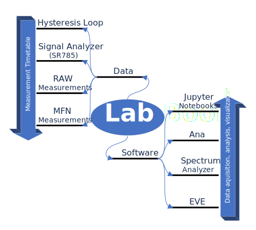

Welcome to my Lab Book!
=======================

.. _measurements: 
.. _parameters: 
.. _produce: 
.. _analyze: 

:Author: Jonathan Pieper

.. image:: https://img.shields.io/badge/Thesis-PDF-EC1C24?style=plastic&logo=adobe-acrobat-reader
   :target: https://gitlab.com/ody55eus/master-thesis/-/jobs/artifacts/file/thesis.pdf?job=build

.. image:: https://img.shields.io/badge/Thesis-LaTeX-008080?style=plastic&logo=latex
   :target: https://gitlab.com/ody55eus/master-thesis

.. image:: https://img.shields.io/badge/LabBook-GitLab-FCA121?style=plastic&logo=gitlab
   :target: https://gitlab.com/ody55eus/lab-book

.. image:: https://img.shields.io/badge/JupyterLab-Server-F37626?style=plastic&logo=jupyter
   :target: https://lab.ody5.de

.. image:: https://img.shields.io/badge/JupyterLab-Dockerfile-2496ED?style=plastic&logo=docker
   :target: https://gitlab.com/ody5-dev/docker/jupyterlab/-/blob/master/Dockerfile

.. image:: https://img.shields.io/badge/Data-Repository-FCA121?style=plastic&logo=gitlab
   :target: https://gitlab.com/ody55eus/master-data

This Lab Book is a review of my work at the `AG Müller <https://www.uni-frankfurt.de/49964693/Molecular_Metals_and_Magnetic_Nanostructures>` and supplemental information to my master thesis.

.. important::
   You can find all information about the :doc:`data and measurements <data/index>` 
   with inside the exported :doc:`OneNote Notebooks <data/onenote/index>`
   and the used software to :doc:`aqquire <modules/eve/index>`,
   :doc:`analyze <modules/notebooks>`, and :doc:`visualize <modules/notebooks>` 
   the data:

   Structure of this Lab Book.

.. admonition:: OneNote

  The exported OneNote notebooks containing all parameters:
     :doc:`data/onenote/exported`

.. admonition:: Data and Measurements

  :doc:`data/index`

.. admonition:: EVE

   The main software used to controll and communicate with the instruments EVE: 
      :doc:`modules/eve/index`
   
.. admonition:: Data Analysis

  The notebooks generating the figures: 
     :doc:`modules/notebooks`

  The analysis framework which analyzed the data: 
     :doc:`modules/ana/index`

.. toctree::
   :maxdepth: 3
   :caption: Lab Book

   readme
   info/usage
   info/gitlab
   data/onenote/index

.. toctree::
   :maxdepth: 3
   :caption: Data

   data/index
   data/hloop/index
   data/mfn/index

.. toctree::
   :maxdepth: 3
   :caption: Software

   modules/notebooks
   modules/ana/index
   modules/sa/index
   modules/eve/index
   modules/scripts

.. toctree::
   :maxdepth: 3
   :caption: Additional Information

   info/license
   contributing
   authors
   history
   info/idx
