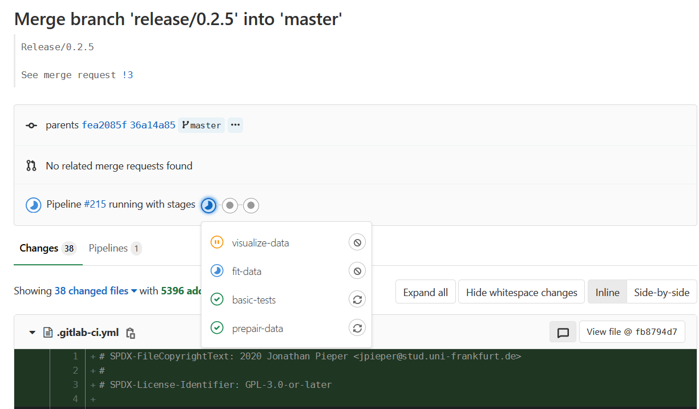
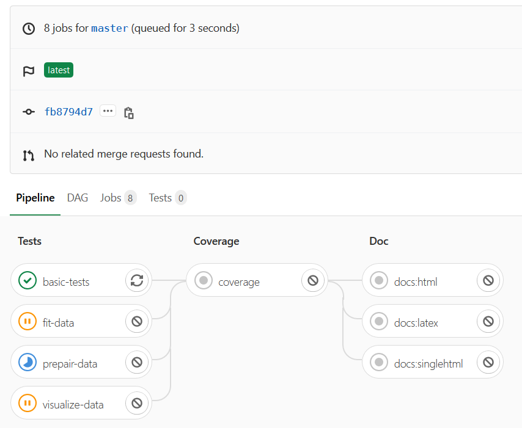
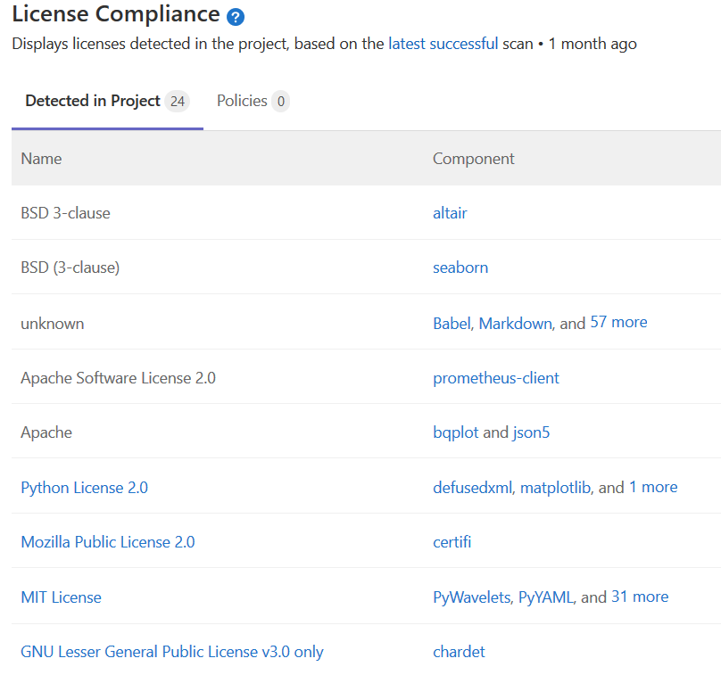
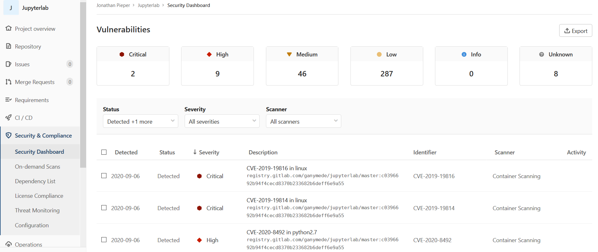

GitLab
======

About GitLab
------------

GitLab provides a single interface for the entire DevOps lifecycle (see `GitLab Workflow`_).
It integrates well with other services (like Mattermost_ and `GitLab flow`_ can simplify collaboration and improve research time.

.. _Mattermost: https://gitlab.com/gitlab-org/gitlab-mattermost
.. _GitLab Workflow: https://about.gitlab.com/blog/2016/10/25/gitlab-workflow-an-overview/#gitlab-workflow-use-case-scenario
.. _GitLab flow: https://about.gitlab.com/solutions/gitlab-flow/

Continuous Integration
~~~~~~~~~~~~~~~~~~~~~~

   
   GitLab interface: Merge Request summary.

   
   GitLab CI interface: Continuous Integration.

   GitLab CI `License Scanner`_

.. _License Scanner: https://gitlab.com/ganymede/jupyterlab/-/licenses

   `GitLab Security Dashboard`_

.. _GitLab Security Dashboard: https://gitlab.com/ganymede/jupyterlab/-/licenses

GitLab Projects
---------------

Documentation using Wiki
~~~~~~~~~~~~~~~~~~~~~~~~

Here are some important pages written for the internal group wiki and EVE wiki.
This displays the flexibility of markup languages and makes content
for the group accessible.

.. toctree::
   :maxdepth: 2

   groupwiki/home
   groupwiki/Server-Update
   EVE.wiki/home
   EVE.wiki/Installation
   EVE.wiki/How-to-update
   EVE.wiki/Programming
   EVE.wiki/Instruments
   EVE.wiki/HF2LI
   EVE.wiki/IPS120
   EVE.wiki/SR830

