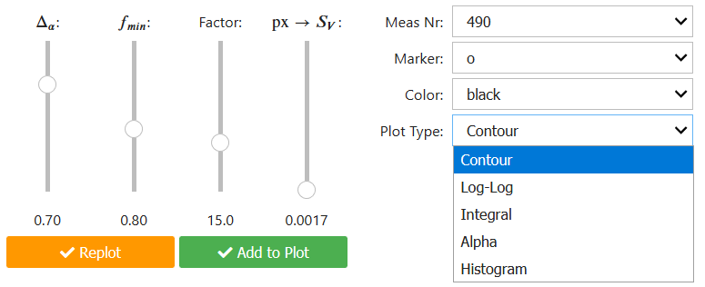

Jupyter Notebooks
=================

The goal is to provide as much information as needed to reproduce and create new plots.

.. note::
   Some of the notebooks contain widgets (Apps) which can not be displayed in this version of the 
   |LabBook| yet.

   A Jupyter notebook app written with `ipywidgets <https://ipywidgets.readthedocs.io/>`_: see `MFN Measurements <../notebooks/04.0_MFN.ipynb>`_ (not yet working)

.. toctree::
   :maxdepth: 3
   :glob:

   /notebooks/*
